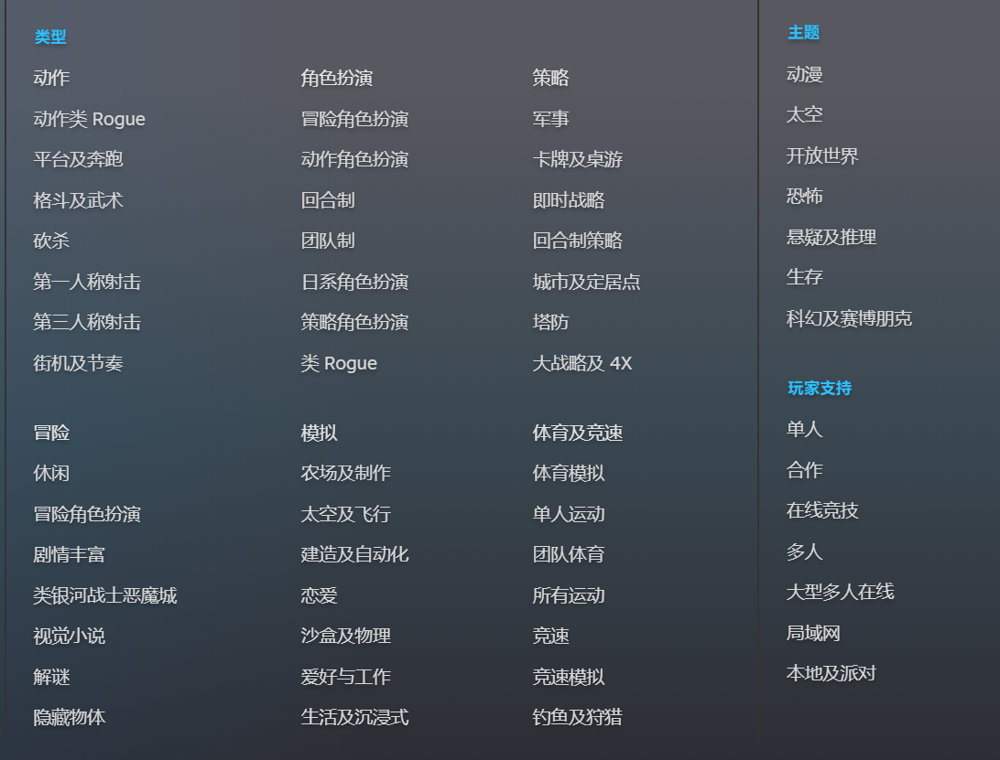
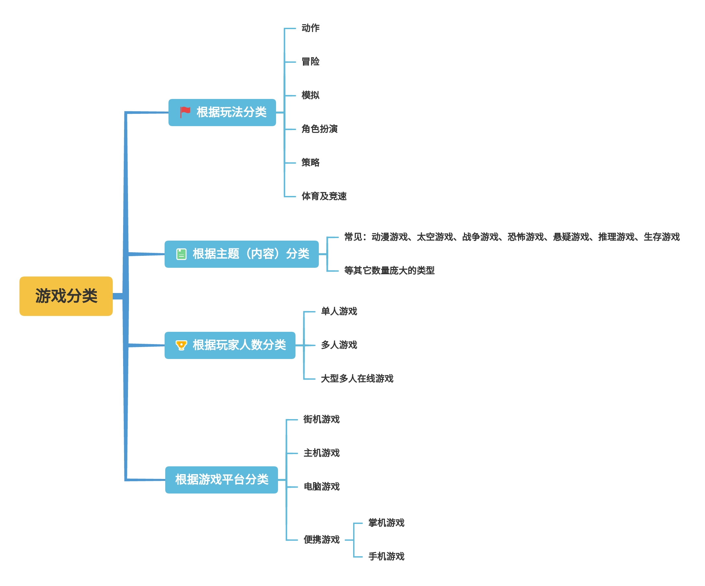

# 作业1  **游戏分类与热点探索**

**20337270 钟海财**

## 1. 使用思维导图描述游戏的分类

下图，是steam平台的游戏分类，可见游戏分类可以根据玩法、主题（内容）、玩家支持（玩家人数、游戏平台）分类。

 

### 1.1 **根据玩法分类：**

根据游戏玩法分类，游戏主要分为七大类：动作、冒险、模拟、角色扮演、策略、体育及竞速。 

**动作游戏**（Action Game），简称为ACT。游戏类型的一种，是一种宽泛的游戏类型。以“动作”作为游戏主要表现形式的游戏即可算作动作游戏，动作游戏也包含“射击游戏”和“格斗游戏”。

**冒险游戏**（Adventure Game），简称为AVG。游戏类型的一种，是一种宽泛的游戏类型。冒险游戏游戏集中于探索未知、解决谜题等情节化和探索性的互动，冒险游戏还强调故事线索的发掘，主要考验玩家的观察力和分析能力。

**模拟游戏**（Simulation Game），简称为SIM或SLG。游戏类型的一种，是一种宽泛的游戏类型。模拟游戏试图去复制各种“现实”生活的各种形式，训练玩家为不同的目的：如提高熟练度、分析情况或预测。仿真程度不同的模拟游戏有不同的功能，较高的仿真度可以用于专业知识的训练、较低的可以作为娱乐手段。

**角色扮演游戏**（Role-playing game），简称为RPG。游戏类型的一种，宽泛的游戏类型。在游戏中，玩家负责扮演这个角色在一个写实或虚构世界中活动。玩家负责扮演一个或多个角色，并在一个结构化规则下通过一些行动令所扮演的角色发展。玩家在这个过程中的成功与失败取决于一个规则或行动方针的形式系统。

**策略游戏**（Strategy Game）。游戏类型的一种，狭窄的游戏类型。这类游戏提供给玩家一个利用大脑思考问题，处理较复杂事情的环境，允许玩家自由控制、管理和使用游戏中的人、或事物，通过这种自由的手段以及玩家们开动脑筋想出的对抗敌人的办法来达到游戏所要求的目标。

**体育游戏**（Sport Game）。游戏类型的一种，狭窄的游戏类型，这个分类的游戏比较多。顾名思义就是以进行体育活动作为主轴的游戏。包括各种体育活动，例如雪上运动、篮球、高尔夫球、足球、网球等具策略性的运动较为热门。

**竞速游戏**（Racing Game）。游戏类型的一种，虽然是按游戏玩法进行分类的标准分类法，但由于是一个狭窄的游戏类型，因而很少被单独列出。通常，竞速游戏都会被并入“体育游戏”（如赛车和赛跑）、载具模拟游戏和动作游戏（驾驶载具比赛）这三类。通常竞速游戏会被定义为无法列入以上三类的其他以速度比赛为主题的游戏，或是被游戏的发行商刻意宣传才定义为此的。

但随着近年来，游戏内容更加丰富，不同种类的游戏之间玩法和内容都有重叠和交叉。单类游戏已经逐渐消失，取而代之的含有多种特点的大型游戏，于是各种游戏的类别又有合并的趋势。

### 1.2 根据主题（内容）分类

按游戏主题（内容）分类是按照游戏内部元素来分类的方法。这种分类方法十分直观，所以可以迅速的框定游戏范围。

但由于游戏内容的区分很多，导致这种类别的分类选项数量**十分庞大**，仅以辅助的分类形式出现。主要分类举例：动漫游戏、太空游戏、战争游戏、恐怖游戏、悬疑游戏、推理游戏、生存游戏等等。

### 1.3 根据玩家人数分类

根据玩家人数分类，游戏可分为：单人游戏，多人游戏、大型多人在线游戏。

### 1.4 根据游戏平台分类

根据游戏平台区分，游戏可分为：

**街机游戏**：（使用大型游戏机进行游玩的设备）

**主机游戏**：（利用家庭用游戏主机进行游玩的游戏）

**电脑游戏**：（使用PC和其他运算计算机进行游玩的游戏）

**便携游戏：**（使用掌上游戏机或手机游玩的电子游戏） 

### 1.5 下图为根据上述方法得到的游戏分类思维导图

## 2. 结合手机游戏市场的下载量与排名等数据，结合游戏分类图，描述当前游戏市场的热点。

### 2.1 小米、华为、OPPO应用商店游戏下载榜单前20名：
数据来源：https://app.diandian.com/rank/android/

| 小米应用商店游戏下载排名 | 应用名称                     | 游戏分类       |
| ------------------------ | ---------------------------- | -------------- |
| 1                        | 地铁跑酷-穿越冰岛秘境        | 动作           |
| 2                        | 和平精英                     | 动作、角色扮演 |
| 3                        | 王者荣耀                     | 角色扮演       |
| 4                        | 开心消消乐®-限时有礼         | 策略           |
| 5                        | 迷你世界                     | 模拟           |
| 6                        | 英雄联盟手游                 | 角色扮演       |
| 7                        | 我的世界                     | 模拟           |
| 8                        | 金铲铲之战                   | 策略           |
| 9                        | 原神                         | 角色扮演       |
| 10                       | 植物大战僵尸2                | 策略           |
| 11                       | 穿越火线：枪战王者(领玉兔枪) | 动作、角色扮演 |
| 12                       | 航天模拟器                   | 模拟           |
| 13                       | QQ飞车手游-极速国潮季        | 竞速           |
| 14                       | 蛋仔派对                     | 其它           |
| 15                       | 暗区突围                     | 动作           |
| 16                       | 途游斗地主（比赛版）         | 策略           |
| 17                       | 多乐麻将                     | 策略           |
| 18                       | 荒野乱斗                     | 角色扮演       |
| 19                       | JJ斗地主                     | 策略           |
| 20                       | 光·遇                        | 其它           |

| 华为应用商店游戏下载排名 | 应用名称           | 游戏分类       |
| :----------------------- | ------------------ | -------------- |
| 1                        | 王者荣耀           | 角色扮演       |
| 2                        | 地铁跑酷           | 动作           |
| 3                        | 和平精英           | 动作、角色扮演 |
| 4                        | 迷你世界           | 模拟           |
| 5                        | 侠隐风云           | 角色扮演       |
| 6                        | 我的世界           | 模拟           |
| 7                        | 开心消消乐®        | 策略           |
| 8                        | 汤姆猫跑酷         | 动作           |
| 9                        | 无双战将           | 策略           |
| 10                       | 贪吃蛇大作战       | 竞速           |
| 11                       | 英雄联盟手游       | 角色扮演       |
| 12                       | 弹壳特攻队         | 冒险           |
| 13                       | 逃跑吧！少年       | 竞速           |
| 14                       | 暗区突围           | 动作           |
| 15                       | 光·遇              | 其它           |
| 16                       | 欢乐斗地主         | 策略           |
| 17                       | 植物大战僵尸2      | 策略           |
| 18                       | 真牛传奇           | 策略           |
| 19                       | 穿越火线：枪战王者 | 动作、角色扮演 |
| 20                       | 金铲铲之战         | 策略           |

| OPPO应用商店游戏下载排名 | 应用名称                            | 游戏分类       |
| ------------------------ | ----------------------------------- | -------------- |
| 1                        | 和平精英（科学之轮）                | 动作、角色扮演 |
| 2                        | 王者荣耀                            | 角色扮演       |
| 3                        | 开心消消乐（开心诗会活动）          | 策略           |
| 4                        | 迷你世界（中秋梦幻岛）              | 模拟           |
| 5                        | 地铁跑酷（穿越冰岛秘境）            | 动作           |
| 6                        | 逃跑吧！少年（竞速之战）            | 竞速           |
| 7                        | 金铲铲之战                          | 策略           |
| 8                        | 英雄联盟手游                        | 角色扮演       |
| 9                        | 暗区突围                            | 动作           |
| 10                       | 使命召唤手游                        | 动作、角色扮演 |
| 11                       | 梦幻西游（领熊猫助战）              | 其它           |
| 12                       | 欢喜斗地主（主播力荐）              | 策略           |
| 13                       | 明日之后（深海巨浪）                | 冒险、角色扮演 |
| 14                       | 梦回凤歌（国风仙侠爬塔修仙）        | 其它           |
| 15                       | 欢乐麻将全集                        | 策略           |
| 16                       | 三国志·战略版（畅爽夏日福利）       | 策略           |
| 17                       | 天天斗地主（真人版）                | 策略           |
| 18                       | 第五人格                            | 角色扮演       |
| 19                       | QQ飞车（极速国潮季）                | 竞速           |
| 20                       | 穿越火线：枪战王者（登录抽388红包） | 动作、角色扮演 |

### 2.2 榜单分析（部分游戏属于两个类型的交叉类型）

#### 统计

前10名（共30个席位）：角色扮演类占11个席位，动作类占9个席位，策略类占7个席位，模拟类占5个席位，竞速占2个。

前20名（共60个席位）：角色扮演类占18个席位，策略类占18个席位，动作类占14个席位，模拟类占6个席位，竞速类占6个，冒险类2个。

#### 分析

可见，角色扮演类游戏是当前的热点游戏类型，动作类和策略类游戏也非常热门，模拟类和竞速类游戏较为冷门，体育类和冒险类非常冷门。

此外，角色扮演类和动作类的热门手游中，大多都是多人在线、实时对抗游戏，代表作有王者荣耀，和平精英，英雄联盟手游。而策略类的热门游戏大多为棋牌类游戏。

#### 结论

当前游戏市场的热点为多人在线、实时对抗的角色扮演类游戏。
