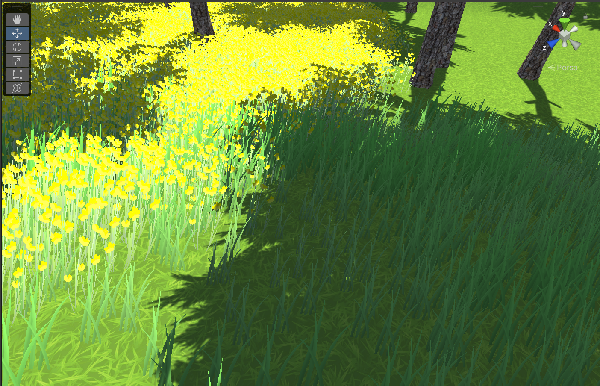

# 作业4

### 基本操作演练

• 下载 Fantasy Skybox FREE，构建自己的游戏场景，并为场景设计地形（含树木和草地等元素）

### 步骤

#### 一、下载资源包

从Asset Store下载资源包Fantasy Skybox FREE并导入到项目中。

#### 二、设置地形

设置地形的高低起伏：

 

结果：

 

由于默认地形是白色的，所以之后我选择使用资源包Fantasy Skybox FREE中的地形（图层为草地）再重新设置。

#### 三、往地形上添加树、花草：

3种树：

 

3种花草：

 

#### 场景结果图：

总览

 

局部：

 

细节：

 

 

#### 四、设置天空盒

在Assets 上下文菜单 -> create -> Material 创建天空盒起名MySkyBox，使用资源包Fantasy Skybox FREE中的贴图：

 

2、使用天空盒

 在 Camera 对象中添加部件 Rendering -> Skybox ，将天空盒拖放入 Skybox！对应摄像机就使用自定义天空盒 ：

 

3、设置恢复系统默认天空，要将天空盒分配给正在处理的场景，执行以下操作： 

✓ 从菜单栏中选择 Window > Rendering > Lighting。

 ✓ 在随后出现的窗口中选择Environment选项卡。 

✓ 将新的天空盒材质拖放到 Skybox 字段。

 

4.最终结果

最终我们的游戏场景就置于我们设置的天空盒中：

 