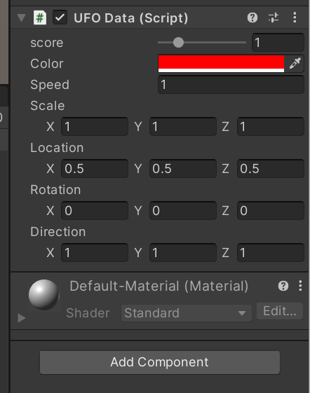
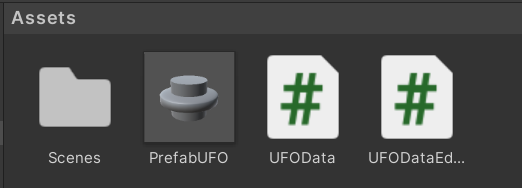
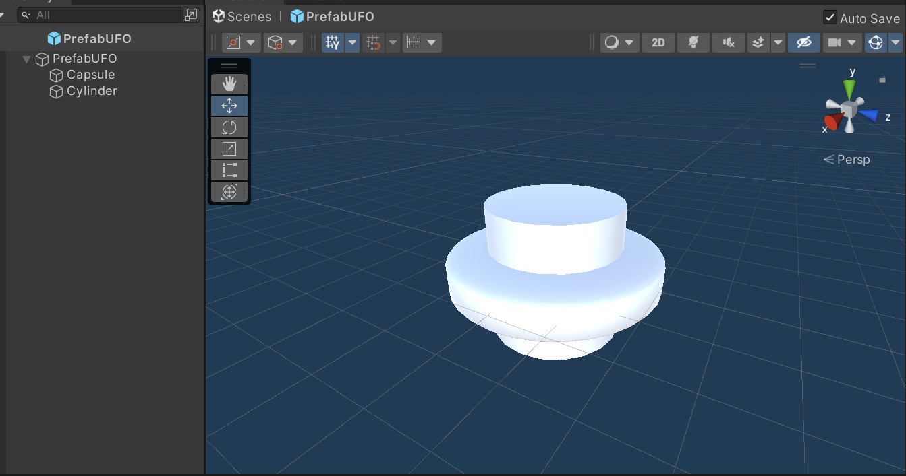
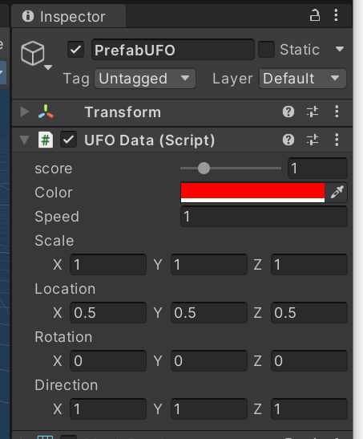
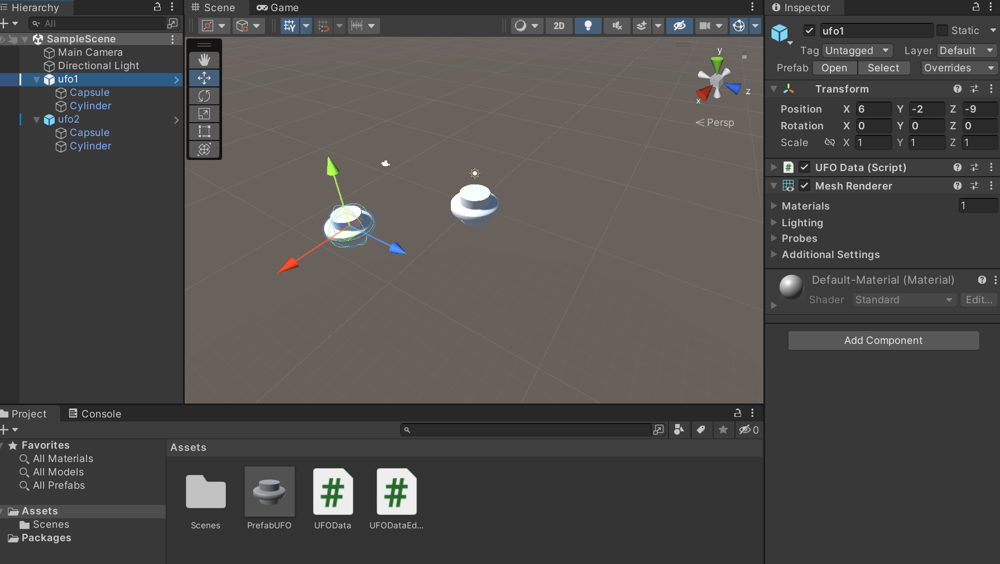

# 作业5

### 作业题目

1. 编写一个简单的自定义 Component 

 用自定义组件定义几种飞碟，做成预制

 • 参考官方手册 https://docs.unity3d.com/ScriptReference/Editor.html

 • 实现自定义组件，编辑并赋予飞碟一些属性


### 作业内容

#### 1 飞碟属性设计及脚本编写

飞碟具有以下属性：色彩、大小、发射位置、速度、角度、得分。

```c#
    // 飞碟的属性: 得分、颜色、速度、大小、起始位置、旋转角度、移动方向
    public int score = 1; // 得分
    public Color color = Color.red;  // 颜色
    public float speed = 1; // 速度
    public Vector3 scale = new Vector3(1, 1, 1); // 大小
    public Vector3 location =  new Vector3(0.5f, 0.5f, 0.5f); // 起始位置
    public Vector3 rotation = new Vector3(0, 0, 0); // 旋转角度
    public Vector3 direction = new Vector3(1, 1, 1); // 移动方向
```

然后编写飞碟数据的脚本文件 UFOData.cs :

```c#
using System.Collections;
using System.Collections.Generic;
using UnityEngine;

public class UFOData : MonoBehaviour
{
    // 飞碟的属性: 得分、颜色、速度、大小、起始位置、旋转角度、移动方向
    public int score = 1; // 得分
    public Color color = Color.red;  // 颜色
    public float speed = 1; // 速度
    public Vector3 scale = new Vector3(1, 1, 1); // 大小
    public Vector3 location =  new Vector3(0.5f, 0.5f, 0.5f); // 起始位置
    public Vector3 rotation = new Vector3(0, 0, 0); // 旋转角度
    public Vector3 direction = new Vector3(1, 1, 1); // 移动方向

    // Start is called before the first frame update
    void Start()
    {
        this.transform.position = location;
    }

    // Update is called once per frame
    void Update()
    {
        Vector3 mv = new Vector3(speed/200, 0, speed/100);
        this.transform.Translate(mv);
    }
}
```


#### 2 使用自定编辑器更改检查器中飞碟脚本的外观

编写UFODataEditor.cs:

```c#
using UnityEngine;
using UnityEditor;
using System.Collections;
[CustomEditor(typeof(UFOData))]
[CanEditMultipleObjects]
public class UFODataEditor : Editor
{  
    SerializedProperty color;
    SerializedProperty scale; 
    SerializedProperty score;
    SerializedProperty speed;
    SerializedProperty location; 
    SerializedProperty rotation; 
    SerializedProperty direction;  

	void OnEnable()
	{
        color = serializedObject.FindProperty("color");
        scale = serializedObject.FindProperty("scale");
        speed = serializedObject.FindProperty("speed");        
        score = serializedObject.FindProperty("score");
        location = serializedObject.FindProperty("location");
        rotation = serializedObject.FindProperty("rotation");
        direction = serializedObject.FindProperty("direction");
	}

	public override void OnInspectorGUI()
	{
		serializedObject.Update();
		EditorGUILayout.IntSlider(score, 0, 5, new GUIContent("score"));
		EditorGUILayout.PropertyField(color);
        EditorGUILayout.PropertyField(speed);
        EditorGUILayout.PropertyField(scale);
        EditorGUILayout.PropertyField(location);
        EditorGUILayout.PropertyField(rotation);
        EditorGUILayout.PropertyField(direction);
		serializedObject.ApplyModifiedProperties();
	}
}

```

然后将UFOData.cs挂载到一个飞碟对象上，我们便能在检查器中可以看到并编辑这几项属性：

|  | --------------------------------------------------------------------------------------------------- |
| ------------------------------------------------------------ | ------------------------------------------------------------ |


#### 3 创建一个简单的飞碟Component并做成预制 

 

##### 首先我们新建飞碟预制

在文件夹Assets的选项中选择Create/Prefab创建PrefabUFO

##### 然后使用胶囊体和圆柱体创建一个飞碟组件



##### 最后将脚本UFOData.cs挂载到预制PrefabUFO上

|  | ---------------------------------------------------------------------------------------------------------- |
| ------------------------------------------------------------ | ------------------------------------------------------------ |


#### 4 结果展示

#### 使用步骤3创建的预制PrefabUFO创建多个飞碟对象

