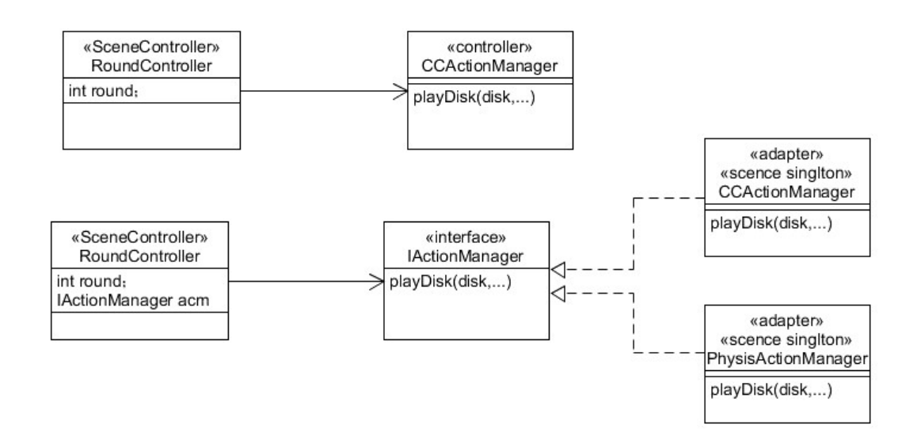
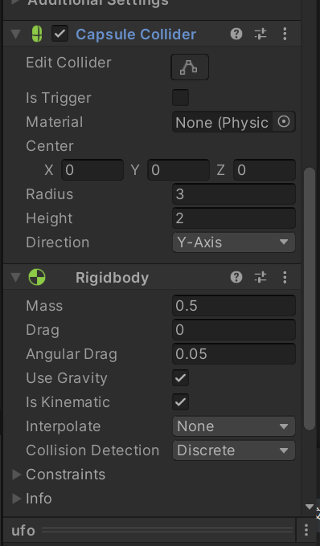

# 作业6

### 作业题目

#### 1、编写一个简单的鼠标打飞碟游戏【选做】

p 游戏内容要求： 

• 游戏有多个轮次，每个轮次都包括10个轨迹； 

• 每个轨迹的飞碟的色彩、大小、发射位置、速度、角度、同时出现的 个数都可能不同。它们由该轮次的 ruler 控制； 

• 每个轨迹的飞碟有随机性，总体难度随轮次上升；

• 鼠标点中得分，计分规则按色彩、大小、速度不同计算，可自由设定 

p 游戏的要求： 

• 使用带缓存的工厂模式管理不同飞碟的生产与回收，该工厂必须是**场景单实例**的！具体实现见参考资源 Singleton 模板类 

• 近可能使用前面 MVC 结构实现人机交互与游戏模型分离


#### 2、 改进打飞碟游戏（可选）：

游戏内容要求：

按下面adapter模式设计图修改飞碟游戏

使它同时支持物理运动与运动学（变换）运动



### 作业内容

#### 一 飞碟预制

通过一个胶囊体和圆柱体构建成一个飞碟组件作为预制，改变**胶囊体**的颜色来改变飞碟的颜色。

```
disk.transform.GetChild(0).gameObject.GetComponent<Renderer>().material.color = Color.red;
```


##### **添加胶囊碰撞体和刚体组件：**

胶囊碰撞体 ：用于检测鼠标点击事件

刚体：用于实现物理运动（受重力、阻力等因素影响）

 

#### 二 工厂模式产生飞碟，实现不同飞碟的生产与回收

使用两个列表记录：正在使用的飞碟used，被回收可以重用的飞碟free

```cs
	List<GameObject> used;
    List<GameObject> free;
```


##### 生产飞碟

首先判断能否重用飞碟，如果能则从free表中取一个飞碟重用；

然后修改该飞碟的各种属性；

最后将该飞碟加入到used表中并返回。

```cs
public GameObject GetDisk(int round, bool isKinematic) {
        GameObject disk;
  		// 首先判断能否重用飞碟，如果能则从free中取一个飞碟重用
        if (free.Count != 0) {
            disk = free[0];
            free.Remove(disk);
        }
        else {
            disk = GameObject.Instantiate(Resources.Load("Prefabs/ufo", typeof(GameObject))) as GameObject;
            disk.AddComponent<DiskData>();
        }
        // 关闭物理引擎的控制
        disk.GetComponent<Rigidbody>().isKinematic = true;
    
    	...
        修改飞碟的属性：得分、大小、颜色、起始位置、速度...
        ...
            
    	used.Add(disk);
        disk.SetActive(true);
        return disk;
 }
 
```


##### 回收飞碟

将飞碟从used表中移除，加入到free表中。

```cs
// 通过回调函数回收飞碟，这样下次只需改变飞碟的属性就能重用
    public void FreeDisk(GameObject disk) {
        // 将飞碟隐藏
        disk.SetActive(false);
        //将位置和大小恢复到预制
        disk.transform.position = new Vector3(0, 0, 0);
        disk.transform.localScale = new Vector3(1, 1, 1);
        if (!used.Contains(disk)) {
            throw new MyException("Try to remove a item from a list which doesn't contain it.");
        }
        used.Remove(disk);
        free.Add(disk);
    }
```


#### 三 飞碟被点击

通过将鼠标点击的游戏对象（这里只用飞碟）隐藏，实现飞碟被点击后消失的效果

```
// 判断飞碟是否被鼠标点击，如果被点击则将该飞碟隐藏
    public void GetHit() {
        if (Input.GetButtonDown("Fire1")) {
			Camera ca = Camera.main;
			Ray ray = ca.ScreenPointToRay(Input.mousePosition);
			RaycastHit hit;
			if (Physics.Raycast(ray, out hit)) {
                Record(hit.transform.gameObject);
                hit.transform.gameObject.SetActive(false);
			}
		}
    }
```


#### 四 使用适配器模式，使它同时支持物理运动与运动学（变换）运动


运动逻辑：先判断飞碟是否要回收（被点击/超出摄像机范围），再进行相应的运动。


#### 五 运动学运动的实现

在update()方法中首先检测是否要回收飞碟，如果不要回收飞碟，则进行运动学运动，这里我只实现简单的直线运动。

CCFlyAction

```cs
public class CCFlyAction : SSAction
{
    public float speedX;
    public float speedY;
    public static CCFlyAction GetSSAction(float x, float y) {
        CCFlyAction action = ScriptableObject.CreateInstance<CCFlyAction>();
        action.speedX = 2 * x;
        action.speedY = 2 * y;
        return action;
    }

    public override void Start() { }

    // Update is called once per frame
    public override void Update()
    {
        //飞碟已经被点击(隐藏)，通过回调函数回收飞碟
        if (this.transform.gameObject.activeSelf == false) {
            this.destroy = true;
            // 通过回调函数回收飞碟
            this.callback.SSActionEvent(this);
            return;
        }
        // 如果飞碟超出摄像机的范围，通过回调函数回收飞碟
        Vector3 vec3 = Camera.main.WorldToScreenPoint (this.transform.position);
        if (vec3.x < -200 || vec3.x > Camera.main.pixelWidth + 200 || vec3.y < -200 || vec3.y > Camera.main.pixelHeight + 200) {
            this.destroy = true;
            this.callback.SSActionEvent(this);
            return;
        }
        // 运动学运动
        transform.position += new Vector3(speedX, speedY, 0) * Time.deltaTime;
    }
 
```


#### 六 物理学运动的实现

由于使用了刚体组件，只需要设置飞碟的初速度和一些参数（重力、阻力等），就能实现飞碟的物理学运动。

所以在update()方法中只需检测是否要回收飞碟。

PhysicFlyAction

```cs
public class PhysicFlyAction : SSAction
{
    public float speedX;
    public float speedY;
    public static PhysicFlyAction GetSSAction(float x, float y) {
        PhysicFlyAction action = ScriptableObject.CreateInstance<PhysicFlyAction>();
        action.speedX = x * 2;
        action.speedX = y * 8;
        return action;
    }
    // Start is called before the first frame update
    public override void Start()
    {
        // Rigidbody刚体,运动将受到 Unity 物理引擎的控制
        gameObject.GetComponent<Rigidbody>().isKinematic = false;
        // 速度矢量
        gameObject.GetComponent<Rigidbody>().velocity = new Vector3(speedX, speedY, 0);
        // 使用重力
        gameObject.GetComponent<Rigidbody>().useGravity = true;
        // 阻力为0
        gameObject.GetComponent<Rigidbody>().drag = 0;
    }

    // Update is called once per frame
    public override void Update()
    {
        //飞碟已经被点击，通过回调函数回收飞碟
        if (this.transform.gameObject.activeSelf == false) {
            this.destroy = true;
            this.callback.SSActionEvent(this);
            return;
        }
        // 如果飞碟超出摄像机的范围，通过回调函数回收飞碟
        Vector3 vec3 = Camera.main.WorldToScreenPoint (this.transform.position);
        if (vec3.x < -200 || vec3.x > Camera.main.pixelWidth + 200 || vec3.y < -200 || vec3.y > Camera.main.pixelHeight + 200) {
            this.destroy = true;
            this.callback.SSActionEvent(this);
            return;
        }
    }
}

```

#### 七 视图控制器RoundController

Start()方法中添加各个组件，飞碟工厂是**场景单例**的

```cs
void Start()
    {
        SSDirector director = SSDirector.getInstance();
        director.currentSceneController = this;
        gameObject.AddComponent<UserGUI>();
        gameObject.AddComponent<DiskFactory>();
        gameObject.AddComponent<CCActionManager>();
        gameObject.AddComponent<PhysicActionManager>();
        actionManager = gameObject.GetComponent<CCActionManager>() as IActionManager;
        factory = Singleton<DiskFactory>.Instance;
        userGUI =  gameObject.GetComponent<UserGUI>();
    }
```


在Update()方法中，首先选择对应的运动管理器（物理学/运动学），然后每隔4s（1个回合，总共5个回合）产生若干飞碟，并使用运动管理器对尝试的飞碟进行运动；同时还要检测哪些飞碟被点击。

```cs
 void Update()
    {
        if (userGUI.mode == 0) return;
        if (userGUI.isKinematic == false) {
            // 物理学
            actionManager = gameObject.GetComponent<PhysicActionManager>() as IActionManager;
            ufo_num = 5;
        }
        else {
            // 运动学
            actionManager = gameObject.GetComponent<CCActionManager>() as IActionManager;
            ufo_num = 10;
        }
        GetHit();
        if (round >= max_round) {
            return;
        }
        timer -= Time.deltaTime;
        if (timer <= 0 && actionManager.GetActionCount() == 0) {
            //从工厂中得到ufo_num个飞碟，为其加上动作
            for (int i = 0; i < ufo_num; ++i) {
                disk = factory.GetDisk(round, userGUI.isKinematic);
                actionManager.MoveDisk(disk);
            }
            round += 1;
            if (round <= max_round) {
                userGUI.round = round;
            }
            timer = 4.0f;
        }
        
    }
```

