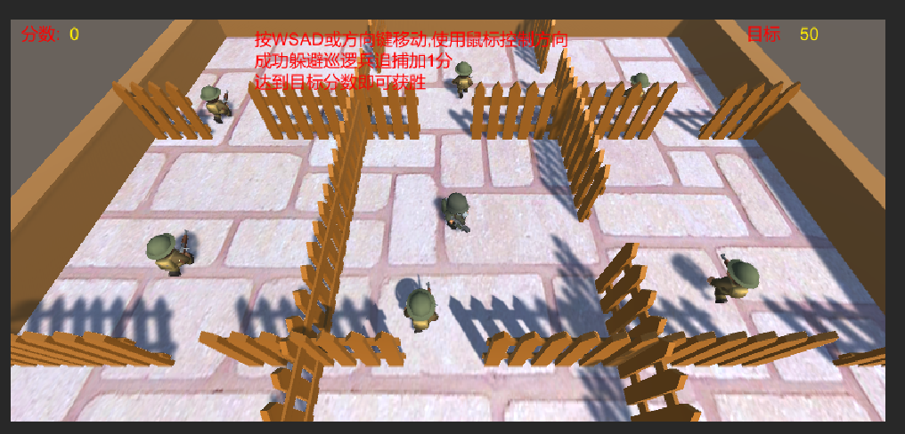
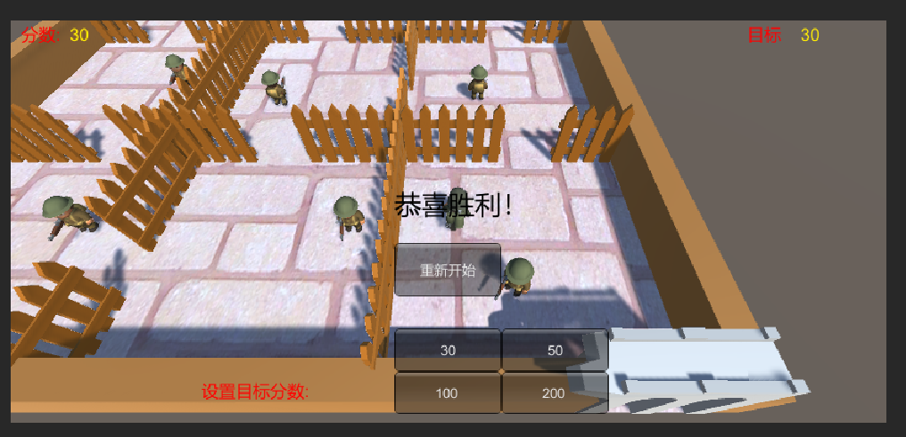
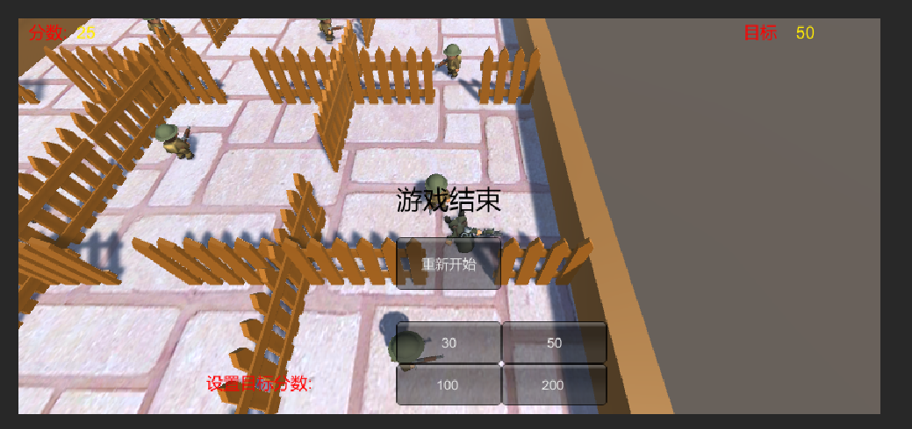
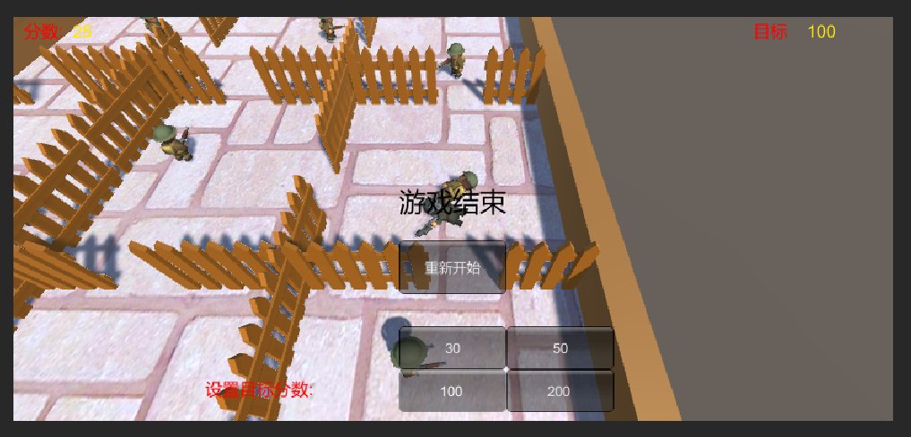

# 作业7

## 作业题目

### 1、智能巡逻兵 

####  游戏设计要求： 

• 创建一个地图和若干巡逻兵(使用动画)； 

• 每个巡逻兵走一个3~5个边的凸多边型，位置数据是相对地址。即每次确定下一个目标位置，用自己当前位置为原点计算； 

• 巡逻兵碰撞到障碍物，则会自动选下一个点为目标； 

• 巡逻兵在设定范围内感知到玩家，会自动追击玩家； 

• 失去玩家目标后，继续巡逻； 

• 计分：玩家每次甩掉一个巡逻兵计一分，与巡逻兵碰撞游戏结束； 

####  程序设计要求： 

• 必须使用订阅与发布模式传消息 

• 工厂模式生产巡逻兵 

####  提示1：生成 3~5个边的凸多边型 

• 随机生成矩形

• 在矩形每个边上随机找点，可得到 3 - 4 的凸多边形


## 游戏实现

### 巡逻兵部分

巡逻兵部分实现了进行矩形路线的自动巡逻移动，当玩家进入它的触发器范围后，如果玩家当前在自己巡逻区域内，则跟随追捕玩家。如果巡逻兵与玩家碰撞，则双方都播放碰撞后动画，游戏结束。

#### 巡逻兵预制体

为巡逻兵添加两个`Collider`，一个是`Capsule Collider`，添加在预制体父节点上，用于检测巡逻兵与玩家的碰撞。另一个是`Box Collider`，添加在预制体的子节点上，用于检测玩家进入巡逻兵巡逻的范围。

##### 巡逻兵的基本数据

```c#
public class PatrolData : MonoBehaviour
{
    public int sign;                      //标志巡逻兵在哪一块区域
    public bool follow_player = false;    //是否跟随玩家
    public int wall_sign = -1;            //当前玩家所在区域标志
    public GameObject player;             //玩家游戏对象
    public Vector3 start_position;        //当前巡逻兵初始位置     
}
```


#### 巡逻兵创建

##### 工厂模式生产巡逻兵

道具工厂，创建了9个巡逻兵，因为巡逻兵的位置有规律所以用循环就可以赋值初始位置，还设置了每个巡逻兵所在区域的标志。当游戏结束时候，需要工厂将巡逻兵的动画设置为初始状态。

```cs
public class PropFactory : MonoBehaviour
{
    private GameObject patrol = null;                              //巡逻兵
    private List<GameObject> used = new List<GameObject>();        //正在被使用的巡逻兵
    private Vector3[] vec = new Vector3[9];                        //保存每个巡逻兵的初始位置
    // public FirstSceneController sceneControler;                    //场景控制器

    public List<GameObject> CreatPatrols()
    {
        int[] pos_x = { -6, 4, 13 };
        int[] pos_z = { -4, 6, -13 };
        int index = 0;
        //生成不同的巡逻兵初始位置
        for(int i=0;i < 3;i++)
        {
            for(int j=0;j < 3;j++)
            {
                vec[index] = new Vector3(pos_x[i], 0, pos_z[j]);
                index++;
            }
        }
        for(int i=0; i < 9; i++)
        {
            patrol = Instantiate(Resources.Load<GameObject>("Prefabs/Patrol"));
            patrol.transform.position = vec[i];
            patrol.GetComponent<PatrolData>().sign = i + 1;
            patrol.GetComponent<PatrolData>().start_position = vec[i];
            used.Add(patrol);
        }   
        return used;
    }

    public void StopPatrol()
    {
        //切换所有巡逻兵的动画
        for (int i = 0; i < used.Count; i++)
        {
            used[i].gameObject.GetComponent<Animator>().SetBool("run", false);
        }
    }
}

```


#### 巡逻兵动作

##### 巡逻——GoPatrolAction

巡逻兵巡逻的动作，根据四个方向来选择要去到的目的地，当**当前位置**与**目的地**相差0.9f的时候，换一个方向继续巡逻：

```cs
public class GoPatrolAction : SSAction
{
    private enum Dirction { EAST, NORTH, WEST, SOUTH };
    private float pos_x, pos_z;                 //移动前的初始x和z方向坐标
    private float move_length;                  //移动的长度
    private float move_speed = 1.2f;            //移动速度
    private bool move_sign = true;              //是否到达目的地
    private Dirction dirction = Dirction.EAST;  //移动的方向
    private PatrolData data;                    //巡逻兵的数据
    

    private GoPatrolAction() { }
    
    public static GoPatrolAction GetSSAction(Vector3 location)
    {
        GoPatrolAction action = CreateInstance<GoPatrolAction>();
        action.pos_x = location.x;
        action.pos_z = location.z;
        //设定移动矩形的边长
        action.move_length = Random.Range(4, 7);
        return action;
    }

    public override void Update()
    {
        //防止碰撞发生后的旋转
        if (transform.localEulerAngles.x != 0 || transform.localEulerAngles.z != 0)
        {
            transform.localEulerAngles = new Vector3(0, transform.localEulerAngles.y, 0);
        }            
        if (transform.position.y != 0)
        {
            transform.position = new Vector3(transform.position.x, 0, transform.position.z);
        }
        //巡逻兵移动
        Gopatrol();
        //如果巡逻兵需要跟随玩家并且玩家就在巡逻兵所在的区域，侦查动作结束
        if (data.follow_player && data.wall_sign == data.sign)
        {
            this.destroy = true;
            this.callback.SSActionEvent(this,0,this.gameobject);
        }
    }
    
    public override void Start()
    {
        this.gameobject.GetComponent<Animator>().SetBool("run", true);
        data  = this.gameobject.GetComponent<PatrolData>();
    }

    //巡逻兵移动
    void Gopatrol()
    {
        if (move_sign)
        {
            //不需要转向则设定一个目的地，按照矩形移动
            switch (dirction)
            {
                case Dirction.EAST:
                    pos_x -= move_length;
                    break;
                case Dirction.NORTH:
                    pos_z += move_length;
                    break;
                case Dirction.WEST:
                    pos_x += move_length;
                    break;
                case Dirction.SOUTH:
                    pos_z -= move_length;
                    break;
            }
            move_sign = false;
        }
        this.transform.LookAt(new Vector3(pos_x, 0, pos_z));
        float distance = Vector3.Distance(transform.position, new Vector3(pos_x, 0, pos_z));
        //当前位置与目的地距离浮点数的比较
        if (distance > 0.9)
        {
            transform.position = Vector3.MoveTowards(this.transform.position, new Vector3(pos_x, 0, pos_z), move_speed * Time.deltaTime);
        }
        else
        {
            dirction = dirction + 1;
            if(dirction > Dirction.SOUTH)
            {
                dirction = Dirction.EAST;
            }
            move_sign = true;
        }
    }
}

```

##### 追击玩家——PatrolFollowAction

巡逻兵朝着玩家的位置移动，移动结束的条件是玩家离开了巡逻兵触发器的范围或是玩家已经不在该区域内了

```cs
public class PatrolFollowAction : SSAction
{
    private float speed = 2f;            //跟随玩家的速度
    private GameObject player;           //玩家
    private PatrolData data;             //侦查兵数据

    private PatrolFollowAction() { }
    public static PatrolFollowAction GetSSAction(GameObject player)
    {
        PatrolFollowAction action = CreateInstance<PatrolFollowAction>();
        action.player = player;
        return action;
    }

    public override void Update()
    {
        speed += 0.002f;
        if (transform.localEulerAngles.x != 0 || transform.localEulerAngles.z != 0)
        {
            transform.localEulerAngles = new Vector3(0, transform.localEulerAngles.y, 0);
        }
        if (transform.position.y != 0)
        {
            transform.position = new Vector3(transform.position.x, 0, transform.position.z);
        }
         
        Follow();
        //如果侦察兵没有跟随对象，或者需要跟随的玩家不在侦查兵的区域内
        if (!data.follow_player || data.wall_sign != data.sign)
        {
            this.destroy = true;
            this.callback.SSActionEvent(this,1,this.gameobject);
        }
    }

    public override void Start()
    {
        data = this.gameobject.GetComponent<PatrolData>();
    }
    
    void Follow()
    {
        transform.position = Vector3.MoveTowards(this.transform.position, player.transform.position, speed * Time.deltaTime);
        this.transform.LookAt(player.transform.position);
    }
}

```

##### 被玩家摆脱——SSActionEvent

当玩家逃离巡逻兵触发器的范围的时候(此时巡逻兵的跟随玩家的动作会调用回调函数)，分数会增加

```cs
	public void SSActionEvent(SSAction source, int intParam = 0, GameObject objectParam = null)
    {
        if(intParam == 0)
        {
            //侦查兵跟随玩家
            PatrolFollowAction follow = PatrolFollowAction.GetSSAction(objectParam.gameObject.GetComponent<PatrolData>().player);
            this.RunAction(objectParam, follow, this);
        }
        else
        {
            //侦察兵按照初始位置开始继续巡逻
            GoPatrolAction move = GoPatrolAction.GetSSAction(objectParam.gameObject.GetComponent<PatrolData>().start_position);
            this.RunAction(objectParam, move, this);
            //玩家逃脱
            Singleton<GameEventManager>.Instance.PlayerEscape();
        }
    }
```


#### 巡逻兵动作管理类——PatrolActionManager

初始的时候场景控制器调用PatrolActionManager中的方法，让巡逻兵开始巡逻，当游戏结束的时候，调用方法让巡逻兵停止巡逻。

巡逻动作结束条件是需要追捕玩家，所以调用了回调函数，用回调函数来进行追捕动作。而当玩家离开追捕范围后，需要重新巡逻，也需要调用回调函数，从初始的位置和方向继续巡逻。

除此之外，PatrolActionManager还实现了游戏结束后，摧毁所有动作，巡逻兵不再移动。

```cs
public class PatrolActionManager : MonoBehaviour, ISSActionCallback
{
    private GoPatrolAction go_patrol;                            //巡逻兵巡逻
    private Dictionary<int, SSAction> actions = new Dictionary<int, SSAction>();    //将执行的动作的字典集合
    private List<SSAction> waitingAdd = new List<SSAction>();                       //等待去执行的动作列表
    private List<int> waitingDelete = new List<int>();                              //等待删除的动作的key      

    protected void Update()
    {
        foreach (SSAction ac in waitingAdd)
        {
            actions[ac.GetInstanceID()] = ac;
        }
        waitingAdd.Clear();

        foreach (KeyValuePair<int, SSAction> kv in actions)
        {
            SSAction ac = kv.Value;
            if (ac.destroy)
            {
                waitingDelete.Add(ac.GetInstanceID());
            }
            else if (ac.enable)
            {
                //运动学运动更新
                ac.Update();
            }
        }

        foreach (int key in waitingDelete)
        {
            SSAction ac = actions[key];
            actions.Remove(key);
            // DestroyObject(ac);
        }
        waitingDelete.Clear();
    }
 
    public void GoPatrol(GameObject patrol)
    {
        go_patrol = GoPatrolAction.GetSSAction(patrol.transform.position);
        this.RunAction(patrol, go_patrol, this);
    }
    //停止所有动作
    public void DestroyAllAction()
    {
        DestroyAll();
    }

    public void RunAction(GameObject gameobject, SSAction action, ISSActionCallback manager)
    {
        action.gameobject = gameobject;
        action.transform = gameobject.transform;
        action.callback = manager;
        waitingAdd.Add(action);
        action.Start();
    }

    public void SSActionEvent(SSAction source, int intParam = 0, GameObject objectParam = null)
    {
        if(intParam == 0)
        {
            //侦查兵跟随玩家
            PatrolFollowAction follow = PatrolFollowAction.GetSSAction(objectParam.gameObject.GetComponent<PatrolData>().player);
            this.RunAction(objectParam, follow, this);
        }
        else
        {
            //侦察兵按照初始位置开始继续巡逻
            GoPatrolAction move = GoPatrolAction.GetSSAction(objectParam.gameObject.GetComponent<PatrolData>().start_position);
            this.RunAction(objectParam, move, this);
            //玩家逃脱
            Singleton<GameEventManager>.Instance.PlayerEscape();
        }
    }

    public void DestroyAll()
    {
        foreach (KeyValuePair<int, SSAction> kv in actions)
        {
            SSAction ac = kv.Value;
            ac.destroy = true;
        }
    }
}

```


### 玩家部分

该部分实现了玩家wsad控制上下左右移动和鼠标控制旋转方向，并播放对应的动画以及相机的跟随。

#### UserGUI

在UserGUI得到用户的输入，然后调用场景控制器移动玩家的函数。部分代码如下

```cs
	 void Update()
    {
        action.setTarget(target);
        //获取方向键的偏移量
        float translationX = Input.GetAxis("Horizontal");
        float translationZ = Input.GetAxis("Vertical");
        //获取鼠标位置
        Vector3 mousePosition = Input.mousePosition;
        //移动玩家
        action.MovePlayer(translationX, translationZ, mousePosition);
    }
```

同时设置游戏的**UI界面**(提示、目标分数、当前分数)及**按钮**（重新游戏、设置目标分数）：

```cs
    private void OnGUI()
    {
        GUI.Label(new Rect(10, 5, 200, 50), "分数:", text_style);
        GUI.Label(new Rect(55, 5, 200, 50), action.GetScore().ToString(), score_style);
        GUI.Label(new Rect(Screen.width - 130, 5, 50, 50), "目标", text_style);
        GUI.Label(new Rect(Screen.width - 80, 5, 50, 50), action.GetTarget().ToString(), score_style);
        if(action.GetGameover() && !action.isWin())
        {
            GUI.Label(new Rect(Screen.width / 2 - 50, Screen.width / 2 - 250, 100, 50), "游戏结束", over_style);
            setBtns();
        }
        else if(action.isWin())
        {
            GUI.Label(new Rect(Screen.width / 2 - 50, Screen.width / 2 - 250, 100, 50), "恭喜胜利！", over_style);
            setBtns();
        }
        if(show_time > 0)
        {
            GUI.Label(new Rect(Screen.width / 2 - 180 ,10, 150, 100), "按WSAD或方向键移动,使用鼠标控制方向", text_style);
            GUI.Label(new Rect(Screen.width / 2 - 180, 30, 100, 100), "成功躲避巡逻兵追捕加1分", text_style);
            GUI.Label(new Rect(Screen.width / 2 - 180, 50, 100, 100), "达到目标分数即可获胜", text_style);
        }
    }


    public void setBtns(){
        GUI.Label(new Rect(Screen.width / 2 - 230, Screen.width / 2 - 70, 100, 50), "设置目标分数:", text_style);
        if (GUI.Button(new Rect(Screen.width / 2 - 50 , Screen.width / 2 - 120, 100, 40), "30")){
            target = 30;
        }
        if (GUI.Button(new Rect(Screen.width / 2 + 50, Screen.width / 2 - 120, 100, 40), "50")){
            target = 50;
        }
        if (GUI.Button(new Rect(Screen.width / 2 - 50, Screen.width / 2 - 80, 100, 40), "100")){
            target = 100;
        }
        if (GUI.Button(new Rect(Screen.width / 2 + 50, Screen.width / 2 - 80, 100, 40), "200")){
            target = 200;
        }
        if (GUI.Button(new Rect(Screen.width / 2 - 50, Screen.width / 2 - 200, 100, 50), "重新开始"))
        {
            action.Restart(target);
            return;
        }
    }
```

#### FirstSceneController

获得偏移量进行上下左右的移动，以及鼠标控制旋转，播放对应的动画。部分代码如下

```cs
    //玩家移动
    public void MovePlayer(float translationX, float translationZ, Vector3 mousePosition)
    {
        if(!game_over)
        {
            Ray ray = Camera.main.ScreenPointToRay(Input.mousePosition);
            RaycastHit hitInfo;
            if(Physics.Raycast(ray, out hitInfo)){
                Vector3 target = hitInfo.point;
                target.y = player.transform.position.y;
                player.transform.LookAt(target);
            }
            if (translationX != 0 || translationZ != 0)
            {
                player.GetComponent<Animator>().SetBool("run", true);
            }
            else
            {
                player.GetComponent<Animator>().SetBool("run", false);
            }
            //移动和旋转
            player.transform.Translate(translationX * player_speed * Time.deltaTime, 0, translationZ * player_speed * Time.deltaTime); 
        }
    }
```


### 区域部分

游戏场景中有9个格子，每个格子为一个区域，每个区域设置了一个`Box Collider`用于检测玩家是否进入该区域，(防止玩家在另一个区域但是进入了其他区域的巡逻兵的触发器时，巡逻兵隔着墙去追捕玩家的情况)

#### AreaCollide

每个区域有自己的标识(将脚本挂载在每个区域上进行设置)，当玩家进入该区域的时候，会设置场景控制器的区域标识为自己的标识，这样其他的巡逻兵就知道玩家现在在哪个区域了

```cs
public class AreaCollide : MonoBehaviour
{
    public int sign = 0;
    FirstSceneController sceneController;
    private void Start()
    {
        sceneController = SSDirector.GetInstance().CurrentScenceController as FirstSceneController;
    }
    void OnTriggerEnter(Collider collider)
    {
        //标记玩家进入自己的区域
        if (collider.gameObject.tag == "Player")
        {
            sceneController.wall_sign = sign;
        }
    }
}
```

#### PatrolCollide

巡逻兵碰撞器

```cs
public class PatrolCollide : MonoBehaviour
{
    void OnTriggerEnter(Collider collider)
    {
        if (collider.gameObject.tag == "Player")
        {
            //玩家进入侦察兵追捕范围
            this.gameObject.transform.parent.GetComponent<PatrolData>().follow_player = true;
            this.gameObject.transform.parent.GetComponent<PatrolData>().player = collider.gameObject;
        }
    }
    void OnTriggerExit(Collider collider)
    {
        if (collider.gameObject.tag == "Player")
        {
            this.gameObject.transform.parent.GetComponent<PatrolData>().follow_player = false;
            this.gameObject.transform.parent.GetComponent<PatrolData>().player = null;
        }
    }
}
```


### 订阅与发布模式传消息 

该部分的数值变化是通过订阅与发布模式实现的，FirstSceneController是模式中的订阅者。

#### 发布事件类

GameEventManager

定义一个专门发布事件的类，订阅者可以订阅该类的事件，当其他类发生改变的时候，会使用GameEventManager的方法发布消息，触发相应事件

```cs
public class GameEventManager : MonoBehaviour
{
    //分数变化
    public delegate void ScoreEvent();
    public static event ScoreEvent ScoreChange;
    //游戏结束变化
    public delegate void GameoverEvent();
    public static event GameoverEvent GameoverChange;

    //玩家逃脱
    public void PlayerEscape()
    {
        if (ScoreChange != null)
        {
            ScoreChange();
        }
    }
    //玩家被捕
    public void PlayerGameover()
    {
        if (GameoverChange != null)
        {
            GameoverChange();
        }
    }
    
}
```

#### 订阅者

FirstSceneController

场景控制器作为订阅者，订阅了`GameEventManager`中的事件，只要相应事件发生，就会导致场景控制器调用注册的方法，部分代码如下

```cs
    void OnEnable()
    {
        //注册事件
        GameEventManager.ScoreChange += AddScore;
        GameEventManager.GameoverChange += Gameover;
    }
    void OnDisable()
    {
        //取消注册事件
        GameEventManager.ScoreChange -= AddScore;
        GameEventManager.GameoverChange -= Gameover;
    }

    void AddScore()
    {
        score++;
    }
    void Gameover()
    {
        game_over = true;
        patrol_factory.StopPatrol();
        action_manager.DestroyAllAction();
    }
```

### 玩家和巡逻兵碰撞

PlayerCollide

巡逻兵身上的碰撞器触碰到玩家的碰撞器将会使游戏结束，并且各自播放对应动画

```cs
public class PlayerCollide : MonoBehaviour
{
    void OnCollisionEnter(Collision other)
    {
        //当玩家与侦察兵相撞
        if (other.gameObject.tag == "Player")
        {
            other.gameObject.GetComponent<Animator>().SetTrigger("death");
            this.GetComponent<Animator>().SetTrigger("shoot");
            Singleton<GameEventManager>.Instance.PlayerGameover();
        }
    }
}
```


## 游戏运行

在unity上创建一个新项目；

令Assets替换新项目的Assets文件夹；

打开项目，运行Assets/Scenes下的myScene场景。


## 运行结果

| 游戏开始                                                     | 游戏获胜                                                     |
| ------------------------------------------------------------ | ------------------------------------------------------------ |
|  |  |
| 游戏失败                                                     | 选择目标分数                                                 |
|  |  |

