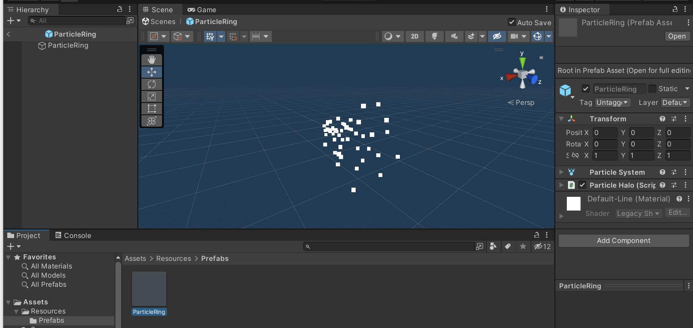
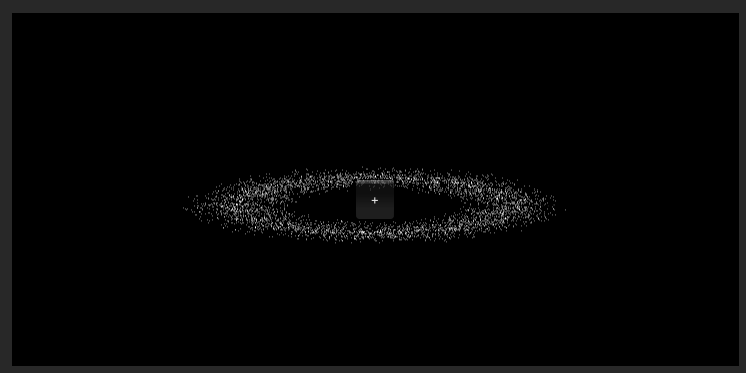
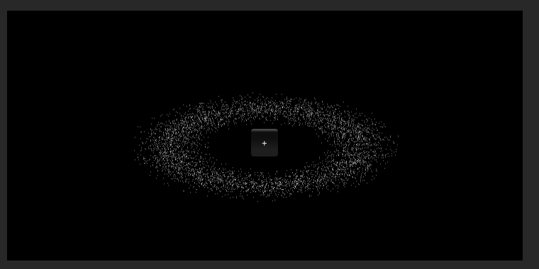
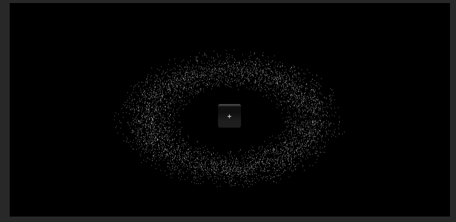
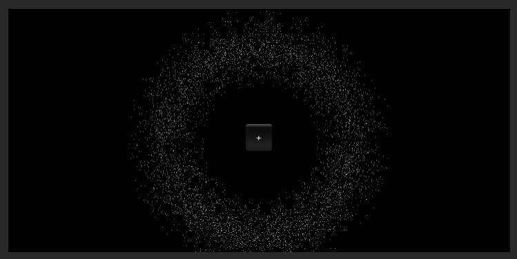

# 作业8

## 作业题目

3、参考 http://i-remember.fr/en 这类网站，使用粒子流编程控制制作一

些效果， 如“粒子光环”。


## 作业内容

### 一 预制体“粒子光环” Prefabs/ParticleRing

挂载了一个粒子系统和一个脚本ParticleHalo.cs



#### ParticleHalo.cs实现

##### 粒子坐标

```cs
public class CirclePosition
{
    public float radius = 0f, angle = 0f, time = 0f, startRadius = 0f;
    public CirclePosition(float radius, float angle, float time, float startRadius)
    {
        this.radius = radius;   // 半径
        this.angle = angle;     // 角度
        this.time = time;       // 时间
        this.startRadius = startRadius;
    }
}
```

##### 使用粒子流编程控制制作粒子光环

Start()方法：初始化粒子数组，粒子系统，梯度颜色控制器以及各粒子位置。

Update()方法：生成粒子光环（椭圆形），同时速度差分使粒子运动速度有差别。

```cs
public class ParticleHalo : MonoBehaviour
{
    private ParticleSystem particleSys;  // 粒子系统
    private ParticleSystem.Particle[] particleArr;  // 粒子数组
    private CirclePosition[] circle; // 极坐标数组

    public int mode;            // 粒子光环的形状(椭圆的a与b之比 = (mode +1) / 10.0f )

    public int count = 10000;       // 粒子数量
    public float size = 0.03f;      // 粒子大小
    public float minRadius = 5.0f;  // 最小半径
    public float maxRadius = 12.0f; // 最大半径
    public bool clockwise = false;   // 顺时针|逆时针
    public float speed = 2f;        // 速度
    public float pingPong = 0.02f;  // 游离范围
    // Start is called before the first frame update
    public Gradient colorGradient;
    void Start ()
    {   
        mode = 9;
        clockwise = false;
        // 初始化粒子数组
        particleArr = new ParticleSystem.Particle[count];
        circle = new CirclePosition[count];
        // 初始化粒子系统
        particleSys = this.GetComponent<ParticleSystem>();
        particleSys.startSpeed = 0;            // 粒子位置由程序控制
        particleSys.startSize = size;          // 设置粒子大小
        particleSys.loop = false;
        particleSys.maxParticles = count;      // 设置最大粒子量
        particleSys.Emit(count);               // 发射粒子
        particleSys.GetParticles(particleArr);
        // 初始化梯度颜色控制器
        GradientAlphaKey[] alphaKeys = new GradientAlphaKey[3];
        alphaKeys[0].time = 0.0f; alphaKeys[0].alpha = 0.0f;
        alphaKeys[1].time = 0.01f; alphaKeys[1].alpha = 1.0f;
        alphaKeys[2].time = 0.99f; alphaKeys[2].alpha = 1.0f;
        GradientColorKey[] colorKeys = new GradientColorKey[2];
        colorKeys[0].time = 0.0f; colorKeys[0].color = Color.white;
        colorKeys[1].time = 1.0f; colorKeys[1].color = Color.white;
        colorGradient.SetKeys(colorKeys, alphaKeys);
 
        RandomlySpread();   // 初始化各粒子位置
    }

    private int tier = 10;  // 速度差分层数
    public float time = 0f;
    void Update ()
    {
        time = (time + Time.deltaTime > 5 ? 5 : time + Time.deltaTime);
        int appear_count = (int)(time / 5.0f * count);
        for (int i = 0; i < count; i++)
        {
            if (clockwise)  // 顺时针旋转
                circle[i].angle -= (i % tier + 1) * (speed / circle[i].radius / tier);
            else            // 逆时针旋转
                circle[i].angle += (i % tier + 1) * (speed / circle[i].radius / tier);
 
            // 保证angle在0~360度
            circle[i].angle = (360.0f + circle[i].angle) % 360.0f;
            float theta = circle[i].angle / 180 * Mathf.PI;
            // 粒子在半径方向上游离
            circle[i].time += Time.deltaTime;
            circle[i].radius += Mathf.PingPong(circle[i].time / minRadius / maxRadius, pingPong) - pingPong / 2.0f;
            if (circle[i].radius < circle[i].startRadius) {
                circle[i].radius += 0.001f;
            }
            else {
                circle[i].radius -= 0.001f;
            }
            if (circle[i].radius > maxRadius) {
                circle[i].radius -= 0.01f;
            }
            if (circle[i].radius < minRadius) {
                circle[i].radius += 0.01f;
            }
            // 通过这一句的参数方程改变粒子光环的形状
            particleArr[i].position = new Vector3(circle[i].radius * Mathf.Cos(theta), (mode +1) / 10.0f * circle[i].radius * Mathf.Sin(theta), 0);
            // 在这里实现粒子光环的逐渐生成
            if (i > appear_count) {
                particleArr[i].startColor = colorGradient.Evaluate(0f);
            }
            else {
                particleArr[i].startColor = colorGradient.Evaluate(circle[i].angle / 360.0f);
            }
            
        }
     
        particleSys.SetParticles(particleArr, particleArr.Length);
    }

    // 初始化各粒子位置
    void RandomlySpread()
    {
        for (int i = 0; i < count; ++i)
        {   // 随机每个粒子距离中心的半径，同时希望粒子集中在平均半径附近
            float midRadius = (maxRadius + minRadius) / 2;
            float minRate = Random.Range(1.0f, midRadius / minRadius);
            float maxRate = Random.Range(midRadius / maxRadius, 1.0f);
            float radius = Random.Range(minRadius * minRate, maxRadius * maxRate);
            // 随机每个粒子的角度
            //float angle = Random.Range(0.0f, 360.0f);
            float angle = (float)i / count * 360.0f;
            // 将角度转换为0~2*PI
            float theta = angle / 180 * Mathf.PI;
            // 随机每个粒子的游离起始时间
            float time = Random.Range(0.0f, 360.0f);

            circle[i] = new CirclePosition(radius, angle, time, radius);
            particleArr[i].position = new Vector3(circle[i].radius * Mathf.Cos(theta), (mode +1) / 10.0f * circle[i].radius * Mathf.Sin(theta), 0);

        }
 
        particleSys.SetParticles(particleArr, particleArr.Length);
    }
}
```


### 二 场景控制器 SceneController

Start()方法：从预制体Prefabs/ParticleRing加载粒子光环到空对象ParticleRing。

OnGUI()方法：添加一个按钮，点击可以改变粒子光环的离心率，实现粒子光环形状的变化。

```cs
public class SceneController : MonoBehaviour
{
    public GameObject ParticleRing;
    // Start is called before the first frame update
    void Start()
    {
        ParticleRing = GameObject.Instantiate<GameObject>(Resources.Load<GameObject>("Prefabs/ParticleRing"), new Vector3(0, 0, 0), Quaternion.identity);
    }

    void OnGUI() {
        if (ParticleRing.GetComponent<ParticleHalo>().time >= 3) 
        {
            if (GUI.Button(new Rect(Screen.width/2-20,Screen.height/2-10,40,40), "+")) {
                ParticleRing.GetComponent<ParticleHalo>().mode = (ParticleRing.GetComponent<ParticleHalo>().mode +1)%10;
            }
        }
    }
}
```


### 三 结果

如图，点击按钮可使粒子光环的离心率发生变化：

|                                                              |                                                              |
| ------------------------------------------------------------ | ------------------------------------------------------------ |
|  |  |
|                                                              |                                                              |
|  |  |


### 四 运行

在场景中新建一个空对象，将脚本SceneController.cs挂载到空对象。
