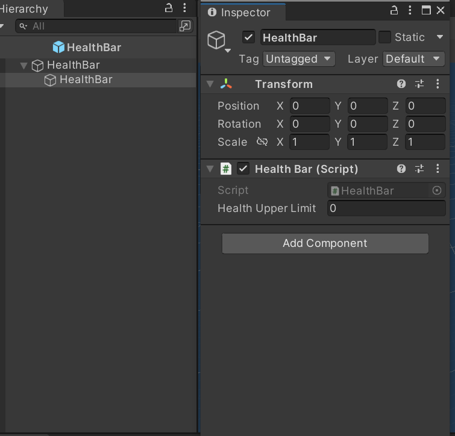
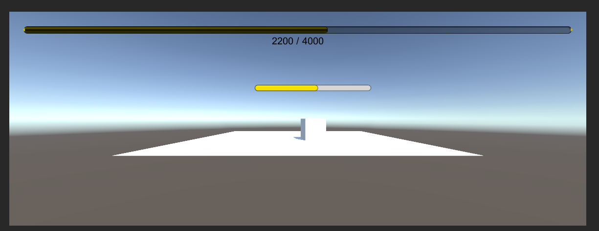

# 作业9

## 作业题目

1、血条（Health Bar）的预制设计。具体要求如下

• 使用 IMGUI 和 UGUI 实现

• 使用 UGUI，血条是游戏对象的一个子元素，任何时候需要面对主摄像机

• 分析两种实现的优缺点

• 给出预制的使用方法


## 作业内容

### • 使用 IMGUI 和 UGUI 实现

#### IMGUI实现

在OnGUI()中制作血条，血条颜色会随血量百分比发生变化。

获取键盘输入以改变血量：f血量减少，h血量增加，r回满血量。

```cs
public class HealthBar : MonoBehaviour
{

    public float healthUpperLimit;
    private float healthValue;
    private float hurtkey = 300f;
    private float healkey = 500f;

    void Start() {
        healthUpperLimit = 4000.0F;
        healthValue = healthUpperLimit;
    }

    void Update() {
        if(Input.GetKeyDown("f")){
            Hurt(hurtkey);
        }

        if(Input.GetKeyDown("h")){
            Heal(healkey);
        }

        if(Input.GetKeyDown("r")){
            Restart();
        }
    }

    public void Hurt(float h) {
        healthValue -= h;
        if(healthValue <= 0){
            healthValue = 0;
        }
    }

    public void Heal(float h) {
        if(healthValue > 0){
            healthValue += h;
            if(healthValue >= healthUpperLimit) {
                healthValue = healthUpperLimit;
            }
        }
    }

    public void Restart(){
        healthUpperLimit = 4000.0F;
        healthValue = healthUpperLimit;
    }

    void OnGUI() {

        GUIStyle healthTextStyle = new GUIStyle();
        healthTextStyle.fontSize = 20;
        healthTextStyle.alignment = TextAnchor.MiddleCenter;
        
        if(healthValue < healthUpperLimit * 0.3) {
            GUI.color = Color.red;
        }
        else if(healthValue < healthUpperLimit * 0.6) {
            GUI.color = Color.yellow;
        }
        else {
            GUI.color = Color.green;
        }
        
        GUI.HorizontalScrollbar(new Rect(30, 30, Screen.width - 60, 30), 0.0F, healthValue, 0.0F, healthUpperLimit);
        GUI.Label(new Rect(30, 50, Screen.width - 60, 20), healthValue.ToString() + " / " + healthUpperLimit.ToString(), healthTextStyle);
        
    }

}

```


#### UGUI 实现

使用Slider制作血条。

为了使任何时候需要面对主摄像机：

```cs
slider.direction = Slider.Direction.LeftToRight;
slider.transform.rotation = Camera.main.transform.rotation;
```

具体代码如下：

```cs
public class HealthBar2 : MonoBehaviour
{
    public Slider slider;
    private float hurtkey = 300f;
    private float healkey = 500f;

    void Start() {
        slider.maxValue = 4000.0F;
        slider.minValue = 0F;
        slider.value = slider.maxValue;
    }

    void Update() {
         if(Input.GetKeyDown("f")){
            Hurt(hurtkey);
        }

        if(Input.GetKeyDown("h")){
            Heal(healkey);
        }

        if(Input.GetKeyDown("r")){
            Restart();
        }

        slider.direction = Slider.Direction.LeftToRight;
        slider.transform.rotation = Camera.main.transform.rotation;

        if(slider.value <= 0.3 * slider.maxValue){
            slider.fillRect.transform.GetComponent<Image>().color = Color.red;
        }
        else if(slider.value <= 0.6 * slider.maxValue){
            slider.fillRect.transform.GetComponent<Image>().color = Color.yellow;
        }
        else{
            slider.fillRect.transform.GetComponent<Image>().color = Color.green;
        }
    }

    public void Hurt(float h) {
        slider.value -= h;
        if(slider.value <= 0){
            slider.value = 0;
        }
    }

    public void Heal(float h) {
        if(slider.value > 0){
            slider.value += h;
            if(slider.value >= slider.maxValue) {
                slider.value = slider.maxValue;
            }
        }
    }

    public void Restart(){
        slider.maxValue = 4000.0F;
        slider.value = slider.maxValue;
    }

}
```


### • 分析两种实现的优缺点

Unity UI 软件包 (UGUI)。这是一个较旧的、基于游戏对象的 UI 系统，可以使用它为游戏和应用程序开发运行时 UI。在 Unity UI 中，即可使用组件和 Game 视图来排列和定位用户界面并设置其样式。它支持高级渲染和文本功能 。

IMGUI。立即模式图形用户界面 (IMGUI) 是一个代码驱动的 UI 工 具包，它使用 OnGUI 函数以及实现它的脚本来绘制和管理用户界面。 可以使用 IMGUI 来创建脚本组件的自定义 Inspector，Unity 编辑器的扩展以及游戏内调试显示。不推荐用于构建运行时 UI。

#### IMGUI

##### **优点：**

- IMGUI 的存在符合游戏编程的传统
- 在修改模型，渲染模型这样的经典游戏循环编程模式中，在渲染阶段之后，绘制 UI 界面无可挑剔
- 这样的编程既避免了 UI 元素保持在屏幕最前端，又有最佳的执行效率，一切控制掌握在程序员手中

##### **缺点：**

- 传统代码驱动的 UI 面临效率低下
- 难以调试等

按 Unity 官方说法，IMGUI 主要用于以下场景：

- 在游戏中创建调试显示工具
- 为脚本组件创建自定义的 Inspector 面板。
- 创建新的编辑器窗口和工具来扩展 Unity 环境。

IMGUI系统通常不打算用于玩家可能使用并与之交互的普通游戏内用户界面。为此，应该使用 Unity 的基于 GameObject 的 UGUI 系统。 

#### UGUI

- 所见即所得（WYSIWYG）设计工具，设计师也能参与程序开发

- 支持多模式、多摄像机渲染

- UI 元素与游戏场景融为一体的交互

- 面向对象的编程

  

### • 预制的使用方法

| IMGUI预制: Resource/HealthBar                                | UGUI预制: Resource/HealthBar2                                |
| ------------------------------------------------------------ | ------------------------------------------------------------ |
|  |  |
| 使用方法：直接将预制HealthBar加到目标场景中                  | 使用方法：将预制HealthBar2添加为目标对象的子对象             |
|  |  |


### •结果展示

上方血条使用IMGUI预制HealthBar，不会跟随游戏对象。

下方血条使用UGUI预制HealthBar2，始终跟随游戏对象并面向相机。

| 初始                                                         | 血量减少                                                     |
| ------------------------------------------------------------ | ------------------------------------------------------------ |
|  |  |
| 血量增加                                                     | 血量回满                                                     |
|  |  |


