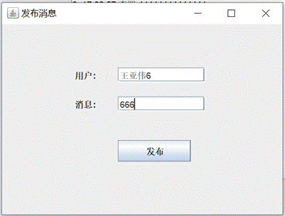
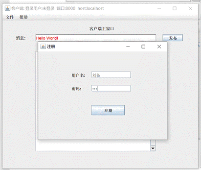

###  现为改进项目：

1. 使用mysql数据库（服务器）

2. 实现多个用户端同时在线

3. 经过测试，服务器和客户端在不同主机上也可正常运行，只需更改客户端的参数host（为服务器的ip），可以在源码中修改，也可以在客户端的文件/设置中修改，如下图：

    

### 原始项目如下：

​		使用Access数据库，

​        未能实现多个客户端同时在线

#### 【实验题目】**大作业--聊天程序**

【实验目的】掌握Java的多线程、网络、数据库和GUI编程方法，设计一个功能完整的Java应用程序。

【实验说明】

 

【功能描述】

​     

 

n  本程序为一个多人聊天程序，每个用户都可以发送消息，所有用户都可以收到，见上图，功能类似QQ。

n  用户在登录后才能发送消息，登录时服务器要*检测用户是否存在，密码是否正确，是否重复登录*。

n  登录后客户端立即从服务器取到最新的十条消息（所有消息都保存在数据库里）。

n  用户可以取消登录或退出。

n  可以注册新用户。

n  在服务器绑定端口后客户端才能登录。服务器可以解除绑定。服务器显示当前登录用户和他们发布的消息。

 

【技术参考】

n  每条消息的第一个字节为类型，每条消息以回车换行结束("\r\n")。

n  s.substring(0,1)取到字符串s的第一个字符, s.substring(1)取到剩余字符，s.substring(1, s.length() - 2)取到不含回车换行的剩余字符。substring的第二个参数是最后一个字符的索引值(从0开始)加1。

n  a&&b(短路与, a为false时不计算b)   a||b(短路或) !a(非) 

采用if(s!=null && s.substring(0,1).equals("1")) then ... ，可以防止s为null时出错。

n  执行套接字函数accept()和readUTF()会阻塞,需要用单独的线程执行。

n  客户端程序：连接并登录成功后，开一个子线程，循环执行readUTF()接收服务器的消息。主线程用于界面操作。

n  服务器程序：用一个子线程循环执行accept()，得到客户端套接字并确认用户之后再用一个子线程循环执行readUTF()接收客户端的消息，并把收到的消息转发给所有的客户端。每个客户端一个子线程。主线程用于界面操作。要用一个ArrayList<HashMap<String,Object>>登记所有的已登录客户端信息：用户名和套接字（可以使用一个对象Sock，见“例程介绍”）。

n  服务器用户验证：检测用户是否注册（从数据库中验证），密码是否正确（从数据库中验证），是否重复登录（利用ArrayList保存的登录用户验证）

n  采用access数据库msg.mdb，需要安装MS Office的Access进行管理和访问。

n  数据域设置为私有，采用setXXX()和getXXX()访问数据域。

例，

 **void** setUserName(String userName) {

​     **this**.userName = userName;

​     setTitle();

   }

 

   String getUserName() {

​     **return** **this**.userName;

   }

 

 

【例程介绍】

n  J开头的都可以执行。要先全部运行一遍并读懂程序。

n  JSubFrameTest：演示调用子窗口输入并返回参数。JPasswordField于JTextField的使用方法相同，用于密码输入，取值方法为String.valueOf(pass.getPassword())。

n  JMenuTest演示菜单以及对话框的使用。

n  JShowData： 把数据插入数据库并从数据库中取数。access数据库SQL语句使用VB函数。
 *对于CONN_STRING包含的路径,这里为.(当前路径，项目的根目录)，Eclipse运行Java时会设置参数classpath为.。可执行Jar文件的classpath放在文件MANIFEST.MF中。*

n  DataConn.java 用于访问数据库的类。

n  JTcpServerEcho：服务器，与客户端建立连接后接收客户端的消息，并关闭连接。

n  JTcpClientEcho：与服务器建立连接后输入并发送消息，然后接收服务器的消息，关闭连接。

n  Sock：最好使用这个类操作套接字，而不要像JTcpServerEcho和JTcpClientEcho直接操作套接字。这里没有其他例程用到。

 

【实验内容】

   1、运行Server.jar和三次Client.jar。先解压rar文件，然后直接点击运行(需要安装Java)。

​     三个客户端进行一些对话之后截屏。（Java版本号为17）

​     参考截屏：

​       

 

​    你的运行截屏：

​      

2、仔细阅读*本实验报告*和*技术参考*。

 

3、在Eclipse中阅读和运行其他例程并截屏（包含子窗口和对话框）：

  JSubFrameTest：

  JMenuTest：

  JShowData：

 

4、在Eclipse中阅读和运行JTcpServerEcho.java和JTcpClientEcho.java。

  运行结果截屏：

5、 编制TcpServerEcho.java和TcpClientEcho.java使得可以把子窗口输入的用户名和消息传给服务器，并在客户端的主窗口的接收编辑框中显示服务器的回应（包含时间，用户名和消息）。

   \* 参考程序：JTcpServerEcho.java和JTcpClientEcho.java，

​         JSubFrameTest.java，FrameLogin.java

   \* 由自己设计窗口，客户端需要主窗口和子窗口，服务器可以不加窗口。

   \* 客户端每次发送需要*建立连接、发送数据、接收数据、关闭连接*。

   \* 发送 -- 用户名+"#"+消息, 接收 -- String[] s = recv.split("#"); //s[0]用户名 s[1]消息

 

  运行结果截屏：

服务器没有窗口。

**客户端主窗口**：

点击“发布”按钮进入客户端子窗口；

**客户端子窗口**：

在输入框中输入用户名和消息内容，

然后点击“发布”按钮进行发送（*建立连接、发送数据、接收数据、关闭连接*）

然后此时的**客户端主窗口**：

 此时客户端主窗口新增一条消息记录，正是我们刚刚发布的消息，可见我们成功实现了：客户端子窗口发送（用户名+"#"+消息）；客户端子窗口接受服务器的回应（用户名+"#"+消息+"#"+时间）；客户端主窗口显示服务器的回应。

 

6、在上一步的基础上，要求服务器把客户端的消息插入数据库的msg表（用户名，消息，时间），并把从数据库读取倒数第二条消息作为回应（时间，用户名和消息）。

   \* 参考例程：JShowData.java,DataConn.java

​    \* 数据库导入方法见【Eclipse使用说明】

   \* 数据库定位的当前目录(.)是项目根目录或者是可执行jar包所在的目录。

  

  运行结果截屏：

**服务器（只用一个简单地窗口用来表示服务器程序在运行）：**

****

**客户端：**

**发布第1条消息：**

 

**发布第2条消息：**

发布第3条消息：

 

使用Access查看Msg表：

成功实现了消息的插入，以及返回倒数第二条消息（order by ID，即上一条发布的消息）作为回应。

 

 

7、把上一步的程序打包为可以执行jar：ServerEcho.jar和ClientEcho.jar，参考【Eclipse使用说明】。

**本次实验我使用VScode作为IDE，通过VScode上的java插件来打可执行包：**

**打包ClientEcho.jar：**

**第1、2步：选择要打包的程序**

**第3步：选择项目依赖项**

**第4步：给打包的可执行包改名**

由于打包出来是项目的名字（图中的vscode_java2.jar）,我们将其重命名为ClientEcho.jar

 

**类似地，打包ServerEcho.jar：**

**第1、2步略；选择要打包的程序**

**第3步：****选择项目依赖项**

****

**第4步：改名**

 

**结果：**

****

**可见我们能够正常运行这两个jar包：**

****

**并且能正常修改数据库中的Msg表：**

****

 

8、用多线程方法实现聊天程序TcpServerChat.java和TcpClientChat.java，参照第1步的功能。

 \* 仔细阅读【技术参考】和编程参考.doc

 运行结果截屏：

**服务器窗口：**

**服务器端口绑定：**

**客户端：**

**注册：**

**登录：**

**登录结果：可见服务器的登录用户列表增加了该用户**

**发布消息：**

**退出登录：**

**退出登录之后的客户端和服务器：服务器在线用户列表减少了该用户**

**登录另一个用户：**

**该用户发布消息：**

**退出再重新进入程序：**

**发布几条消息：**

可以看到客户端会加载全部的消息记录，而服务器只会显示服务器程序本次启动后的消息记录：

**使用Access查看此时的数据库**：

Msg表：

Users表：

可见我们成功地对数据库进行了正确的操作。

 

9、把上一步的程序打包为可以执行jar：ServerChat.jar和ClientChat.jar，参考【Eclipse使用说明】。

按第7步的步骤：

 

 

【完成情况】

是否完成以下步骤？(√完成 ×未完成)

 1 [√] 2 [√]  3 [√] 4 [√] 5 [√] 6 [√] 7 [√] 8 [√] 9 [√]

 

【实验体会】

写出实验过程中遇到的问题，解决方法和自己的思考;并简述实验体会（如果有的话）。

问题1：实验3在Eclipse中运行JShowData.java时没有显示内容

解决方法：因为读取数据库要使用jar包lib/Access_JDBC30.jar，我没有编写.classpath,采用的是原项目文件夹的.classpath，所以我使用vscode作为本次项目的IDE，通过编写.vscode/ settings.json

{

  "java.project.referencedLibraries": [

​    "lib/**/*.jar",

  ],

  "java.project.sourcePaths": [

​    "src"

  ],

  "java.project.outputPath": "bin",

 

}

来构建本次的项目结构,其中lib文件夹就用来存放我们引用的jar包。

