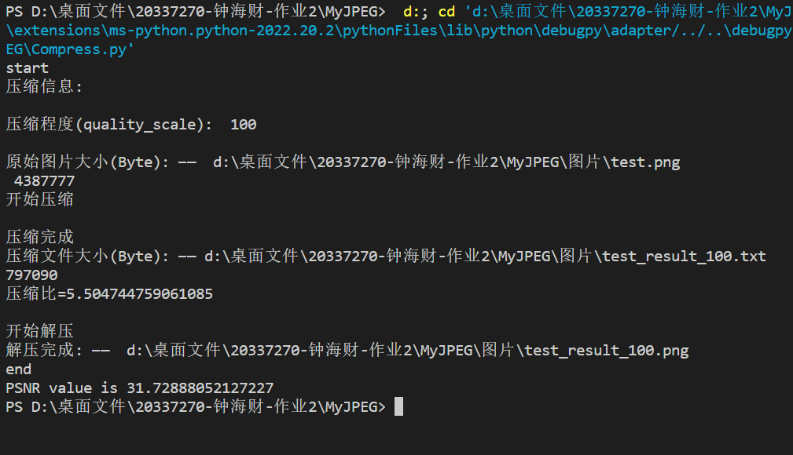

# Readme

## 0、项目依赖包

```python
import numpy as np
import cv2
import os
from PIL import Image
from pathlib import Path
```


## 1、代码运行

直接运行Compress.py

可在运行前修改参数quality_scale选择压缩程度，修改参数img_path1选择压缩的原图像

```python
if __name__ == '__main__':
    # 选择压缩质量，参数1~999，数字越大压缩程度越高
    quality_scale = 100
    # 原始图片路径
    img_path1 = Path(__file__).parent / "./图片/test.png"
    ...
    ...
  
```

main.py实现了一个简易图形界面，有点卡。


## 2、 运行结果

生成两个文件：

test_result_N.txt  (文件名中的N表示此时的压缩参数quality_scale为N)

test_result_N.png

会在控制台输出压缩信息，如各文件大小、压缩比、PSNR，如下图：

 


## 3、代码注释

在类MyJPEG里实现了压缩和解压缩函数，

压缩函数为 MyJPEG.Compress(img_path1)，img_path1为原始图像路径

```python
    # 压缩
    def Compress(self, filename):
        # 根据路径image_path读取图片，并存储为RGB矩阵
        image = Image.open(filename)
        # 获取图片宽度width和高度height
        self.width, self.height = image.size
        image = image.convert('RGB')
        image = np.asarray(image)
        r, g, b = image[:, :, 0], image[:, :, 1], image[:, :, 2]
        # 将图像RGB转YUV
        y, u, v = self.__Rgb2Yuv(r, g, b)
        # 对图像矩阵进行DCT变换+量化+DPCM差分编码
        y_blocks = self.__Encode(y, self.__lt)
        u_blocks = self.__Encode(u, self.__ct)
        v_blocks = self.__Encode(v, self.__ct)
        # 对图像小块进行Zig编码和RLc编码
        y_code = self.__Rlc(self.__Zig(y_blocks))
        u_code = self.__Rlc(self.__Zig(u_blocks))
        v_code = self.__Rlc(self.__Zig(v_blocks))
        # 计算VLI可变字长整数编码并写入文件，未实现Huffman编码
        # 写入文件
        tfile = os.path.splitext(filename)[0] + "_result_" + str(self.quality_scale) + ".txt"
        if os.path.exists(tfile):
            os.remove(tfile)
        # 写入图片的大小
        with open(tfile, 'wb') as o:
            o.write(self.height.to_bytes(2, byteorder='big'))
            o.flush()
            o.write(self.width.to_bytes(2, byteorder='big'))
            o.flush()
            o.write((len(y_code)).to_bytes(4, byteorder='big'))
            o.flush()
            o.write((len(u_code)).to_bytes(4, byteorder='big'))
            o.flush()
            o.write((len(v_code)).to_bytes(4, byteorder='big'))
            o.flush()
            o.write(self.quality_scale.to_bytes(4, byteorder='big'))
            o.flush()
        # 写入图片的YUV 3个通道
        self.__Write2File(tfile, y_code, u_code, v_code)
```

解压函数为 MyJPEG.Decompress(img_path2)，img_path2为压缩文件路径

```python
	# 解压
    def Decompress(self, filename):
        y_dcode, u_dcode, v_dcode = self.__ReadFile(filename)
        # RLC解码，逆Z字形
        y_blocks = self.__Zag(self.__IRlc(y_dcode))
        u_blocks = self.__Zag(self.__IRlc(u_dcode))
        v_blocks = self.__Zag(self.__IRlc(v_dcode))
        # DPCM解码，逆量化，逆DCT变换
        y = self.__Decode(y_blocks, self.__lt)
        u = self.__Decode(u_blocks, self.__ct)
        v = self.__Decode(v_blocks, self.__ct)
        # 颜色空间从YUV转换回RGB
        r, g, b = self.__Yuv2Rgb(y, u, v)
        r = Image.fromarray(r).convert('L')
        g = Image.fromarray(g).convert('L')
        b = Image.fromarray(b).convert('L')
        image = Image.merge("RGB", (r, g, b))
        new_name = os.path.splitext(filename)[0] + ".png"
        path1 = Path(__file__).parent / new_name
        image.save(path1, "png")
        # image.show()
```


### 3.1 颜色模式转换（RGB <—> YUV）

使用相应的转换公式进行RGB颜色模式到YUV颜色模式的相互转换：

```python
    def __Rgb2Yuv(self, r, g, b):
        # 从图像获取YUV矩阵
        y = 0.299 * r + 0.587 * g + 0.114 * b
        u = -0.1687 * r - 0.3313 * g + 0.5 * b + 128
        v = 0.5 * r - 0.419 * g - 0.081 * b + 128
        return y, u, v

    def __Yuv2Rgb(self, y, u, v):
        r = (y + 1.402 * (v - 128))
        g = (y - 0.34414 * (u - 128) - 0.71414 * (v - 128))
        b = (y + 1.772 * (u - 128))
        return r, g, b
```


### 3.2 下采样 与 上采样

由于UV通道进行了下采样，UV通道宽度和高度分别降低为原来的1/2，所以我们需要在下采样先将图片的宽度和高度都补成16的倍数。

最后在上采样之后，需要将图像还原为原图像大小。

填充与逆填充使用如下函数：

```python
    # 图片填充
    def __Fill(self, matrix):
        # 图片的长宽都需要满足是16的倍数（采样长宽会缩小1/2）
        # 图像压缩三种取样方式4:4:4、4:2:2、4:2:0
        fh, fw = 0, 0
        if self.height % 16 != 0:
            fh = 16 - self.height % 16
        if self.width % 16 != 0:
            fw = 16 - self.width % 16
        res = np.pad(matrix, ((0, fh), (0, fw)), 'constant', constant_values=(0, 0))
        return res
        
    # 逆填充，保证图片size不变
    def __IFill(self, matrix, h, w):
        matrix = matrix[:h, :w]
        return matrix
```

下采样：使用cv2.resize函数

先填充，再下采样

```python
        # 先对矩阵进行填充
        matrix = self.__Fill(matrix)
        # 4:2:0降采样，亮度Y不变，色度UV下采样
        if tag == self.__ct:
            matrix = cv2.resize(matrix, (matrix.shape[1]//2, matrix.shape[0]//2), 
                                interpolation=cv2.INTER_NEAREST)
```

上采样：使用cv2.resize函数

先上采样，再分割出原图像大小的矩阵

```python
         # 上采样：将下采样的色度UV通道还原为原图像大小
        if tag == self.__ct:
            # 插值方式：双线性插值、最近邻插值——cv2.INTER_LINEAR_EXACT cv2.INTER_NEAREST
            matrix = cv2.resize(matrix, (matrix.shape[1] * 2, matrix.shape[0]*2), 
                                interpolation=cv2.INTER_LINEAR)
        # 逆填充，分割出原图像大小
        res = self.__IFill(matrix, self.height, self.width)
```


### 3.3 离散余弦变换及其逆变换

使用cv2.dct()和cv2.idct()进行离散余弦变换及其逆变换：

```python
# DCT变换
block = cv2.dct(blocks[i, j])
# 逆DCT变换
block = cv2.idct(blocks[i, j])
```


### 3.4 量化与逆量化

#### 量化

首先初始化量化表，改变压缩质量，量化表值越大，压缩程度越高。

self.lq_Table和self.cq_Table分别为标准亮度量化表和标准色度量化表，

self.\_\_lq和self.\_\_cq分别为重新计算的亮度量化表和色度量化表。

```python
    # 初始化量化表，改变压缩质量，参数1~999，数字越大压缩程度越高
    def init_Quantization_Table(self, quality_scale):
        self.quality_scale = quality_scale
        if quality_scale <= 0:
            quality_scale = 1
        elif quality_scale >= 1000:
            quality_scale = 999
        for i in range(64):
            tmp = int((self.lq_Table[i] * quality_scale + 100) / 100)
            if tmp > 255:
                tmp = 255
            self.__lq[i] = tmp 
            tmp = int((self.cq_Table[i] * quality_scale + 100) / 100)
            if tmp > 255:
                tmp = 255
            self.__cq[i] = tmp
```

量化则是将DCT变换的结果除以量化表得到量化矩阵

```python
        # DCT变换+数据量化
        for i in range(height // 8):
            for j in range(width // 8):
                # DCT变换
                block = cv2.dct(blocks[i, j])
                block = block.flatten(order='C')
                # 数据量化
                block[:] = np.round(np.divide(block, q_table)) # q_table为对应的量化表
                res.append(block)
```

#### 逆量化

逆量化则是矩阵的每个8*8小块都将乘以量化表，得到得结果再进行逆DCT变换。


### 3.5 DPCM编码与解码

因为Zigzag扫描排序不会改变DC系数的位置，所以

使用前面的公式：

```
DPCM编码
Delta[0] = DC[0]
Delta[n] = DC[n] - DC[n-1] , n>0

DPCM解码
DC[0] = Delta[0]
DC[n] = Delta[n] + DC[n-1], n>0
```

DPCM编码与解码函数如下:

```python
    # blocks[i][0] 为第i个8*8小块的DC系数
    # DPCM编码
    def __DPCM(self, blocks):
        preDc = 0
        for i in range(len(blocks)):
            nowDc = blocks[i][0]
            blocks[i][0] = nowDc - preDc
            preDc = nowDc
            
    # blocks[i][0] 为第i个8*8小块的差分系数
    # DPCM解码
    def __IDPCM(self, blocks):
        preDc = 0
        for i in range(len(blocks)):
            nowDc = blocks[i][0]
            preDc = nowDc + preDc
            blocks[i][0] = preDc
```


### 3.6 Zigzag扫描排序 与 逆Zigzag扫描排序

self.__zig为Z字表

self.__zag为逆Z字表

```python
    # Z字形扫描排序
    def __Zig(self, blocks):
        ty = np.array(blocks)
        tz = np.zeros(ty.shape)
        for i in range(len(self.__zig)):
            tz[:, i] = ty[:, self.__zig[i]]
        tz = tz.reshape(tz.shape[0] * tz.shape[1])
        return tz.tolist()
        
    # 逆Z字形
    def __Zag(self, dcode):
        dcode = np.array(dcode).reshape((len(dcode) // 64, 64))
        tz = np.zeros(dcode.shape)
        for i in range(len(self.__zag)):
            tz[:, i] = dcode[:, self.__zag[i]]
        rlist = tz.tolist()
        return rlist
```


### 3.7 RLC编码与解码

在JPEG编码中，RLC编码之后得到了一个（M,N）的数据对，其中M是两个非零AC系数之间连续的0的个数（即行程长度），N是下一个非零的AC系数的值。采用这样的方式进行表示，是因为AC系数当中有大量的0，而采用Zigzag扫描也会使得AC系数中有很多连续的0的存在，如此一来，便非常适合于用RLC进行编码。

RLC解码则是从一系列（M,N）的数据对 还原为8*8的小块中的数。

```python
    # RLC编码，行程编码
    def __Rlc(self, blist):
        res = []
        cnt = 0
        for i in range(len(blist)):
            if blist[i] != 0:
                res.append(cnt)
                res.append(int(blist[i]))
                cnt = 0
            elif cnt == 15:
                res.append(cnt)
                res.append(int(blist[i]))
                cnt = 0
            else:
                cnt += 1
        # 末尾全是0的情况
        if cnt != 0:
            res.append(cnt - 1)
            res.append(0)
        return res
    
    # RLC解码
    def __IRlc(self, dcode):
        rlist = []
        for i in range(len(dcode)):
            if i % 2 == 0:
                rlist += [0] * dcode[i]
            else:
                rlist.append(dcode[i])
        return rlist
```


### 3.8 解压的图像质量衡量

使用峰值信噪比(PSNR)进行图像质量的分析：PSNR的取值通常在0到100之间，单位是分贝（dB）PSNR的高低可以用来衡量压缩图像质量的好坏，一般认为PSNR值越高，图像质量就越好。

PSNR高于40dB说明图像质量极好（即非常接近原始图像），
在30—40dB通常表示图像质量是好的（即失真可以察觉但可以接受），
在20—30dB说明图像质量差；
最后，PSNR低于20dB图像不可接受。

计算代码如下：

```python
# 计算PSNR, 衡量解压图像质量
def compute_psnr(img_path1, img_path2):
    img1 = np.array(Image.open(img_path1))
    img2 = np.array(Image.open(img_path2))
    mse = np.mean((img1 - img2) ** 2)
    if mse == 0:
        psnr = 100
    else:
        max_pixel = 255.0
        psnr = 20 * np.log10(max_pixel / np.sqrt(mse))
    print("PSNR value is {}".format(psnr))
    return psnr
```


