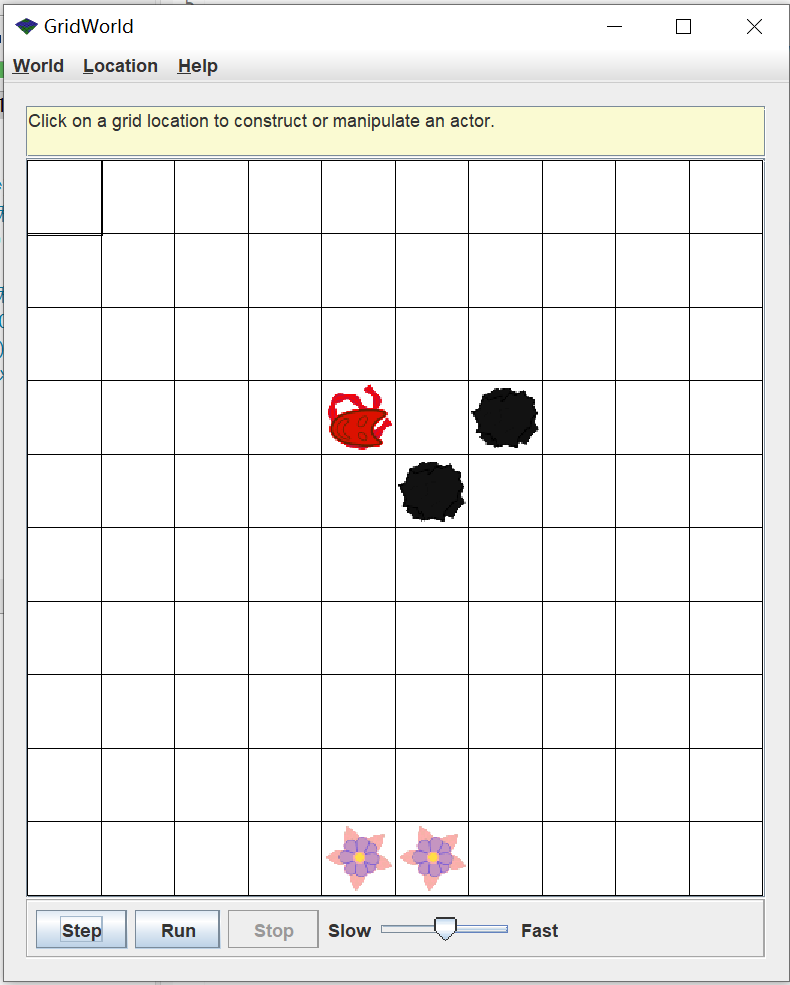
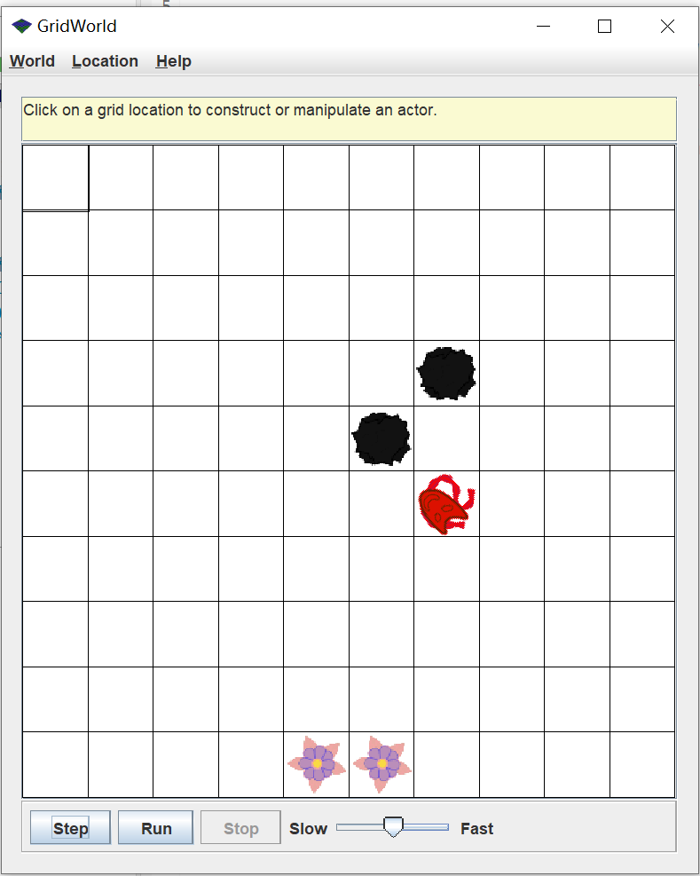
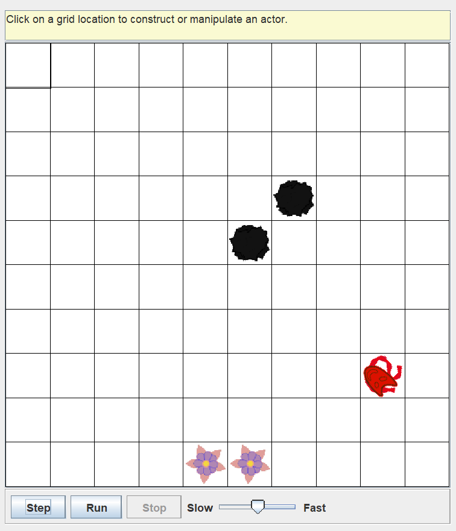
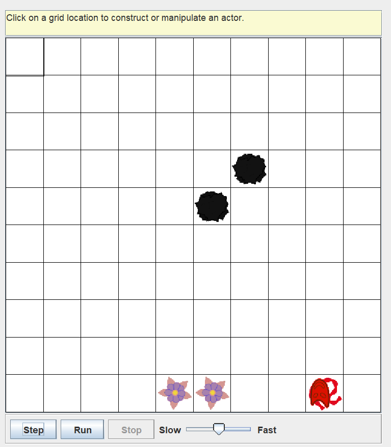
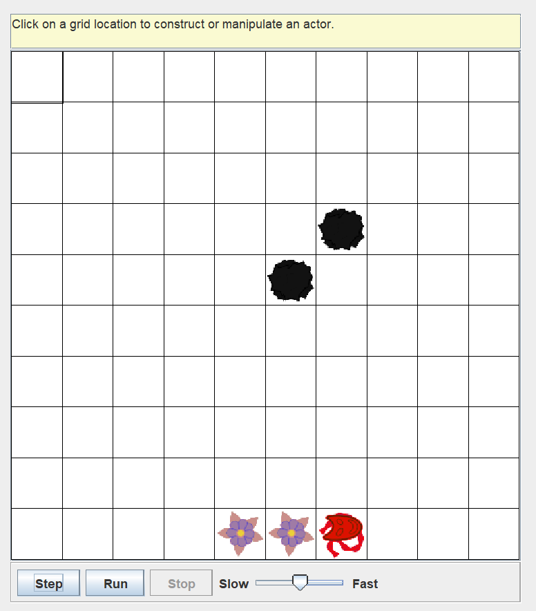
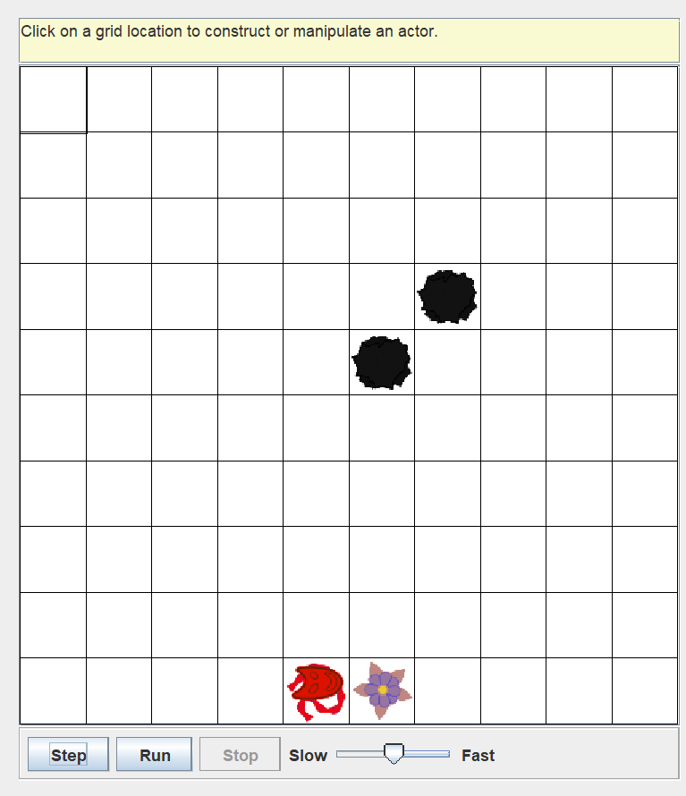
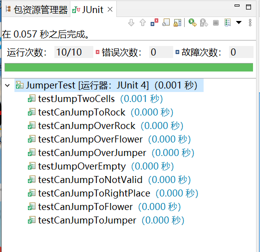
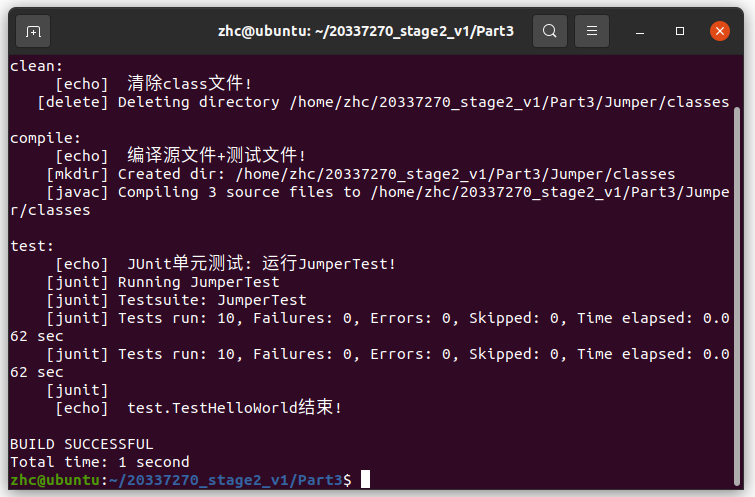
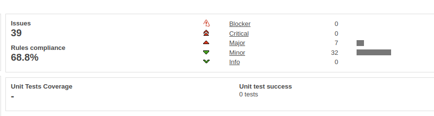

### TestReport

#### 零、代码运行方式：

解压后，在当前目录（Part3）下，在终端运行指令：

```
javac -classpath .:lib/* Jumper/*.java && java -classpath .:lib/*:Jumper JumperRunner
```


#### 一 、JumperRunner运行结果

| 初始：方向为EAST                                             | 前方为Rock1，不能跳到Rock1；于时转弯，并成功跳过Rock2        |
| ------------------------------------------------------------ | ------------------------------------------------------------ |
|  |  |
| 前方是网格外                                                 | 旋转并跳到合适位置                                           |
|  |  |
| 前方第1个、第2个单元格都是Flower                             | 可以跳过Flower1、跳到Flower2                                 |
|  |  |


#### 二、JUnit单元测试

**我编写的测试主要分位3类：**

1、测试jumper能否跳到正确的位置：

testJumpTwoCells和testCanJumpToRightPlace

2、测试jumper能否跳过第1个单元格（在其为空/Flower/Rock/Jumper的情况）：

testCanJumpOver* 共4个

3、测试jumper能否跳到第2个单元格（在其为空/Flower/Rock/Jumper的情况）：

testCanJumpTo* 共4个

**在eclipse运行JUnit单元测试的结果：全部通过测试**

 

使用ant+Junit测试结果：成功通过测试

在Part3目录下运行：ant test

 

#### 三、Sonar代码评估

**步骤**

cd $SONAR_HOME

./sonar.sh start 启动服务

在源文件目录下sonar-runner 运行

在http:\\\\localhost:9000 查看结果：通过评估！

 

 

最后 ./sonar.sh stop 停止服务

