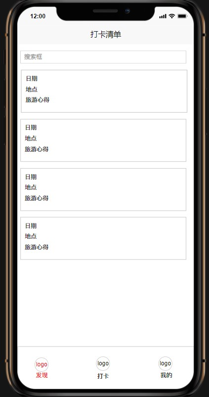
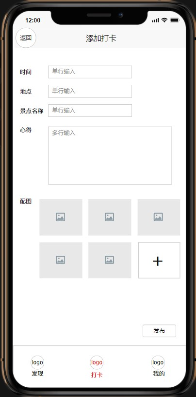
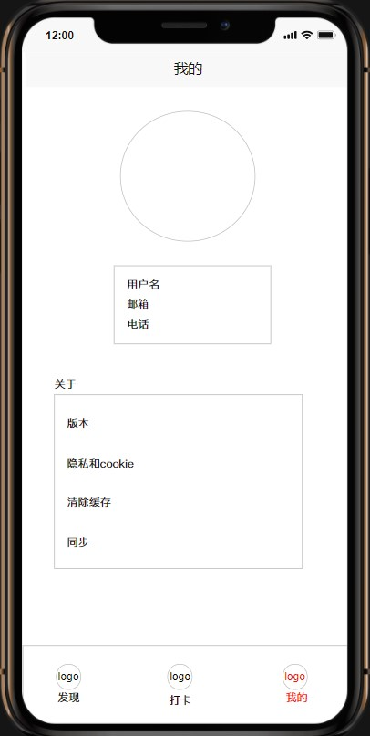
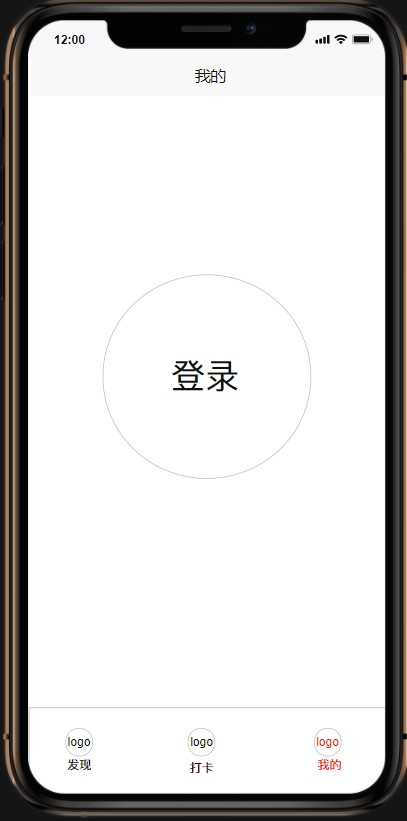

##  MOSAD_HW2
### 介绍
个人作业-UI组件布局及动画学习
### 开发环境
* Mac OS 
* Objective-C
* Xcode

### 时间要求

* 验收时间: 第6周实验课或提前
* PR时间: 第7周前

### 实验目的
1. 学习使用纯代码进行UI布局
2. 学习TableView，UICollectionView，UINavigationController，UICollectionController，UITabBarController等组件的使用，以及delegate和protocol的概念。
3. 学习使用UIView动画及Core Animation动画
### 实验内容
实现一个包含若干页面和子页面的“打卡”App，页面如下：
|发现页面|打卡页面|
|:--:|:--:|
| ||
|详细页面|我的页面|
|||
|我的页面（未登录）||
|||

要求如下：
1. 发现页面包含一个搜索框、一个打卡清单、一个添加按钮、一个底部导航
   - 页面的背景是渐变的，背景色从左上角到右下角渐变（颜色可自选）。
   - 底部的导航栏包含三个按钮，分别对应三个子页面，点击按钮切换到对应的页面。按钮在选中和未选中状态下图片和文字的颜色都不同。
   - 搜索框可以输入时间、地点对打卡信息进行快速检索。
   - 打卡清单是一个可以滚动的列表，默认显示全部打卡记录。打卡记录按时间倒序从上至下排列。滚动打卡清单时，在清单下方加入0.5s的加载动画。
   - 每个打卡记录为一个圆角矩形，点击某一个打卡记录可跳转查看详细信息。
2. 编辑页面包含若干个单行输入框、一个多行输入框，图片选取及两个按钮。
   - 点击配图处的加号，可以从相册中选择图片上传并展示，按照每行三张图的方式显示，要求图片之间的边距相等。
   - 点击发布按钮，先展示动画效果再跳转到发现页面。动画效果可以设计为在屏幕中央显示一个发布成功的弹窗，持续时间0.5s，然后跳转到发现页面显示最新添加的打卡记录。
3. 点击发现页面的任一一个打卡记录，进入详情页面，自行设计一个转场动画。
4. 我的页面包含用户头像、用户基本信息以及APP的通用信息和功能。
   - 用户头像为圆形，居中显示。
5. 未登录时的我的页面只有一个圆形的登录按钮，登录按钮水平居中、垂直居中。登录页面的背景是渐变的，背景色从中心向四周渐变。
6. 【加分】在以上基础上，鼓励适当优化，做出更自然、美观、友好的界面与动画。

### 验收内容
- 实验内容中要求的各个组件是否正确齐全显示
- 各个页面及子页面之间的正确跳转与切换
- 底部导航栏的是否正确显示
- 是否实现规定的动画效果

### 提交要求及命名格式

/src 存放项目文件

/report 存放项目报告

个人项目提交方式:

- 布置的个人项目先fork到个人仓库下；
- clone自己仓库的个人项目到本地目录；
- 在个人项目中，在src、report目录下，新建个人目录，目录名为“学号+姓名”，例如“12345678WangXiaoMing”；
在“src\12345678WangXiaoMing”目录下，保存项目，按要求完成作业;
- 实验报告以md的格式，写在“report\12345678WangXiaoMing”目录下；
- 完成任务需求后，Pull Request回主项目的master分支，PR标题为“学号+姓名”， 如“12345678王小明”；
- 一定要在deadline前PR。因为批改后，PR将合并到主项目，所有同学都能看到合并的结果，所以此时是不允许再PR提交作业的。

PS：clone项目后，不能删除或修改项目原有的所有目录和文件，否则PR项目会出错。