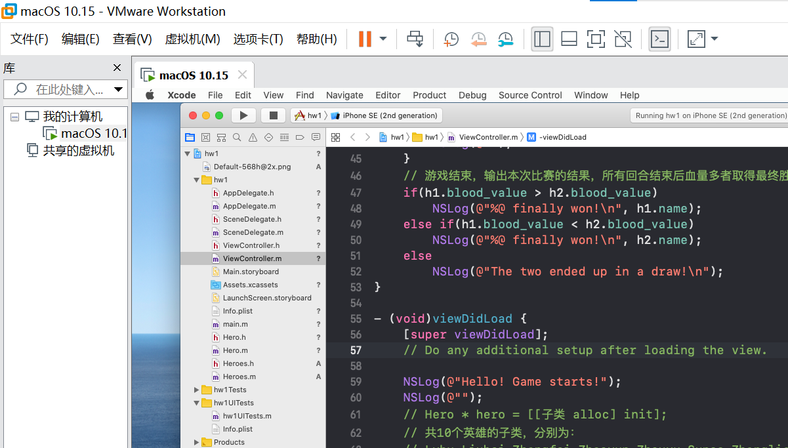
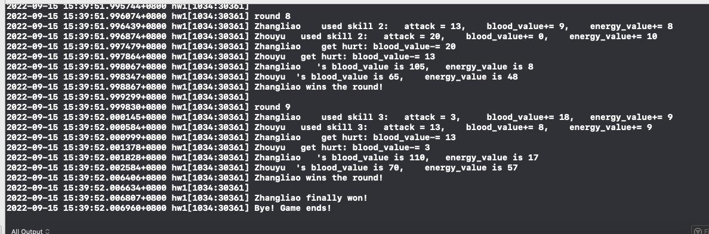
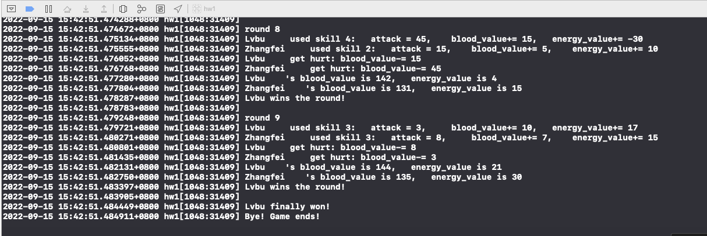
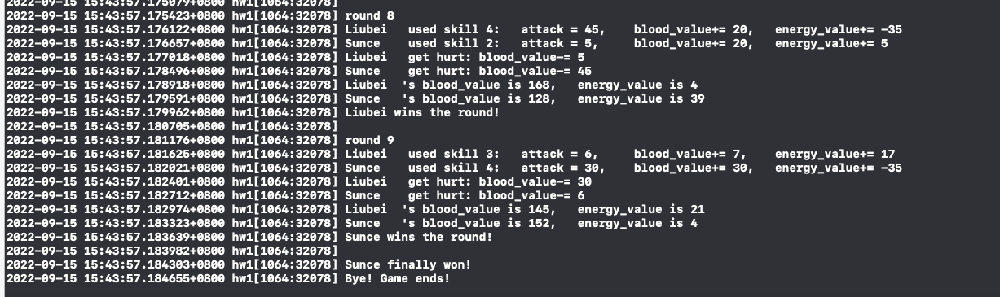
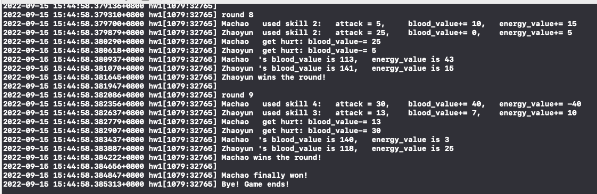

# **现代操作系统应用开发 实验1**

## 个人信息

【院系】计算机学院

【专业】软件工程

【学号】20337270

【姓名】钟海财

## 实验题目

###  任务

- 安装配置Mac OS和Xcode
- 熟悉Mac OS按键操作
- 熟悉Xcode项目结构，编译运行第一个Xcode项目，项目创建流程详见[tutorial](https://gitee.com/zhonghc_sysu/mosad-hw1/blob/master/manual/tutorial.md)
- 选取并设计N（N>10）个三国英雄

实现场景输出（log形式即可）：随机选择两名英雄，挑战M（M<=10）个回合，其中每个回合各英雄可发动不同技能，从而导致不同的结果发生（英雄各属性变化及每个回合的输赢）。

#### 要求

- 输出随机选择的英雄及其关键属性，输出单挑中每回合的过程、结果，以及最终胜负结果
- 需要用到多态
- 输出程序设计和运行过程中，相关设计体现的oo特性（数据隐秘性、封装性、继承、多态）

#### 验收要点

- 输出随机选择的英雄及其关键属性，输出单挑中每回合的过程、结果，以及最终胜负结果

- 类的设计与封装

- 类与类之间的继承关系与多态的体现

  

## 实验目的

1. 了解Objective-C语言的特性和OO特性（封装、继承、多态性）

2. 掌握Xcode项目的创建、编写和debug能力

3. 熟悉Xcode项目结构和OO特性（封装、继承、多态性）的使用

   

## 实验方案

### 使用到的软件工具与作用

软件工具：虚拟机VMware Workstation Pro；Xcode

作用：虚拟机用于安装mac OS，Xcode用于创建并运行实验项目。

### 方案的思想

首先创建一个英雄的父类Hero，具有英雄通用的属性（ 国家，名字，血量，能量，攻击力）和方法（初始化、输出状态、使用技能、状态改变、受伤）；

然后再创建一些英雄的子类继承父类Hero，并对父类中的一些方法进行重写，这里我只重写英雄**使用技能**的方法，从而实现不同英雄有不同的技能；

最后在任选两个英雄进行pk的时候，设计一个pk函数:

```objective-c
- (void)pk:(Hero*)h1
       and:(Hero*)h2
    rounds:(int)m; // PK的回合数
```

子类英雄的实例都分别用一个父类指针（Hero*）指向，利用多态性，从而pk函数可以进行任意两个子类英雄的PK，实现了PK函数的接口复用。


### 相关原理

#### 函数重载：

子类可以重写父类中的函数。

#### Objective-C语言的OO特性（封装、继承、多态性）：

封装：在构造英雄的父类Hero时使用

继承：子类英雄继承父类Hero时使用

多态性：在任选两个子类英雄进行pk的时候，设计一个pk函数，子类英雄的实例都分别用一个父类指针（Hero*）指向，利用多态性，从而pk函数可以进行任意两个子类英雄的PK，实现了PK函数的接口复用。


### 程序流程

主程序为函数 - (void)viewDidLoad：

**首先**初始化两个英雄子类的对象，都分别使用父类指针来指向；

```objective-c
    Hero * h1 = [[Zhangliao alloc] init];
    Hero * h2 = [[Sunce alloc] init];
```

**然后**对这两个对象调用父类的初始化函数进行初始化；

```objective-c
// 英雄初始化：国家，名字，初识血量，初始能量
    [h1 initWithC:c1 andN:n1 andB:b1 andE:e1];
    [h2 initWithC:c2 andN:n2 andB:b1 andE:e1];
```

**然后**调用PK函数，让这两个子类对象进行pk：

```objective-c
[self pk:h1 and:h2 rounds:9];
```

​		在PK函数中，两个子类英雄对象进行 n=9 个回合的pk（调用相关类方法）：

​			1.分别使用技能，并输出使用技能后的状态改变（攻击力、血量、能量）；

```objective-c
        // 两个英雄分别根据回合数i和能量值使用技能
        [h1 skills:i];
        [h2 skills:i];
```

​			2.分别受到伤害，并输出收到的伤害值，伤害值为对方英雄本回合使用技能后的攻击力；

```objective-c
        // 两个英雄分别受伤
        [h1 getHurt: h2.attack];
        [h2 getHurt: h1.attack];
```

​			3.分别输出本回合结束后的状态；

```objective-c
        // 这回合结束两英雄的状态
        [h1 PKOneUnit];
        [h2 PKOneUnit];
```

​			4.根据本回合结束后剩余血量（多者获胜）选出本回合的获胜者。

​		在9个回合结束后，根据最后一回合结束后的剩余血量选出本次比赛的获胜者（即最后一回合的获胜者）。


### 算法和数据结构

#### 算法：

英雄根据回合数 **i** 和能量值使用技能，规则为：

1. 每个英雄都有3个普通技能（skill1-3）和1个大招（skill4），这些技能都在重写的类方法\- (void)skills:(int)round里，根据条件（回合数 **i** 和能量值）判断使用哪一个。

2. 普通技能会积蓄能量，当能量值超过一个界限时，会释放大招，并消耗一定的能量。

3. 每个英雄每回合开始时只能使用一次技能，首先判断能量值是否满足使用大招的条件，如果满足条件则使用大招，否则使用一个普通技能（skill1-3），根据回合数 **i** 选择使用第（**i**%3 +1）个普通技能。

#### 数据结构：

除了英雄的父类和子类外，均为基本数据类型（NSString，NSInteger，int）


### 程序关键模块，结合代码在程序中的位置进行解释

#### 模块一：父类Hero的声明与实现(Hero.h和Hero.m)

```objective-c
@interface Hero : NSObject{
}
// 国家，名字，血量，能量，攻击力
@property(nonatomic) NSString *country;
@property(nonatomic) NSString *name;
@property(nonatomic) NSInteger blood_value;
@property(nonatomic) NSInteger energy_value;
@property(nonatomic) NSInteger attack;
// 初始化：国家，名字，血量，能量
- (void)initWithC: (NSString*) s1
             andN: (NSString*) s2
             andB: (NSInteger) s3
             andE: (NSInteger) s4;
// 输出该回合结束的英雄的状态：血量，能量
- (void)PKOneUnit;
// 英雄在回合round使用技能，由子类进行重写
- (void)skills:(int)round;
// 英雄使用技能后，状态（攻击力，血量，能量）发生改变
- (void)changeStateWithAttack:(NSInteger) a
                         andB:(NSInteger) b
                         andE:(NSInteger) e;
// 英雄受伤：血量blood_value -= 敌方英雄本回合的攻击力attack
- (void)getHurt:(NSInteger) attacks;

```

```objective-c
#import "Hero.h"
@implementation Hero
@synthesize country = _country;
@synthesize name = _name;
@synthesize blood_value = _blood_value;
@synthesize energy_value = _energy_value;
@synthesize attack = _attack;

- (void)initWithC: (NSString*) s1
             andN: (NSString*) s2
             andB: (NSInteger) s3
             andE: (NSInteger) s4
{
    _country = s1;
    _name = s2;
    _blood_value = s3;
    _energy_value  = s4;
    _attack = 0;
    NSLog(@"%@\t's country is %@,\t blood_value is %ld,\t energy_value is %ld",_name, _country, _blood_value, _energy_value);
    
}

- (void)skills:(int)round{
    NSLog(@"This is class Hero!");
}

- (void)changeStateWithAttack:(NSInteger) a
                         andB:(NSInteger) b
                         andE:(NSInteger) e{
    _attack = a;
    _blood_value += b;
    _energy_value += e;
}

- (void)getHurt:(NSInteger) attacks{
    NSLog(@"%@\t get hurt: blood_value-= %ld",_name, attacks);
    _blood_value -= attacks;
}

- (void)PKOneUnit{
    NSLog(@"%@\t's blood_value is %ld,\t energy_value is %ld",_name, _blood_value, _energy_value);
}
@end
```


#### 模块二：英雄子类的声明与实现(Heroes.h和Heroes.m)

这里以一个子类Lvbu为例，其余子类结构和Lvbu相同，只有技能的数值不同。

共10个英雄的子类，分别为 Lvbu， Liubei， Zhangfei， Zhaoyun， Zhouyu， Sunce， Zhangliao， Machao， Huaxiong， Guanyu

```objective-c
#import "Hero.h"
@interface Heroes : NSObject{
}
@end

@interface Lvbu : Hero {
// 子类，继承基类Hero，只重写使用技能的方法(void)skills:(int)round
}
@end
```

```objective-c
#import <Foundation/Foundation.h>
#import "Heroes.h"

@implementation Heroes
@end

@implementation Lvbu
// 只重写使用技能的方法(void)skills:(int)round
- (void)skills:(int)round{
    // 以下为使用技能后英雄各项属性发生的变化值
    NSInteger attack0 = 0;
    NSInteger blood0 = 0;
    NSInteger energe0 = 0;
    // 这个是使用技能的序号，从1-4
    int skill0 = 0;
    // 如果能量值满30则使用大招skill4
    if(self.energy_value >= 30){
        attack0 = 45;
        blood0 = 15;
        energe0 = -30;
        skill0 = 4;
    }
    // 否则使用普通技能，skill 1-3
    else{
        switch (round % 3) {
            case 0:
                attack0 = 10;
                blood0 = 10;
                energe0 = 10;
                skill0 = 1;
                break;
            case 1:
                attack0 = 25;
                blood0 = 5;
                energe0 = 0;
                skill0 = 2;
                break;
            case 2:
                attack0 = 3;
                blood0 = 10;
                energe0 = 17;
                skill0 = 3;
                break;
            default:
                break;
        }
    }
    // 英雄使用技能后状态发生改变
    [self changeStateWithAttack:attack0 andB:blood0 andE:energe0];
    // 输出英雄的状态改变
    NSLog(@"%@\t used skill %d:\t attack = %ld,\t blood_value+= %ld,\t energy_value+= %ld",
          self.name, skill0, attack0, blood0, energe0);
}
@end
```


#### 模块三：ViewController：包含pk函数和主程序viewDidLoad

在主程序viewDidLoad中首先定义两个子类英雄对象，分别进行初始化，再调用pk函数使两者进行pk。

```objective-c
@interface ViewController ()
- (void)pk:(Hero*)h1
       and:(Hero*)h2
    rounds:(int)m;
@end

@implementation ViewController
// 英雄h1和h2进行m个回合的pk，在这里体现了多态性，实现接口重用
- (void)pk:(Hero*)h1
       and:(Hero*)h2
    rounds:(int)m
{
    for(int i = 0 ; i < m  ; ++i){
        NSLog(@"round %d", i+1);
        // 两个英雄分别使用技能
        [h1 skills:i];
        [h2 skills:i];
        // 两个英雄分别受伤
        [h1 getHurt: h2.attack];
        [h2 getHurt: h1.attack];
        // 这回合结束两英雄的状态
        [h1 PKOneUnit];
        [h2 PKOneUnit];
        // 这回合的结果, 本回合结束后血量多者获胜
        if(h1.blood_value > h2.blood_value)
            NSLog(@"%@ wins the round!\n", h1.name);
        else if(h1.blood_value < h2.blood_value)
            NSLog(@"%@ wins the round!\n",h2.name);
        else
            NSLog(@"The round is a draw!\n");
        NSLog(@"");
    }
    // 游戏结束，输出本次比赛的结果，所有回合结束后血量多者取得最终胜利（即最后一次回合的结果）
    if(h1.blood_value > h2.blood_value)
        NSLog(@"%@ finally won!\n", h1.name);
    else if(h1.blood_value < h2.blood_value)
        NSLog(@"%@ finally won!\n", h2.name);
    else
        NSLog(@"The two ended up in a draw!\n");
}

- (void)viewDidLoad {
    [super viewDidLoad];
    // Do any additional setup after loading the view.
    
    NSLog(@"Hello! Game starts!");
    NSLog(@"");
    // Hero * hero = [[子类 alloc] init];
    // 共10个英雄的子类，分别为：
    // Lvbu Liubei Zhangfei Zhaoyun Zhouyu Sunce Zhangliao Machao Huaxiong Guanyu
    
    // 初始化两个英雄子类的对象，都使用父类指针来指向
    Hero * h1 = [[Zhangliao alloc] init];
    Hero * h2 = [[Sunce alloc] init];
    // 设置英雄所属国家
    NSString *c1 = @"Wei";
    NSString *c2 = @"Wu";
    // 根据类实际的类型名得到英雄的名字
    NSString *n1 = NSStringFromClass([h1 class]);
    NSString *n2 = NSStringFromClass([h2 class]);
    // 初始血量
    NSInteger b1 = 150;
    // 初始能量
    NSInteger e1 = 0;
    // 英雄初始化：国家，名字，初识血量，初始能量
    [h1 initWithC:c1 andN:n1 andB:b1 andE:e1];
    [h2 initWithC:c2 andN:n2 andB:b1 andE:e1];
    NSLog(@"");
    // 调用PK方法，进行n=9个回合的PK, 多态性: 对任意两个子类的对象，都使用父类指针来指向，以实现接口重用
    [self pk:h1 and:h2 rounds:9];
    
    NSLog(@"Bye! Game ends!\n");
}
@end
```


## 实验过程

### 主要工具安装使用过程及截图结果

**主要工具**：虚拟机VMware Workstation Pro，Xcode

**使用过程**：1.安装虚拟机； 2. 对虚拟机进行破解； 3.安装mac-OS；4. 安装Xcode； 5.使用Xcode创建项目

**截图结果：**

 


成功安装了虚拟机、mac-OS、Xcode，并成功使用Xcode创建项目。


### 程序过程中的操作步骤、测试数据、输入及输出说明

#### 操作步骤

1. 在viewDidLoad函数里选择要pk的两个英雄（ 从这里任选两个：Lvbu Liubei Zhangfei Zhaoyun Zhouyu Sunce Zhangliao Machao Huaxiong Guanyu），然后分别设置相关的属性（国家，初始血量，初始能量）并进行初始化。

```objective-c
    // 初始化两个英雄子类的对象，都使用父类指针来指向
    Hero * h1 = [[Zhangliao alloc] init];
    Hero * h2 = [[Zhouyu alloc] init];
    // 设置英雄所属国家
    NSString *c1 = @"Wei";
    NSString *c2 = @"Wu";
    // 根据类实际的类型名得到英雄的名字
    NSString *n1 = NSStringFromClass([h1 class]);
    NSString *n2 = NSStringFromClass([h2 class]);
    // 初始血量
    NSInteger b1 = 150;
    // 初始能量
    NSInteger e1 = 0;
    // 英雄初始化：国家，名字，初识血量，初始能量
    [h1 initWithC:c1 andN:n1 andB:b1 andE:e1];
    [h2 initWithC:c2 andN:n2 andB:b1 andE:e1];
```

2. 点击运行按钮运行程序。

#### 测试数据

这里随机选了4组2个英雄对战9个回合（回合数可另行设置），初始血量都为150，初始能量都为0，国家随便设置（对结果无影响）。

```objective-c
// 第1组
Hero * h1 = [[Zhangliao alloc] init];
Hero * h2 = [[Zhouyu alloc] init];
// 第2组
Hero * h1 = [[Lvbu alloc] init];
Hero * h2 = [[Zhangfei alloc] init];
// 第3组
Hero * h1 = [[Liubei alloc] init];
Hero * h2 = [[Sunce alloc] init];
// 第4组
Hero * h1 = [[Machao alloc] init];
Hero * h2 = [[Zhaoyun alloc] init];
```

#### 输入及输出说明

本次实验无输入，选择英雄直接在主程序里选择。

输出方式为NSLog输出，输出两个英雄的初始信息，每个回合的使用技能及状态改变信息，受伤信息，以及回合结束的状态及本个回合的获胜者，最后输出本次比赛的获胜者。


### 遇到的问题及解决情况

**问题1**: 我准备将所有的英雄子类都放到名为"Heroes.h"和"Heroes.m"的文件中，但发生错误。

解决方法：由于我最开始把两个英雄类（其中一个为Lvbu）的声明与实现都反在了"Lvbu.h"和"Lvbu.m"里，且程序运行正确，所以我准备把所有英雄子类都放到名为"Heroes.h"和"Heroes.m"的文件中，发生错误。因此我推测原因应该是，这两个文件中不存在与文件名同名的类。于是我在这两个文件中分别增加类Heroes的声明与实现。

解决情况：成功解决。


### 关键功能或操作的截图结果

#### 关键功能：任选2个子类英雄进行对战

#### 结果截图

测试数据的结果（最后2个回合的对战及最终的获胜者）：


**第1组**



**第2组**



**第3组**



**第4组**

 


## 实验总结

使用objective-C语言编写代码时，我感到该语言与C/C++有几点不同，具有几种特性：

### 1. 成员变量和属性的区别：

- 成员变量用于类内部（类似于C++中的私有变量），无需与外界接触的变量。

- 属性是整个工程所有类都可见，其它类是可以访问得到这个成员变量的（类似于公有变量）。

- 根据成员变量的私有性，为了方便访问，所以就有了属性变量。属性变量的好处就是允许让其他对象访问到该变量。当然，你可以设置只读或者可写等，设置方法也可自定义。所以，属性变量是用于与其他对象交互的变量。

- 什么时候用属性？什么时候用成员变量？

  这个变量需要被其他类访问时就用属性，如果不希望被其他类访问时就用成员变量。

  ```objective-c
  @interface OtherMain : UIViewController
  {
      NSMutableArray *aboutList;
  }
  @property (nonatomic) NSMutableArray *otherList;
  ```

  上面这段代码中的aboutList就是成员变量，otherList就是属性。

  

### 2. objectiv-C是一门充满OO（面向对象）特性的语言

Obj-C中所有的对象类型的变量都必须加上“\*”,在Obj-C中对象其实就是一个指针；

Obj-C中使用[]进行方法调用，在Obj-C中方法调用的本质就是给这个对象或类发送一个消息；

在Obj-C中类的实例化需要两个步骤：分配内存、初始化；

类的初始化调用了父类的init方法，如果使用默认初始化方法进行初始化（没有参数），可以写成如本次实验中的：

```objective-c
Hero * h1 = [[Zhangliao alloc] init];
```


### 3. Obj-C中不存在私有方法，只能通过隐藏该方法不被被人看到

 例如在头文件.h中的方法都是公有方法：

```objective-c
@interface AClass : NSObject
- (void)publicMethod;
@end
```

想要实现“私有“方法，可以在例如在.m中通过一个类拓展实现：

```objective-c
@interface AClass()
- (void)privateMethod;
@end
    
@implementation AClass
- (void)privateMethod;
@end
```

不过这并不是真正的私有方法，只是在头文件中隐藏了，别人找不到


此外，通过本次项目，加深了我对C/C++中一些概念的理解：

### 多态性和动态绑定：

#### C++的多态性

以下这段C++代码，我们本来希望父类指针f指向了子类后，能够调用子类的out()函数，但是结果仍然调用的是父类的out()函数：

```c++
#include<iostream>
using namespace std;

class Father{
public:
	void out(){
		cout<<"This is Father"<<endl;
	}
}; 

class son1: public Father{
public:
	void out(){
		cout<<"This is son1"<<endl;
	}
};

class son2: public Father{
public:
	void out(){
		cout<<"This is son2"<<endl;
	}
};

int main(){
	Father *f;
	// Child* pChild = new Child();
	son1 *s1 = new son1();
	son2 *s2 = new son2();
	f = s1;
	f->out();
	f = s2;
	f->out();
	return 0;
}
```

导致错误输出的原因是，调用函数 out() 被编译器设置为基类中的版本，这就是所谓的**静态多态**，或**静态链接** ,即函数调用在程序执行前就准备好了。有时候这也被称为**早绑定**，因为 out() 函数在程序编译期间就已经设置好了。

但现在，让我们对程序稍作修改，在Father类中，out() 的声明前放置关键字 **virtual**，如下所示：

```c++
class Father{
public:
	virtual void out(){
		cout<<"This is Father"<<endl;
	}
}; 
```

便能得到我们想要的结果：父类指针f能够调用子类的out()函数！

这就是C++提供多态性的方法：**虚函数** 

是在基类中使用关键字 **virtual** 声明的函数。在派生类中重新定义基类中定义的虚函数时，会告诉编译器不要静态链接到该函数。

我们想要的是在程序中任意点可以根据所调用的对象类型来选择调用的函数，这种操作被称为**动态链接**，或**后期绑定**。


#### Obj-C的多态性

而对于Obj-C语言来说，Objective-C的类中定义的方法都是消息传递，而且类和消息之间是**运行时绑定**的，运行时编译器把消息发送转换成对objc_msgSend方法的调用。所以Obj-C不需要用如C++中“virtual”的关键字就能实现多态性。


通过本次实验，我初步掌握了Obj-C语言的特性，也加深了对面向对象特性（封装、继承、多态性）的理解，还明白了动态绑定（运行时绑定）是产生多态性的原因。


## 参考文献

（如有要列出，包括网上资源）

[全网最详细的VMware虚拟机安装MacOS系统教程，没有之一！！！附全部资源 - 知乎 (zhihu.com)](https://zhuanlan.zhihu.com/p/337036027)

[ObjectiveC中“私有成员方法”的实现 - 走看看 (zoukankan.com)](http://t.zoukankan.com/cnsec-p-11515882.html)

[Objective-C - 动态绑定(C - Dynamic Binding)_学习Objective_c|WIKI教程 (iowiki.com)](https://iowiki.com/objective_c/objective_c_dynamic_binding.html)
