# **现代操作系统应用开发 实验2**

## 个人信息

【院系】计算机学院

【专业】软件工程

【学号】20337270

【姓名】钟海财

## 实验题目

###  任务

**UI组件布局及动画学习**

#### 要求

1. 发现页面包含一个搜索框、一个打卡清单、一个添加按钮、一个底部导航

   - 页面的背景是渐变的，背景色从左上角到右下角渐变（颜色可自选）。
   - 底部的导航栏包含三个按钮，分别对应三个子页面，点击按钮切换到对应的页面。按钮在选中和未选中状态下图片和文字的颜色都不同。
   - 搜索框可以输入时间、地点对打卡信息进行快速检索。
   - 打卡清单是一个可以滚动的列表，默认显示全部打卡记录。打卡记录按时间倒序从上至下排列。滚动打卡清单时，在清单下方加入0.5s的加载动画。
   - 每个打卡记录为一个圆角矩形，点击某一个打卡记录可跳转查看详细信息。

2. 编辑页面包含若干个单行输入框、一个多行输入框，图片选取及两个按钮。

   - 点击配图处的加号，可以从相册中选择图片上传并展示，按照每行三张图的方式显示，要求图片之间的边距相等。
   - 点击发布按钮，先展示动画效果再跳转到发现页面。动画效果可以设计为在屏幕中央显示一个发布成功的弹窗，持续时间0.5s，然后跳转到发现页面显示最新添加的打卡记录。

3. 点击发现页面的任一一个打卡记录，进入详情页面，自行设计一个转场动画。

4. 我的页面包含用户头像、用户基本信息以及APP的通用信息和功能。

   - 用户头像为圆形，居中显示。

5. 未登录时的我的页面只有一个圆形的登录按钮，登录按钮水平居中、垂直居中。登录页面的背景是渐变的，背景色从中心向四周渐变。

6. 【加分】在以上基础上，鼓励适当优化，做出更自然、美观、友好的界面与动画。

   

#### 验收要点

- 实验内容中要求的各个组件是否正确齐全显示
- 各个页面及子页面之间的正确跳转与切换
- 底部导航栏的是否正确显示
- 是否实现规定的动画效果


## 实验目的

1. 学习使用纯代码进行UI布局

2. 学习TableView，UICollectionView，UINavigationController，UICollectionController，UITabBarController等组件的使用，以及delegate和protocol的概念。

3. 学习使用UIView动画及Core Animation动画

   

## 实验方案

### 使用到的软件工具与作用

软件工具：虚拟机VMware Workstation Pro；Xcode

作用：虚拟机用于安装mac OS，Xcode用于创建并运行实验项目。

### 方案的思想

通过UITabBarController以选项卡方式管理3个子控制器（发现、打卡、我的 三个主要页面）的切换，每个子控制器中都包含一个UINavigationController来负责该子控制器的视图控制器切换。


### 相关原理

#### MVC架构

Model: 业务数据的表示，通过Notification & KVO广播更新给Controller 。

View: 数据的呈现，提供UI和交互，不拥有数据。间接与Controller沟通（action，delegate/protocol，data source）。 

Controller: Model和View的中介，处理业务逻辑，获得Model的数据并更新界面 ，可直接访问Model和View，为View解析、格式化Model的信息。


### 程序流程

（1）使用一个UITabBarController（MainTabBarController）作为根视图控制器

（2）设置UIWindow的rootViewController为MainTabBarController

（3）创建并实现3个子视图控制器（FindViewController，PostViewController，MyViewController）

（4）把子控制器添加到MainTabBarController


### 算法和数据结构

#### 根视图控制器MainTabBarController结构：

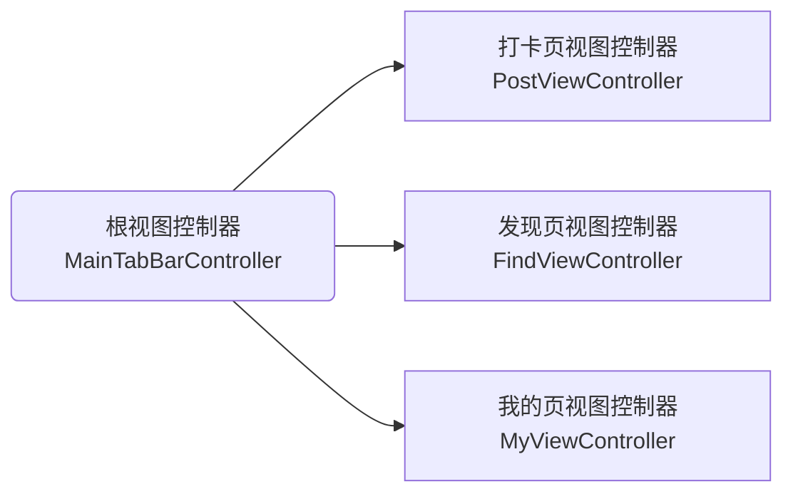

#### 详情页面

详情页视图控制器DetailsViewController只是打卡页视图控制器PostViewController在某条打卡记录的实例化：

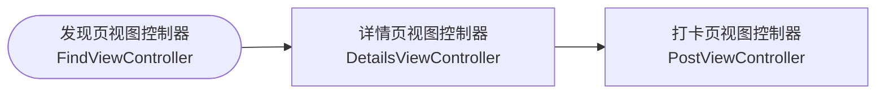

#### 打卡记录存储结构：

Record类只含单条打卡记录的5个属性：日期、地点、景点、心得、图片。

RecordStorage类只含一个可变数组NSMutableArray<Record *> * records用于记录所有已的发布打卡，以及一个方法用于添加打卡。


### 程序关键模块，结合代码在程序中的位置进行解释

#### 一、 数据存储：Record类 和 RecordStorage类

```objc
@interface Record : NSObject
@property(nonatomic, copy)NSString *date;
@property(nonatomic, copy)NSString *place;
@property(nonatomic, copy)NSString *sights;
@property(nonatomic, copy)NSString *experience;
@property(nonatomic, retain) NSMutableArray<UIImage *> * imgs;
@end

@interface RecordStorage : NSObject
@property (nonatomic) NSMutableArray<Record *> * records;
- (void)storeWithData:(NSString *)Data
             andPlace:(NSString *)Place
            andSights:(NSString *)Sights
               andExp:(NSString *)Exp
              andImgs:(NSMutableArray<UIImage *> *)Imgs;
@end
```

可变数组NSMutableArray<Record *> * records用于记录所有已的发布打卡，

方法storeWithDataandPlaceandSightsandExpandImgs用于向records添加打卡记录。


#### 二、 打卡页面：类PostViewController

遵守协议UINavigationControllerDelegate,UIImagePickerControllerDelegate用于实现自己的照片选择：在选择图片完成时，获取选择照片的数据并显示，同时将添加图片按钮向下一个位置移动。

此外，由于发布按钮和清空按钮都涉及到与发现页的**数据交互**，所以这两个按钮不在这里添加，而是在MainTabBarController处添加。

```objc
#import <UIKit/UIKit.h>
#import "RecordStorage.h"
@interface PostViewController : UIViewController<UINavigationControllerDelegate,UIImagePickerControllerDelegate>
@property(nonatomic,strong) UIView *view1;// 最底层的可见视图，最靠近self.view的子视图
@property(nonatomic,strong) UINavigationController *nav; // 导航控制器
@property(nonatomic,strong) UITextField * inputDate;  // 打卡文字输入
@property(nonatomic,strong) UITextField * inputPlace;
@property(nonatomic,strong) UITextField * inputSights;
@property(nonatomic,strong) UITextView * inputExp;  // 多行文字输入
@property(nonatomic,strong) NSMutableArray<UIImage *> * imgs; // 打卡图片
@property(nonatomic,strong) UIButton * addButton; // 添加图片按钮
@property(nonatomic,strong) UIImagePickerController *imagePicker;// 图片选择控制器
@property(nonatomic,strong)CAGradientLayer * gradient;// 渐变层
-(void) setAddButton; // 打卡页面使用，设置添加图片按钮addButton
-(void) showWith:(Record *) r1; // 详情页面使用，将记录r1展示出来
-(CGRect) getPos:(unsigned long)i; // 图片的自动布局使用，返回第i张图片的自动布局
@end
```

##### **初始化：**

只包含文本框的添加与自动布局。

```objc
-(instancetype)init{
    self.navigationItem.title = @"新建打卡";
    // 渐变图层
    [self setUI];
    _view1 = [[UIView alloc]initWithFrame:CGRectMake(0, 0,[UIScreen mainScreen].bounds.size.width, 
                                                     [UIScreen mainScreen].bounds.size.height)];
    // 用于自动布局
    CGFloat w = _view1.bounds.size.width;
    CGFloat h = _view1.bounds.size.height;
    // 单行输入框
    _inputDate = [self getTextField:30 andName:@"日期:" andPlaceHolder:@" Eg: YYYY-MM-DD"];
    _inputPlace= [self getTextField:70 andName:@"地点:" andPlaceHolder:@" Eg: 北京"];
    _inputSights = [self getTextField:110 andName:@"景点:" andPlaceHolder:@" Eg: 故宫"];
    UILabel *labelExp = [[UILabel alloc] initWithFrame:CGRectMake(20, 150, 40, 30)];
    [labelExp setText:@"心得:"];
    // 多行输入框
    _inputExp = [[UITextView alloc] initWithFrame:
                 CGRectMake(30, 180,w - 50, h*0.2)];
    UILabel *label2 = [[UILabel alloc] initWithFrame:CGRectMake(20, 195+h*0.2, 40, 30)];
    [label2 setText:@"配图:"];
    
    [_view1 addSubview:_inputDate];
    [_view1 addSubview:_inputPlace];
    [_view1 addSubview:_inputSights];
    [_view1 addSubview:labelExp];
    [_view1 addSubview:_inputExp];
    [_view1 addSubview:label2];
    //
    _inputExp.backgroundColor = [UIColor clearColor];//设置它的背景颜色
    _inputExp.layer.masksToBounds = YES;// 边框圆角
    _inputExp.layer.cornerRadius = 10; // 圆角弧度
    _inputExp.layer.borderWidth = 5; // 边框宽度
    _inputExp.layer.borderColor = [UIColor grayColor].CGColor;// 边框颜色
    _inputExp.returnKeyType = UIReturnKeyDefault;//返回键的类型
    _inputExp.scrollEnabled = YES;//是否可以拖动
    _inputExp.autoresizingMask = UIViewAutoresizingFlexibleHeight;//自适应
    _inputExp.font = [UIFont fontWithName:@"Arial" size:16];//字体，大小
    
    // 图片
    _imgs = [[NSMutableArray<UIImage *> alloc] init];
    // 将self做为nav的根视图控制器
    self.nav = [[UINavigationController alloc]initWithRootViewController:self];
    [self.view addSubview:_view1];
    return self;
}

// 根据占位文字和布局得到单行输入框
-(UITextField *)getTextField:(CGFloat)h1 andName:(NSString *)s1 andPlaceHolder:(NSString *)s2{
    UILabel *label = [[UILabel alloc] initWithFrame:CGRectMake(20, h1, 60, 30)];
    UITextField *text = [[UITextField alloc] initWithFrame:
                         CGRectMake(80, h1,[UIScreen mainScreen].bounds.size.width - 150, 30)];
    [label setText:s1];//text是输入的结果
    [text setPlaceholder:s2];
    text.layer.borderWidth = 3;
    text.layer.borderColor = [UIColor grayColor].CGColor;
    text.layer.masksToBounds = YES;// 边框圆角
    text.layer.cornerRadius = 5;
    text.clearButtonMode = UITextFieldViewModeWhileEditing;// 清除按钮,编辑时出现
    //设置为YES时文本会自动缩小以适应文本窗口大小.默认是保持原来大小,而让长文本滚动
    text.adjustsFontSizeToFitWidth = YES;
    //设置左边视图的宽度,用于设置文字的左边距
    text.leftView = [[UIView alloc]initWithFrame:CGRectMake(0, 0, 8, 0)];
    //设置显示模式为永远显示(默认不显示 必须设置 否则没有效果)
    text.leftViewMode = UITextFieldViewModeAlways;
    [_view1 addSubview:label];
    return text;
}
```

##### 图片显示位置的自动布局: 

防止图片超出视图边界，且具有合适的size

```objc
// 返回第i张图片的布局，采用自动布局
-(CGRect) getPos:(unsigned long)i{
    CGFloat w = _view1.bounds.size.width;
    CGFloat h = _view1.bounds.size.height; // 用于自动布局
    CGFloat h2 = (h -(245+h*0.2))*0.25;
    CGFloat s = h*0.15<0.25*w ? h*0.15 : 0.25*w ;
    s = s<h2 ? s:h2;
    CGRect pos[5];
    pos[0]=CGRectMake(45, 245+h*0.2, s, s);
    pos[1]=CGRectMake(65+s, 245+h*0.2, s, s);
    pos[2]=CGRectMake(85+2*s, 245+h*0.2, s, s);
    pos[3]=CGRectMake(45, 265+h*0.2+s, s, s);
    pos[4]=CGRectMake(65+s, 265+h*0.2+s, s, s);
    return pos[i];
}
```

##### 设置添加图片按钮addButton：

-(void) setAddButton；

由于**复用**打卡页面作为详情页面，而详情页面不需要addButton，所以将setAddButton分离出来，仅在MainTabBarController处创建的PostViewController需要调用。

```objc
// 设置添加按钮
-(void) setAddButton{
    _imagePicker = [[UIImagePickerController alloc] init];// 用于选择图片
    _imagePicker.delegate = self;
    UIImage *image1 = [UIImage imageNamed:@"test4.png"];
    _addButton = [[UIButton alloc] initWithFrame:[self getPos:0]];// 自动布局
    _addButton.backgroundColor = [UIColor clearColor];
    _addButton.layer.masksToBounds = YES;// 圆形按钮
    _addButton.layer.cornerRadius = _addButton.bounds.size.height/2;
    _addButton.layer.borderColor=[UIColor grayColor].CGColor;
    _addButton.layer.borderWidth=1;
    [_addButton setImage:image1 forState:0];
    // 绑定事件
    [_addButton addTarget:self action:@selector(chooseImg) forControlEvents:UIControlEventTouchUpInside];
    [_addButton adjustsImageWhenDisabled];
    [_view1 addSubview:_addButton];
}
// 当添加按钮点击时调用imagePicker
-(void)chooseImg{
    NSLog(@"addButton click");
    [self presentViewController:_imagePicker animated:YES completion:nil];
}
// 获取调用完imagePicker返回的图像并展示，同时将添加按钮右移
- (void)imagePickerController:(UIImagePickerController*)picker
didFinishPickingMediaWithInfo:(NSDictionary<NSString*,id>*)info {
    //获得添加的图片
    UIImage* image=info[UIImagePickerControllerOriginalImage];
    [self.imgs addObject:image];
    //在打卡页面上显示图片
    UIImageView* imgView=[[UIImageView alloc] init];
    imgView.frame= [self getPos:self.imgs.count-1];
    imgView.image=image;
    [self.view1 addSubview:imgView];
    //添加图片按钮后移
    self.addButton.frame = [self getPos:self.imgs.count];
    if (self.imgs.count>=5)
        self.addButton.enabled=false;// 最多添加5张图片
    [picker dismissViewControllerAnimated:YES completion:nil];
}
```

##### 通过一条记录实例化为详情页面：

- (void)showWith:(Record *) r1；

```objc
// 展示图片，该函数用于详情页面
- (void)setImgPos{
    self.addButton.enabled=false;
    for(int i=0;i<self.imgs.count;i++){
        UIImage* img=self.imgs[i];
        UIImageView* imgView=[[UIImageView alloc] init];
        imgView.frame= [self getPos:i];
        imgView.image=img;
        [_view1 addSubview:imgView];
    }
}
// 用于详情页面，只显示，不编辑
- (void)showWith:(Record *) r1{
    _inputDate.text = r1.date;
    [_inputDate setEnabled:NO];
    _inputPlace.text = r1.place;
    [_inputPlace setEnabled:NO];
    _inputSights.text = r1.sights;
    [_inputSights setEnabled:NO];
    _inputExp.text = r1.experience;
    [_inputExp setEditable:NO];
    _imgs = r1.imgs;
    [self setImgPos];
}
```

##### 渐变图层：-(void) setUI；

```objc
// 设置背景渐变
-(void) setUI{
    // 设置背景渐变
    //  创建 CAGradientLayer 对象
    _gradient = [CAGradientLayer layer];
    //  设置 gradientLayer 的 Frame
    _gradient.frame = CGRectMake(0, 0,[UIScreen mainScreen].bounds.size.width, [UIScreen mainScreen].bounds.size.height);
    //  创建渐变色数组，需要转换为CGColor颜色
    _gradient.colors = @[(id)[UIColor colorWithRed:0xb5/255.0 green:0xa5/255.0 blue:0xa4/255.0 alpha:1].CGColor,
                         (id)[UIColor colorWithRed:0x87/255.0 green:0xc0/255.0 blue:0x35/255.0 alpha:1].CGColor];
    //  设置三种颜色变化点，取值范围 0.0~1.0
    _gradient.locations = @[@(0.1f) ,@(1.0f)];
    //  设置渐变颜色方向，左上点为(0,0), 右下点为(1,1)
    _gradient.startPoint = CGPointMake(0, 0);
    _gradient.endPoint = CGPointMake(1, 1);
    //  添加渐变色到创建的 UIView 上去
    [self.view.layer insertSublayer:_gradient atIndex:0];
}
```

#### 三、详情页面：类DetailsViewController

通过一条记录实例化一个打卡页面以获取详情页面，所以本个类完全可以去掉，用如下代码获得的vc代替：

PostViewController * vc = [[PostViewController alloc] init];

vc.navigationItem.title=@"打卡详情";

[vc showWith:r1]; // r1为要显示的记录

```objc
#import <UIKit/UIKit.h>
#import "RecordStorage.h"
#import "PostViewController.h"
@interface DetailsViewController : UIViewController
@property(nonatomic,strong) PostViewController * vc;
-(DetailsViewController*)initWithItem:(Record *) r1;
@end
```

```objc
@implementation DetailsViewController
-(DetailsViewController*)initWithItem:(Record *) r1{
    NSLog(@"打卡详情");
    self.navigationItem.title=@"打卡详情";
    self.view=[[UIView alloc]initWithFrame:CGRectMake(0, 0,[UIScreen mainScreen].bounds.size.width, [UIScreen mainScreen].bounds.size.height)];
    _vc = [[PostViewController alloc] init];
    [_vc showWith:r1]; // 通过记录r1实例化一个打卡页面获取详情页面
    [self.view addSubview:_vc.view];
    return self;
}
@end
```


#### 四、发现页面：类FindViewController

遵守协议UITableViewDataSource, UITableViewDelegate, UISearchBarDelegate，实现自己的UITableView和UISearchBar

```objc
#import "RecordStorage.h"
#import <UIKit/UIKit.h>
#import "DetailsViewController.h"
@interface FindViewController : UIViewController<UITableViewDataSource, UITableViewDelegate, UISearchBarDelegate>
@property(nonatomic,strong) RecordStorage *store; // 存储打卡数据
@property(nonatomic,strong) UISearchBar *search; // 搜索栏
@property(nonatomic,strong) UITableView *tableview; // TableView
@property(nonatomic,strong) UINavigationController *nav; // 导航控制器，用于页面切换
@property (nonatomic, strong)CAGradientLayer * gradient;// 渐变层
@end
```

##### 初始化：

设置TableView的布局、数据源和委托，SearchBar的布局和委托

```objc
- init{
    self.navigationItem.title =@"打卡清单";
    _store = [[RecordStorage alloc] init];//初始化数据源
    [self setUI];//设置渐变色图层，方式和打卡页面的setUI相同，只是颜色渐变范围不同
    _tableview=[[UITableView alloc]initWithFrame:CGRectMake(0, 0,[UIScreen mainScreen].bounds.size.width, 	  			[UIScreen mainScreen].bounds.size.height*0.8) style:UITableViewStyleGrouped];
    _tableview.backgroundColor=[UIColor clearColor];
    _tableview.separatorInset = UIEdgeInsetsMake(0,30, 0, 20);
    _tableview.separatorStyle = UITableViewCellSeparatorStyleSingleLine;
    // 设置数据源和委托
    _tableview.delegate = self;
    _tableview.dataSource = self;
    // 搜索框
    _search=[[UISearchBar alloc] initWithFrame:(CGRectMake(0, 0, self.view.bounds.size.width - 10, 50))];
    _tableview.tableHeaderView=_search;
    _search.delegate = self;
    [_tableview addSubview:_search];
    // 把FindViewController作为根控制器
    self.nav = [[UINavigationController alloc]initWithRootViewController:self];
    [self.view addSubview:_tableview];
    return self;
}
```

##### TableView的委托:

```objc
// section的个数
- (NSInteger)numberOfSectionsInTableView:(UITableView *)tableView {
    return [_store.records count];
}
//每个cell的个数
- (NSInteger)tableView:(UITableView *)tableView numberOfRowsInSection:(NSInteger)section {
    return 4; //每个cell的个数：date;place;sights;experience
}

// 每个section的头部的上下间距
-(CGFloat)tableView:(UITableView *)tableView heightForHeaderInSection:(NSInteger)section{
    if(section==0){
        return 40;
    }
    return 25;
}l

// 返回indexPath对应的cell
-(UITableViewCell *)tableView:(UITableView*)tableView
        cellForRowAtIndexPath:(NSIndexPath *)indexPath{
    //[self.tableview reloadData];
    NSString *cellID = @"cellID";
    UITableViewCell *cell = [tableView dequeueReusableCellWithIdentifier:cellID];
    if(cell == nil){
        // 代码块内只做Cell样式的处理，不做数据设置
        cell = [[UITableViewCell alloc] initWithStyle:UITableViewCellStyleDefault
                                      reuseIdentifier:cellID];
        // 当给新的cell分配内存时输出其indexPath
        NSLog(@"new cell: section %ld, row %ld",indexPath.section,indexPath.row);
    }
    else{
        while ([cell.contentView.subviews lastObject] != nil){
            [(UITableViewCell *)[cell.contentView.subviews lastObject] removeFromSuperview];
        }
    }
    [cell setBackgroundColor:[UIColor clearColor]];
    Record *temp = [[Record alloc] init];
    if(_store.records.count>indexPath.section){
        temp = _store.records[indexPath.section];
        // [_store.records objectAtIndex:indexPath.section];
    }
    else{
        temp.date = @"";
        temp.place = @"";
        temp.sights = @"";
        temp.experience = @"";
    }
    if(indexPath.row==0)
        cell.textLabel.text=[NSString stringWithFormat:@"日期      %@",temp.date];
    if(indexPath.row==1)
        cell.textLabel.text=[NSString stringWithFormat:@"地点      %@",temp.place];
    if(indexPath.row==2)
        cell.textLabel.text=[NSString stringWithFormat:@"景点      %@",temp.sights];
    if(indexPath.row==3)
        cell.textLabel.text=[NSString stringWithFormat:@"旅游心得   %@",temp.experience];
    return cell;
}

// cell的高度
- (CGFloat)tableView:(UITableView *)tableView heightForRowAtIndexPath:(NSIndexPath *)indexPath{
    return 30;
}

// 每个section的标题
-(NSString *)tableView:(UITableView *)tableView titleForHeaderInSection:(NSInteger)section{
    NSString * groupName = @"打卡";
    if(section == 0)
        groupName =  @"最新打卡：打卡0(点击打卡内容查看详情)";
    else
        groupName = [groupName stringByAppendingFormat:@"%ld", section];
    return groupName;
}

// section的动画效果
- (void)tableView:(UITableView *)tableView willDisplayHeaderView:(UIView *)view forSection:(NSInteger)section {
    UITableViewHeaderFooterView *header = (UITableViewHeaderFooterView *)view;
    header.textLabel.textColor = [UIColor redColor];
    header.textLabel.font = [UIFont boldSystemFontOfSize:15];
    CGRect headerFrame = header.frame;
    header.textLabel.frame = headerFrame;
}

// 选择cell执行操作：进入详情页面
- (void)tableView:(UITableView *)tableView didSelectRowAtIndexPath:(NSIndexPath*)indexPath{
    DetailsViewController *dectrl = [[DetailsViewController alloc] initWithItem:_store.records[indexPath.section]];
    // 进入打卡详情页面
    [self.nav pushViewController:dectrl animated:YES];
    NSLog(@"select section %zd,row %zd",indexPath.section,indexPath.row);
}

// cell的动画效果
- (void)tableView:(UITableView *)tableView willDisplayCell:(UITableViewCell *)cell forRowAtIndexPath:(NSIndexPath *)indexPath{
    cell.layer.transform = CATransform3DMakeScale(0.3, 0.3, 1);
    // 滚动时的加载动画
    [UIView animateWithDuration:0.5 animations:^{cell.layer.transform = CATransform3DMakeScale(1, 1, 1);}];
    [cell.contentView.layer setBorderColor:UIColor.lightGrayColor.CGColor];
    [cell.contentView.layer setBorderWidth:1];
    cell.contentView.layer.borderWidth=4;
    cell.contentView.layer.cornerRadius=12;
    cell.contentView.layer.masksToBounds=YES;
}
```

##### SearchBar的委托：

```objc
// 搜索栏
-(void)searchBarCancelButtonClicked:(UISearchBar *)searchBar{
    [searchBar setShowsCancelButton:NO animated:YES];
    searchBar.text=@"";
    [searchBar endEditing:YES];
}
// 搜索栏被编辑时
-(void)searchBarTextDidBeginEditing:(UISearchBar *)searchBar {
    [searchBar setShowsCancelButton:YES animated:YES];
}
// 搜索按钮被点击
- (void)searchBarSearchButtonClicked:(UISearchBar*)searchBar{
     NSString *input=[searchBar text];//获得输入
     bool succ=false;
     for(int i=0;i<self.store.records.count;i++){
         NSString *info = [NSString stringWithFormat:@"%@  %@  %@",_store.records[i].date, _store.records[i].place, _store.records[i].sights];
         if([info rangeOfString:input].location != NSNotFound){
             [self skipToIndex:i withInfo:info];//找到
             succ=true;
             break;
         }
     }
    if(!succ) [self noReply];//没找到
}
//没找到
- (void)noReply {
    UIAlertController* alert = [UIAlertController alertControllerWithTitle:@"提示" message:@"无查询相关内容" preferredStyle:UIAlertControllerStyleAlert];
    [alert addAction:[UIAlertAction actionWithTitle:@"确定" style:UIAlertActionStyleDefault handler:nil]];
    [self presentViewController:alert animated:true completion:nil];
}
//找到，通过下标index打开对应的详情页面
- (void)skipToIndex:(int)index withInfo:(NSString*)info {
    UIAlertController *alert = [UIAlertController alertControllerWithTitle:@"找到" message:info preferredStyle:UIAlertControllerStyleAlert];
    [alert addAction:[UIAlertAction actionWithTitle:@"查看"
    style:UIAlertActionStyleDefault handler:^(UIAlertAction* _Nonnull action) {
        // 若找到则新建对应的详情页面并跳转
        DetailsViewController* dectrl=[[DetailsViewController alloc]
                                    initWithItem:self.store.records[index]];
        [self.navigationController pushViewController:dectrl animated:YES];
        // 清空搜索框
        self.search.text=@"";
     }]];
    [alert addAction:[UIAlertAction actionWithTitle:@"取消" style:UIAlertActionStyleDefault handler:nil]];
    [self presentViewController:alert animated:true completion:nil];
}
```


#### 五、 我的页面：类MyViewController

```objc
#import <UIKit/UIKit.h>
@interface MyViewController : UIViewController
@property(nonatomic,strong) UINavigationController *nav; // 用于切换视图控制器
@property(nonatomic,strong) UIView * view1; // 登录器页面
@property(nonatomic,strong) UIButton * btn; //圆形登录按钮
@property(nonatomic,strong) UIViewController *vc;// 登录后的页面视图控制器
@end
```

##### 初始化:

绘制渐变图层，添加登陆按钮（都是加到view1上，view1作为登陆前的页面）。

```objc
-init{
    self.navigationItem.title = @"登录";
    _view1 = [[UIView alloc]initWithFrame:CGRectMake(0, 0,[UIScreen mainScreen].bounds.size.width, [UIScreen mainScreen].bounds.size.height*0.8)];
    [self setUI2];// 绘制渐变图层
    [self setBtn];// 添加登陆按钮
    self.nav = [[UINavigationController alloc]initWithRootViewController:self];
    [self.view addSubview:_view1];
    return self;
}
```

##### 绘制渐变图层：

-(void)setUI2;

从中心向四周,沿圆半径方向渐变。

```objc
// 画出圆半径方向渐变图层
- (void)drawRadialGradient:(CGContextRef)context path:(CGPathRef)path
    startColor:(CGColorRef)startColor endColor:(CGColorRef)endColor{
    CGColorSpaceRef colorSpace = CGColorSpaceCreateDeviceRGB();
    CGFloat locations[] = { 0.0, 1.0 };
    NSArray *colors = @[(__bridge id) startColor, (__bridge id) endColor];
    CGGradientRef gradient = CGGradientCreateWithColors(colorSpace, (__bridge CFArrayRef) colors, locations);
    
    CGRect pathRect = CGPathGetBoundingBox(path);
    CGPoint center = CGPointMake(CGRectGetMidX(pathRect), CGRectGetMidY(pathRect));
    CGFloat radius = MAX(pathRect.size.width/2, pathRect.size.height/2) * sqrt(2);
    
    CGContextSaveGState(context);
    CGContextAddPath(context, path);
    CGContextEOClip(context);
    CGContextDrawRadialGradient(context, gradient, center, 0, center, radius, 0);
    CGContextRestoreGState(context);
    CGGradientRelease(gradient);
    CGColorSpaceRelease(colorSpace);
}

-(void)setUI2{
    //创建CGContextRef
    UIGraphicsBeginImageContext(self.view.bounds.size);
    CGContextRef gc = UIGraphicsGetCurrentContext();
    //创建CGMutablePathRef
    CGMutablePathRef path = CGPathCreateMutable();
    //绘制Path
    CGRect rect = CGRectMake(0, 0, _view1.bounds.size.width, _view1.bounds.size.height);
    CGPathMoveToPoint(path, NULL, CGRectGetMinX(rect), CGRectGetMinY(rect));
    CGPathAddLineToPoint(path, NULL, CGRectGetMinX(rect), CGRectGetMaxY(rect));
    CGPathAddLineToPoint(path, NULL, CGRectGetMaxX(rect), CGRectGetMaxY(rect));
    CGPathAddLineToPoint(path, NULL, CGRectGetMaxX(rect), CGRectGetMinY(rect));
    CGPathCloseSubpath(path);
    //绘制渐变
    [self drawRadialGradient:gc path:path 
     	startColor:[UIColor colorWithRed:0xe5/255.0 green:0x25/255.0 blue:0xe4/255.0 alpha:1].CGColor 
     	endColor:[UIColor colorWithRed:0x35/255.0 green:0xe5/255.0 blue:0x64/255.0 alpha:1].CGColor];
    //注意释放CGMutablePathRef
    CGPathRelease(path);
    //从Context中获取图像，并显示在界面上
    UIImage *img = UIGraphicsGetImageFromCurrentImageContext();
    UIGraphicsEndImageContext();
    UIImageView *imgView = [[UIImageView alloc] initWithImage:img];
    [_view1 addSubview:imgView];
}
```

##### 登录按钮设置：

-(void)setBtn；

```objc
-(void)setBtn{
    _btn = [[UIButton alloc] initWithFrame:CGRectMake(0, 0, 130, 130)];
    [_btn addTarget:self action:@selector(logIn) forControlEvents:UIControlEventTouchUpInside];
    _btn.center=CGPointMake(_view1.center.x, _view1.center.y);// 使用自动布局
    _btn.layer.borderColor=[UIColor blackColor].CGColor;
    _btn.layer.borderWidth=2;
    _btn.layer.cornerRadius = _btn.bounds.size.width / 2.0; // 圆形按钮
    [_btn setTitle: @"登录" forState: UIControlStateNormal];
    _btn.titleLabel.font = [UIFont systemFontOfSize: 25.0];
    _btn.backgroundColor = [UIColor clearColor];
    [_btn setTitleColor:[UIColor blackColor]forState:UIControlStateNormal];
    [_view1 addSubview:_btn];
}
// 登录按钮绑定事件
-(void)logIn{
    [self setVc];
    //[self.nav pushViewController:_vc animated:YES];
    // 0.8s的弹窗,弹窗时间不能太短；或者干脆去除弹窗
    UIAlertController *alert1 = [UIAlertController alertControllerWithTitle:@"提示" message:@"登录成功!" preferredStyle:UIAlertControllerStyleAlert];
    // 弹窗以浮动形式加到self
    [self presentViewController:alert1 animated:YES completion:nil];
    [self performSelector:@selector(delayAlert1) withObject:nil afterDelay:0.8f];
    // 转到登录后的界面
    // [self.nav pushViewController:_vc animated:YES];//error!
}
-(void) delayAlert1{
    [self dismissViewControllerAnimated:YES completion:nil];
    [self.nav pushViewController:_vc animated:YES]; // 转到登录后的界面
}
```

##### 设置登录后界面：

-(void)setVc；

```objc
// 设置登录后界面
-(void)setVc{
    _vc = [[UIViewController alloc]init];
    UIView *view2 = [[UIView alloc] initWithFrame:CGRectMake(0,0,[UIScreen mainScreen].bounds.size.width, [UIScreen mainScreen].bounds.size.height)];
    view2.backgroundColor = [UIColor colorWithRed:0xa5/255.0 green:0x75/255.0 blue:0x64/255.0 alpha:1];
    [self addImg:view2 withName:@"test3_selected.png"];
    CGFloat h = [UIScreen mainScreen].bounds.size.height; // 用于自动布局
    CGFloat w = [UIScreen mainScreen].bounds.size.width; // 用于自动布局
    UILabel *label = [[UILabel alloc] initWithFrame:CGRectMake(0.35*w,h*0.4,0.6*w,90)];
    label.layer.borderWidth = 2;
    label.layer.borderColor = [UIColor grayColor].CGColor;
    [view2 addSubview:label];
    UILabel *label2 = [[UILabel alloc] initWithFrame:CGRectMake(40,h*0.6,(w-40)*0.7,180)];
    label2.layer.borderWidth = 3;
    label2.layer.borderColor = [UIColor grayColor].CGColor;
    [view2 addSubview:label2];
    
    [self addLabel:view2 withText:@"用户名:test" withFrame:CGRectMake(0.35*w+10,h*0.4,0.6*w-10,30) withFont:16.0];
    [self addLabel:view2 withText:@"邮箱:12345@qq.com" withFrame:CGRectMake(0.35*w+10,h*0.4+30,0.6*w-10,30) withFont:16.0];
    [self addLabel:view2 withText:@"电话:12345" withFrame:CGRectMake(0.35*w+10,h*0.4+60,0.6*w-10,30) withFont:16.0];
    [self addLabel:view2 withText:@"关于" withFrame:CGRectMake(40,h*0.5,52,h*0.1) withFont:25.0];
    [self addLabel:view2 withText:@"版本" withFrame:CGRectMake(50,h*0.6,200,40) withFont:20.0];
    [self addLabel:view2 withText:@"隐私和cookie" withFrame:CGRectMake(50,h*0.6+40,200,40) withFont:20.0];
    [self addLabel:view2 withText:@"清除缓存" withFrame:CGRectMake(50,h*0.6+80,200,40) withFont:20.0];
    [self addLabel:view2 withText:@"同步" withFrame:CGRectMake(50,h*0.6+120,200,40) withFont:20.0];
    _vc.navigationItem.title=@"我的";
    [_vc.view addSubview:view2];
}

// 通过：内容、框架、字号添加一个label
-(void)addLabel:(UIView*)view2 withText:(NSString*)str withFrame:(CGRect)r1 withFont:(CGFloat)f1{
    UILabel *label1 = [[UILabel alloc] initWithFrame:r1];
    label1.text = str;//text是输入的结果
    label1.font = [UIFont systemFontOfSize: f1];
    label1.textAlignment = NSTextAlignmentLeft;
    [view2 addSubview:label1];
}
// 增加一个圆形图像
-(void)addImg:(UIView*)view2 withName:(NSString*)str{
    CGFloat h = [UIScreen mainScreen].bounds.size.height; // 用于自动布局
    UIImageView *v1 = [[UIImageView alloc] initWithFrame:CGRectMake(0,0,h*0.24,h*0.24)];
    v1.center=CGPointMake(self.view.bounds.size.width/2,h*0.24);
    v1.backgroundColor = [UIColor clearColor];
    v1.layer.masksToBounds = YES;
    v1.layer.cornerRadius = h*0.12;
    v1.layer.borderColor=[UIColor grayColor].CGColor;
    v1.layer.borderWidth=2;
    UIImage *image1 = [UIImage imageNamed:str];
    [v1 setImage:image1];
    [view2 addSubview:v1];
    
}
```


#### 六、主标签栏界面：MainTabBarController

MainTabBarController继承于UITabBarController，三个子视图控制器为FindViewController，PostViewController，MyViewController。

```objc
#import <UIKit/UIKit.h>
#import "DetailsViewController.h"
#import "FindViewController.h"
#import "MyViewController.h"
#import "PostViewController.h"
#import "RecordStorage.h"
@interface MainTabBarController :  UITabBarController
@property(nonatomic,strong) FindViewController*vc1;
@property(nonatomic,strong) PostViewController*vc2;
@property(nonatomic,strong) MyViewController*vc3;
```

##### **MainTabBarController的视图加载后：**

初始化3个vc，将3个vc添加到MainTabBarController，再设置一些按钮：

```objc
- (void)viewDidLoad {
    [super viewDidLoad];
    // Do any additional setup after loading the view.
    _vc1 = [[FindViewController alloc] init];
    _vc2 = [[PostViewController alloc] init];
    _vc3 = [[MyViewController alloc] init];
    // 将3个vc添加到MainTabBarController
    NSArray *array = @[_vc1.nav, _vc2.nav, _vc3.nav];
    self.viewControllers = array;
    // 打卡页面设置添加图片按钮
    [_vc2 setAddButton];
    // 设置标签栏按钮的图像和文字
    [self setTabBarItem];
    // 给vc2增加一个“返回顶部”按钮
    _vc1.navigationItem.rightBarButtonItem = [[UIBarButtonItem alloc] initWithTitle:@"返回顶部" style:UIBarButtonItemStyleDone target:self action:@selector(returnTop)];
    // 给vc2增加一个“发布”按钮
    _vc2.navigationItem.rightBarButtonItem = [[UIBarButtonItem alloc] initWithTitle:@"发布" style:UIBarButtonItemStyleDone target:self action:@selector(btnClick1)];
    // 给vc2增加一个“清空”按钮
    _vc2.navigationItem.leftBarButtonItem = [[UIBarButtonItem alloc] initWithTitle:@"清空"  style:UIBarButtonItemStyleDone target:self action:@selector(btnClick2)];
}
```

##### **导航栏按钮中需要用到的函数：**

隐藏打卡页面键盘：-(void)hidKeyboard;

打卡页面清空输入框和图片：-(void)clearInput;

```objc
//点击空白处键盘隐藏
-(void)touchesBegan:(NSSet *)touches withEvent:(UIEvent *)event{
    [self hidKeyboard];
    [_vc1.search resignFirstResponder];
}
// 隐藏打卡页面键盘
-(void)hidKeyboard{
    [_vc2.inputDate resignFirstResponder];
    [_vc2.inputPlace resignFirstResponder];
    [_vc2.inputSights resignFirstResponder];
    [_vc2.inputExp resignFirstResponder];
}
// 打卡页面清空输入框和图片
-(void)clearInput{
    NSLog(@"clearInput");
    self.vc2.inputDate.text=@"";
    self.vc2.inputPlace.text=@"";
    self.vc2.inputSights.text=@"";
    self.vc2.inputExp.text = @"";
    // 删除图片在打卡页面的子视图
    for(UIView *mylabelview in [_vc2.view1 subviews]){
        if ([mylabelview isKindOfClass:[UIImageView class]]) {
            [mylabelview removeFromSuperview];
        }
    }
    // 清空选择的图片
    self.vc2.imgs = [[NSMutableArray<UIImage *> alloc] init];
    // 添加按钮回到起点
    self.vc2.addButton.frame = [self.vc2 getPos:0];
    // 添加按钮设为可用
    self.vc2.addButton.enabled=true;
}
```

##### **导航栏按钮绑定事件**

**发现页面**返回顶部并更新UItableView：-(void)returnTop;

**打卡页**发布按钮：- (void)btnClick1；

**打卡页**清空按钮：- (void)btnClick1;

```objc
// 发现页面返回顶部并更新UItableView
-(void)returnTop{
    [UIView animateWithDuration:0 animations:^{
        [self.vc1.tableview setContentOffset:CGPointZero animated:NO];
    } completion:^(BOOL finished) {
        [self.vc1.tableview reloadData];// 更新tableView
    }];
}

//发布按钮
- (void)btnClick1{
    // 隐藏键盘
    [self hidKeyboard];
    NSLog(@"button1 is click");
    // 如果时间、地点、景点存在为空的情况，不能发布，需要继续编辑打卡
    if( [_vc2.inputDate.text isEqual:@""] || [_vc2.inputPlace.text isEqual:@""] || [_vc2.inputSights.text isEqual:@""]){
        UIAlertController *alertVC0 = [UIAlertController alertControllerWithTitle:@"提示" message:@"时间、地点、景点不能为空！" preferredStyle:UIAlertControllerStyleAlert];
        UIAlertAction *comfirmAc0 = [UIAlertAction actionWithTitle:@"继续编辑"     style:UIAlertActionStyleDefault handler:^(UIAlertAction * _Nonnull action) {}];
        [alertVC0 addAction:comfirmAc0];
        [_vc2 presentViewController:alertVC0 animated:YES completion:nil];
        return;
    }
    // 弹窗
    UIAlertController *alertVC = [UIAlertController alertControllerWithTitle:@"提示" message:@"是否发布打卡？" preferredStyle:UIAlertControllerStyleAlert];
    UIAlertAction *comfirmAc = [UIAlertAction actionWithTitle:@"是，查看最新打卡"     style:UIAlertActionStyleDefault handler:^(UIAlertAction * _Nonnull action) {
        // 代码块隐式地保留'self'; 明确地使用“self”来表示这是有意的行为
        // 将数据添加到数据源
        [self.vc1.store storeWithData:self.vc2.inputDate.text andPlace:self.vc2.inputPlace.text andSights:self.vc2.inputSights.text andExp:self.vc2.inputExp.text andImgs:self.vc2.imgs];
        // 发现页面先返回根视图tableView（如果当前页面不是tableView）
        [self.vc1.nav popToRootViewControllerAnimated:YES];
        // 发现页返回顶部并更新数据源
        [self returnTop];
        // 转到发现页面
        self.vc2.tabBarController.selectedIndex=0;//tabBarController
        DetailsViewController *dectrl = [[DetailsViewController alloc] initWithItem:self.vc1.store.records[0]];
        // 再进入打卡详情页面，查看最新打卡
        [self.vc1.nav pushViewController:dectrl animated:YES];
        // 0.5s的弹窗
        UIAlertController *alert1 = [UIAlertController alertControllerWithTitle:@"提示" message:@"发布成功" preferredStyle:UIAlertControllerStyleAlert];
        // 弹窗以浮动形式加到vc1
        [self.vc1 presentViewController:alert1 animated:YES completion:nil];
        [self performSelector:@selector(delayAlert1) withObject:nil afterDelay:0.5f];
        // 清除输入框和图片
        [self clearInput];
    }];
    UIAlertAction *comfirmAc2 = [UIAlertAction actionWithTitle:@"否，继续编辑" style:UIAlertActionStyleDefault handler:nil];
    [alertVC addAction:comfirmAc];
    [alertVC addAction:comfirmAc2];
    [_vc2 presentViewController:alertVC animated:YES completion:nil];
}
// 去除弹窗
-(void) delayAlert1{
    [self.vc1 dismissViewControllerAnimated:YES completion:nil];
}

// 清空按钮
- (void)btnClick2{
    [self hidKeyboard];
    NSLog(@"button2 is click");
    // 弹窗
    UIAlertController *alertVC = [UIAlertController alertControllerWithTitle:@"提示" message:@"是否清空打卡内容？" preferredStyle:UIAlertControllerStyleAlert];
    UIAlertAction *comfirmAc = [UIAlertAction actionWithTitle:@"是" style:UIAlertActionStyleDefault handler:^(UIAlertAction * _Nonnull action) {
        [self clearInput];// 清除输入框
    }];
    UIAlertAction *comfirmAc2 = [UIAlertAction actionWithTitle:@"否" style:UIAlertActionStyleDefault handler:^(UIAlertAction * _Nonnull action) {}];
    [alertVC addAction:comfirmAc];
    [alertVC addAction:comfirmAc2];
    [_vc2 presentViewController:alertVC animated:YES completion:nil];
}
```

##### **设置标签栏按钮的图像和文字（选中和未选中不同）：**

-(void) setTabBarItem;

```objc
// 调整图像大小
- (UIImage *)scaleToSize:(UIImage *)img size:(CGSize)newsize{
    // 创建一个bitmap的context
    // 并把它设置成为当前正在使用的context
    UIGraphicsBeginImageContext(newsize);
    // 绘制改变大小的图片
    [img drawInRect:CGRectMake(0, 0, newsize.width, newsize.height)];
    // 从当前context中创建一个改变大小后的图片
    UIImage* scaledImage = UIGraphicsGetImageFromCurrentImageContext();
    // 使当前的context出堆栈
    UIGraphicsEndImageContext();
    // 返回新的改变大小后的图片
    return scaledImage;
}
// 以newsize大小获取图像
- (UIImage *)getImg:(NSString*) name size:(CGSize)newsize{
    UIImage *image1 = [UIImage imageNamed:name];
    image1 = [self scaleToSize:image1 size:newsize];
    return image1;
}
// 设置标签栏按钮的图像和文字（选中和未选中不同）
-(void) setTabBarItem{
    _vc1.nav.tabBarItem.title = @"发现";
    _vc2.nav.tabBarItem.title = @"打卡";
    _vc3.nav.tabBarItem.title = @"我的";
    UIImage *img1_selected = [self getImg:@"test1_selected.png" size:CGSizeMake(30, 30)];
    UIImage *img1 = [self getImg:@"test1.png" size:CGSizeMake(30, 30)];
    [_vc1.nav.tabBarItem setImage:[img1 imageWithRenderingMode:UIImageRenderingModeAlwaysOriginal]];
    [_vc1.nav.tabBarItem setSelectedImage:[img1_selected imageWithRenderingMode:UIImageRenderingModeAlwaysOriginal]];
    UIImage *img2_selected = [self getImg:@"test2_selected.png" size:CGSizeMake(30, 30)];
    UIImage *img2 = [self getImg:@"test2.png" size:CGSizeMake(30, 30)];
    [_vc2.nav.tabBarItem setImage:[img2 imageWithRenderingMode:UIImageRenderingModeAlwaysOriginal]];
    [_vc2.nav.tabBarItem setSelectedImage:[img2_selected imageWithRenderingMode:UIImageRenderingModeAlwaysOriginal]];
    UIImage *img3_selected = [self getImg:@"test3_selected.png" size:CGSizeMake(30, 30)];
    UIImage *img3 = [self getImg:@"test3.png" size:CGSizeMake(30, 30)];
    [_vc3.nav.tabBarItem setImage:[img3 imageWithRenderingMode:UIImageRenderingModeAlwaysOriginal]];
    [_vc3.nav.tabBarItem setSelectedImage:[img3_selected imageWithRenderingMode:UIImageRenderingModeAlwaysOriginal]];
    //[_vc3.nav.tabBarItem setFinishedSelectedImage:img3_selected  
    //已弃用的API withFinishedUnselectedImage:img3];
}
```


## 实验过程

### 遇到的问题及解决情况

#### 问题1：Xcode模拟器不能弹出键盘

解决方法：

打开模拟器，I/O选项的Keyboard点击【Connect HardWare KeyBoard】（使其为未选中状态，即没有✔️）

或【Command】+【Shift】+【K】（注意：先点击模拟器，然后，快捷键）

#### **问题2：在Xcode的模拟器中的textField/textView中无法输入中文：**

依次选择:Xcode—>product —> scheme —> Edit scheme —> run —> options — > application Region.将选项改成”中国”.

然后在模拟器中的setting将语言改为中文简体。

最后在键盘中选择简体拼音即可输入中文。


### 关键功能的结果截图

模拟器为：iPhone 11 Pro Max

#### 4个页面

##### **发现页面**（点击打卡进入对应的详情页面，点击“返回顶部按钮”返回到顶部搜索栏） 

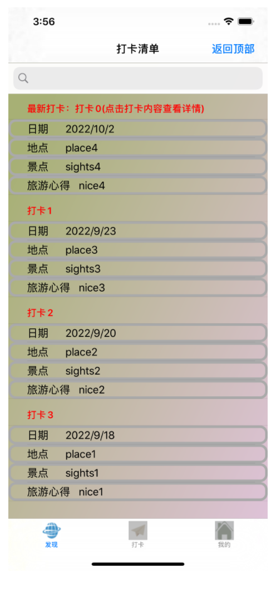  

​                                            

##### **打卡页面：**

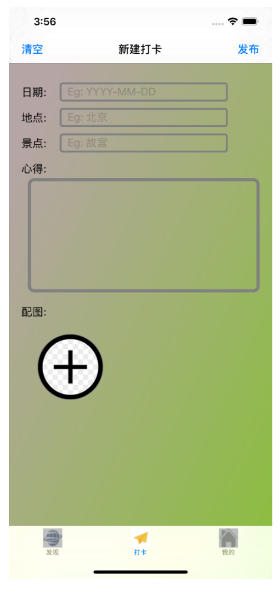    


##### 详情页面（最多添加5张图片）：

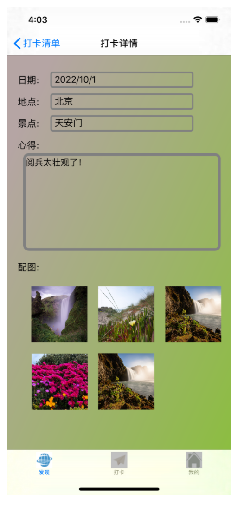  

​                                               

##### 我的页面

登陆前（沿中心向四周的渐变色）

                        

登录后

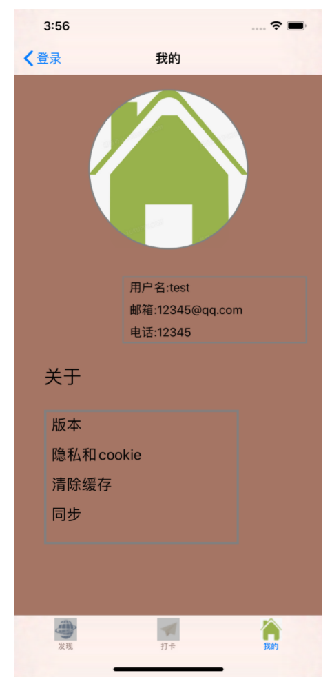  

​                                            

#### 2个主要功能

##### 发布打卡：

打卡内容中：时间、地点、景点不能为空

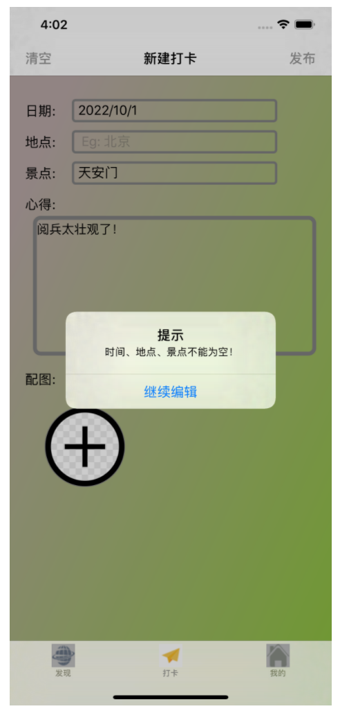   

点击发布按钮

  

随机跳转打卡详情

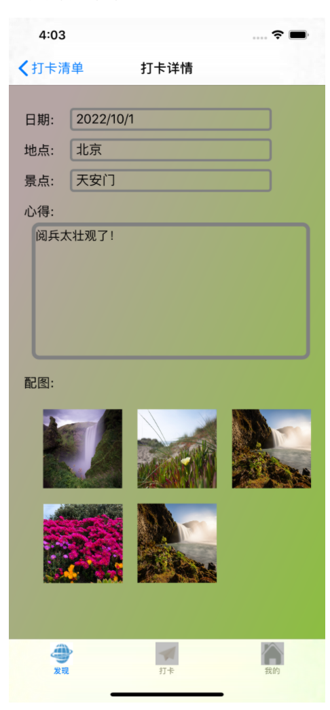 

返回打卡清单可见，最新打卡为刚刚发布的打卡，至此证明打卡成功。

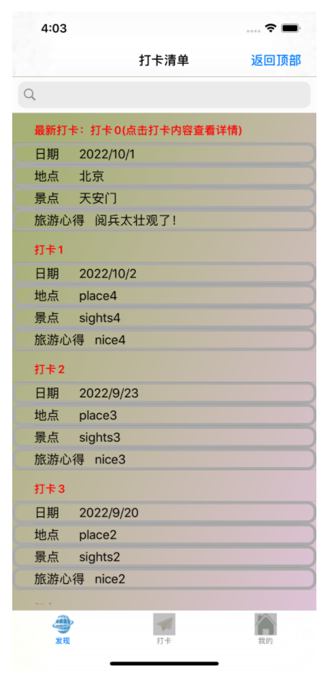  

##### 搜索打卡

可根据时间、地点、景点搜索打卡，暂未实现显示多个结果，找到了第一个符合的结果就返回。

点击查看可进入该打卡的详情页面。

根据时间搜索：

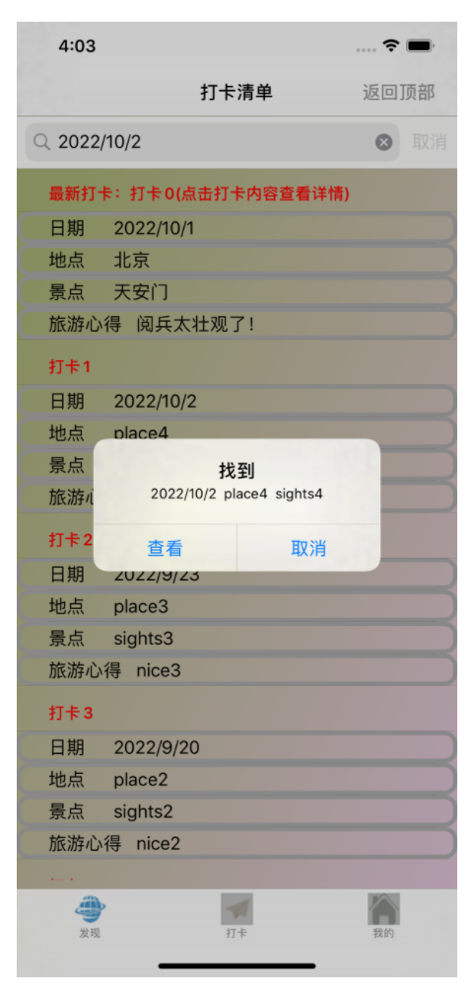 

根据地点搜索：

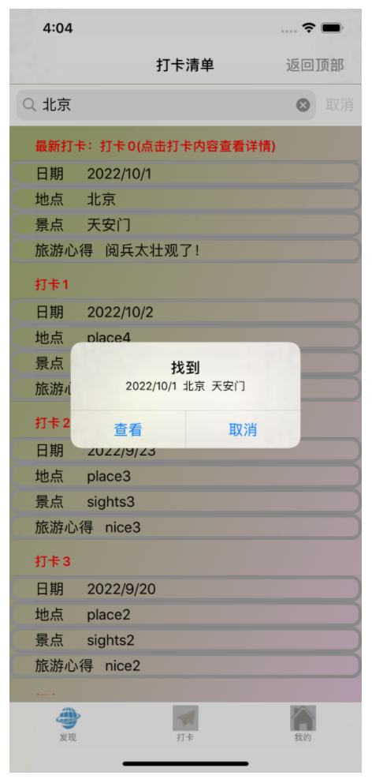  


#### 自动布局

在打卡页面和登录页面实现了自动布局：

如图所示，是两个页面在模拟器为**iPhone SE (2nd generation)**时运行的截图，可与前面的**iPhone 11 pro MAX**进行对比：

打卡页面：

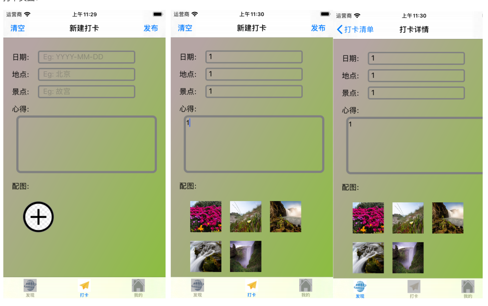   

登录页面

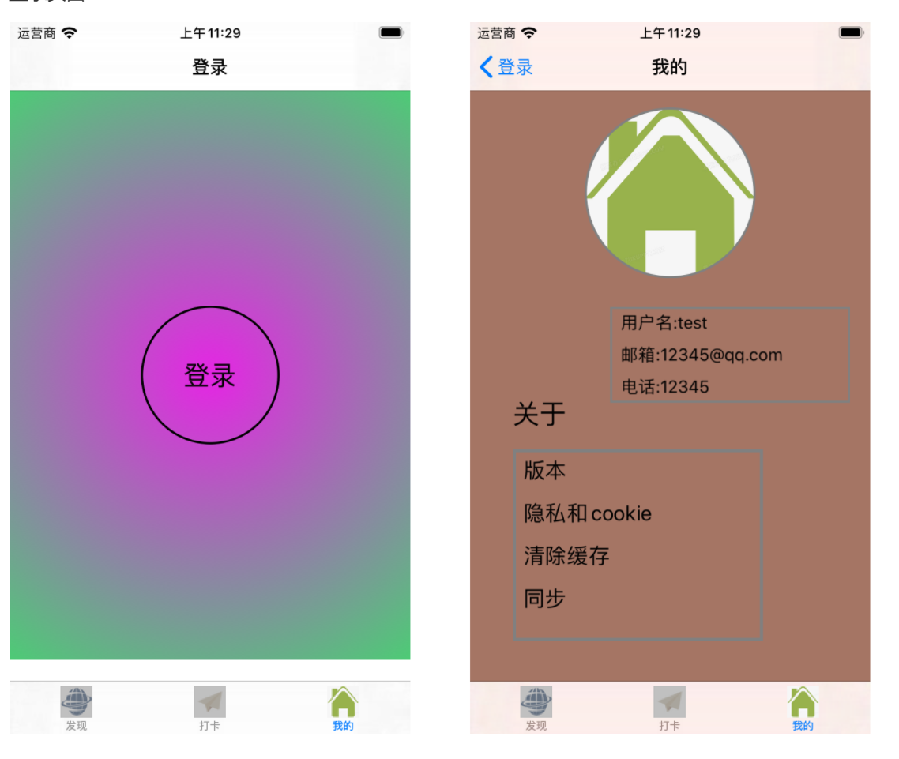  

 


## 实验总结

通过本次实验我对委托、代理、协议有了一定了解：

代理设计模式，是iOS中一种消息传递的方式，由代理对象、委托者、协议组成。

protocol（协议）：定义公用的一套接口，但不提供具体的实现方法。协议约定可选择实现的方法和必须实现的方法。

> @required：必须实现的方法
> @optional：可选是否实现的方法

- 协议：用来指定代理可以做什么，必须做什么。
- 代理：根据指定协议，完成委托方需要实现的方法。
- 委托：根据指定协议，指定代理必须完成和可以完成的方法。

如图：

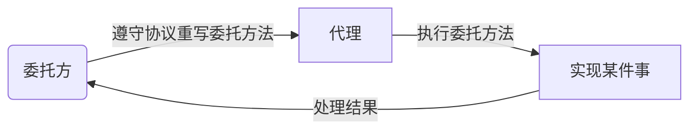


例如：

我突然口渴了，想喝一瓶红茶。这时我就可以拿起手机去外卖app上定一个红茶，然后外卖app就会下单给店铺并让店铺给我送过来。

这个过程中，外卖app就是我的**代理**，我就是**委托方**，我买了一瓶红茶并付给外卖app钱，这就是购买**协议**。我只需要从外卖app上购买就可以，具体的操作都由外卖app去处理，我只需要最后接收这瓶红茶就可以。我付的钱就是**参数**，最后送过来的红茶就是**处理结果**。

但是我买红茶的同时，我还想吃一份必胜客披萨，我需要另外向必胜客app去订餐，上面的外卖app并没有这个功能。我又向必胜客购买了一份披萨，必胜客当做我的代理去为我做这份披萨，并最后送到我手里。这就是多个代理对象，我就是委托方。


## 参考文献

（如有要列出，包括网上资源）

HW2实验报告_参考1、2、3

[UITableView的数据源(dataSource)和代理(delegate) - 简书 (jianshu.com)](https://www.jianshu.com/p/e759d23700bd)

[UITableView 复用机制 - 掘金 (juejin.cn)](https://juejin.cn/post/6844904056758992910)

[ios修改UIIMage大小 - wp7ers - 博客园 (cnblogs.com)](https://www.cnblogs.com/mamamia/p/9836178.html)

[总结iOS实现渐变颜色的三种方法_IOS_脚本之家 (jb51.net)](https://www.jb51.net/article/94356.htm)

[字符串（NSString）拼接、截取等 - 简书 (jianshu.com)](https://www.jianshu.com/p/666961486f14)

[NSMutableArray基本概念 - iFat - 博客园 (cnblogs.com)](https://www.cnblogs.com/xufengyuan/p/6636906.html)
