# 现代操作系统应用开发 实验3

## 个人信息

【院系】计算机学院

【专业】软件工程

【学号】20337270

【姓名】钟海财

## 实验题目

###  任务

个人作业3 - 网络访问和本地存储

#### 要求

实现一个简单的“树洞”应用，主要有用户页面、图文页面两个页面

1. 用户页面，首先要通过用户名和密码、验证码进行登录，然后展示用户的基本信息。
2. 图文页面，包含一个Label，一个图文列表（可以用UICollectionView或UITableView），以及三个按钮（"加载" "清空" "删除缓存"）。
   - 点击"加载"按钮，若Cache中没有缓存的文件，则加载网络图文（含多条图片与文本信息）并显示在图文列表中，要求：图片下载完成前，显示loading图标；图片下载后，存入沙盒的Cache中。
   - 点击"加载"按钮，若Cache中已存在图文文件，则直接从Cache中读取出图文并显示，图片与文本可分别保存。
   - 点击"清空"按钮，清空图片列表中的所有图片。
   - 点击"删除缓存"按钮，删除存储在Cache中的图片文件。
3. 用户个人信息、图文列表的获取通过访问网络API实现。
4. 【加分】使用更多API，登录后发布图文。

#### 验收要点

- 能够通过网络访问正常获取数据

- 点击"加载"，正常加载网络图文，加载过程中的loading图标能正常显示

- 清空图片后，再次点击"加载"，能够正常地从Cache读取图片

- 删除缓存并清空图片后，点击"加载"，再次从网络获取图片

  

## 实验目的

1. 学习使用NSURLSession或AFNetworking库进行网络访问
2. 学习iOS沙盒机制，进行文件读写操作


## 实验方案

### 使用到的软件工具与作用

软件工具：Apifox；Microsoft Edge的开发者工具

作用：

Apifox用于测试http请求；

Microsoft Edge的开发者工具用于捕获发送的http请求的header、body的数据格式、响应的数据格式。

### 方案的思想

本次实验主要内容有3个方面：网络请求，本地存储，评论图文列表的UI设计。

#### 1.使用NSURLSession进行网络访问

首先通过Microsoft Edge的开发者工具捕获相关的http请求：验证码的GET请求，登录的POST请求，获取个人信息的GET请求，以及获取评论列表的GET请求，得到相关请求的header、body及其响应的数据格式，再根据相应的数据格式设计对应的数据结构。

然后再使用Apifox测试上述4个请求，测试每个请求的header和body填的内容与格式是否正确，能否得到正确的响应；由于测试登录的POST请求需要第一个GET请求响应返回的验证码，后两个GET请求需要登录POST请求返回的token作为header里的Authorization，所以Apifox测试与网络请求模块（MyHttpAPI）和UI设计并行开发。

最后将成功实现的网络请求模块放在类MyHttpAPI里，含有4个http请求的方法，相应请求header、body里需要的数据，相应响应携带的数据。

#### 2.评论图文列表的UI设计

使用一个UICollectionView作为图文列表界面，重写相关委托，数据源为图文列表的文本（含图片url），图片加载使用异步加载，且只有当该图片所在cell需要展示时才会从Cache中加载（通过图片url中的图片名加载）。

#### 3.，使用NSFileManager实现图文列表的本地存储

评论的图片与文本分别保存。

从网络加载时：文本在获取评论列表的GET请求的响应时已全部获取，可作为UICollectionView的数据源，并保存到Cache里；而图片的url也保存在了该响应里，故图片可采用异步的方式逐个从网络下载并保存在Cache里，图片下载通过NSData自带的下载方法：

```objc
UIImage * img = [UIImage imageWithData:[NSData dataWithContentsOfURL:url]];
```

从本地加载时：从Cache里加载文本（含图片url）作为UICollectionView的数据源。


### 相关原理

#### 1.使用NSURLSession进行网络访问

步骤：

1、创建NSURLSession会话

2、创建url

3、创建并配置请求（协议方法、header、body）

4、创建任务（每一个任务默认都是挂起的），在任务的代码块中可对响应数据进行处理。

5、开启任务（调用 resume 方法）

#### 2.iOS沙盒机制

##### 目录结构

沙盒机制根据访问权限和功能区别分为不同的目录: 

document，library（包含 caches 和preferences），tmp，.app。

- document: 保存App运行时生成的 需要持久化的数据，iTunes会自动备份 该目录；通常用于存放可以对外共享的文件。
- library: 这个目录下有两个目录

> - caches: 一般存储的是缓存文件，例如图片视频等，此目录下的文件不会再应用程序退出时删除，在手机备份的时候，iTunes不会备份该目录。
> - preferences: 保存应用程序的所有偏好设置iOS的Settings(设置)，我们不应该直接在这里创建文件，而是需要通过NSUserDefault这个类来访问应用程序的偏好设置。iTunes会自动备份该文件目录下的内容.

- tmp: 临时文件目录，在程序重新运行和开机的时候，会清空tmp文件夹。
- .app: 这个就是可运行的应用文件，带有签名的文件包，包含应用程序代码和静态数据.

##### 特点

- 每个应用程序都在自己的沙盒内.

- 不能随意跨越自己的沙盒去访问别的应用程序沙盒的内容.

- 应用程序向外请求或接收数据都需要经过权限认证.

  

### 程序流程

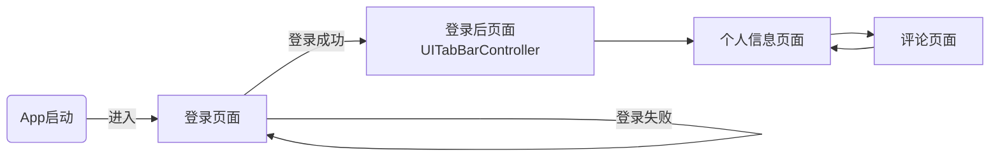


### 数据结构

由于http响应的格式为JSON，故使用字典NSDictionary保存响应。

评论图文列表的数据源使用数组NSArray保存，数组每个元素都是一个字典，对应一条评论。


### 程序关键模块

#### 程序结构

```
 ├── MyHttpAPI 网络请求类
 │   └── 验证码的GET请求
 │   └── 登录的POST请求
 │   └── 获取个人信息/评论列表的GET请求
 │
 ├── MyCacheAPI 本地存储类
 │   └── 图文列表的文本保存到Cache
 │   └── 从Cache加载图文列表的文本
 │   └── 从网络加载图片并保存到Cache
 │   └── 从Cache加载图片
 │
 ├── RegisterController 主界面：登录页面
 │   └── UITabBarController 登录后页面
 │        └── UserViewController 个人信息页面 	
 │        └── GraphicListController 图文列表页面
 │   └── 设置各个页面的按钮并绑定事件
 │   └── MyHttpAPI负责执行按钮相应的网络请求
 │
 ├── UserViewController个人信息页面 
 │   └── UIScrollView展示个人信息
 │
 ├── GraphicListController图文列表页面
 │   └── UICollectionView展示评论的图文列表页面
 │   └── MyCacheAPI作为数据源并实现本地存取
```

#### 模块一 MyHttpAPI 网络请求类

##### MyHttpAPI.h

```objc
// 负责网络通信
@interface MyHttpAPI : NSObject<NSURLSessionDelegate>
@property(nonatomic) NSString *name;// 用户登陆信息
@property(nonatomic) NSString *password;
@property(nonatomic) NSString *code;
@property(nonatomic) NSString *uuid;// 验证码的uuid
@property(nonatomic) NSString *token;
@property(nonatomic) NSString *msg; // 登录按钮返回的验证信息
@property(nonatomic) NSNumber *responseCode;// 登录按钮返回的状态码：200OK
@property(nonatomic,strong) NSDictionary *dic;// 获取的个人信息保存在字典dic里
@property(nonatomic,strong) NSDictionary *dic2;// 获取的评论信息保存在字典dic2[@"data"]里
@property(nonatomic,strong) NSURLSessionConfiguration *defaultConfigObject;
@property(nonatomic,strong) NSURLSession *delegateFreeSession;
-(instancetype)init;
// 登录页面调用：将输入框的个人信息保存到MyAPI
-(void) setJsonWIthName:(NSString *)n andPassword:(NSString *)p andCode:(NSString *)c;
// GET,获取/刷新验证码图片
-(void)getVerify:(UIButton *)btn2;
// POST,登录获取token
-(void) login;
// GET,获取个人信息/评论图文
- (void)getWithUrl:(NSString*)urlStr toDic:(NSNumber*)dicNum;
@end
```

##### MyHttpAPI.m关键方法

-(void)getVerify:(UIButton *)btn2;

通过GET请求获取/刷新验证码（按钮btn2）图片.

```objc
#pragma mark --GET
// http://172.18.178.57:3000/prod-api/captchaImage
// 获取验证码
- (void)getVerify:(UIButton *)btn2{
    NSLog(@"click btn2:获取/刷新验证码");
    NSURL *url = [NSURL URLWithString:[NSString stringWithFormat: @"http://172.18.178.57:3000/prod-api/captchaImage"]];
    NSURLRequest *request = [NSURLRequest requestWithURL:url];
    //生成任务
    NSURLSessionDataTask * dataTask = [_delegateFreeSession dataTaskWithRequest:request completionHandler:^(NSData *data, NSURLResponse *response, NSError *error){
        if(error == nil){
            NSString * jsonString = [[NSString alloc] initWithData: data encoding: NSUTF8StringEncoding];
            NSData *jsonData = [jsonString dataUsingEncoding:NSUTF8StringEncoding];
            error = nil;
            // 转字典
            NSDictionary *dic = [NSJSONSerialization JSONObjectWithData:jsonData options:NSJSONReadingAllowFragments error:&error];
            // 保存uuid 和 验证码图片
            self.uuid = dic[@"uuid"];
            NSLog(@"uuid = %@\n",self.uuid);
            UIImage * img = [self stringToUIImage:dic[@"img"]];
            [btn2 setImage:img forState:0];
            [btn2 adjustsImageWhenDisabled];
            
        }
    }];
    //创建的task是停止状态，需要我们去启动
    [dataTask resume];
}
// NSString与UIImage的相互转化
- (NSString *)imageToNSString:(UIImage *)image{
    NSData *imageData = UIImagePNGRepresentation(image);
    return [imageData base64EncodedStringWithOptions:NSDataBase64Encoding64CharacterLineLength];
}

- (UIImage *)stringToUIImage:(NSString *)string{
    NSData *data = [[NSData alloc]initWithBase64EncodedString:string
                                                      options:NSDataBase64DecodingIgnoreUnknownCharacters];
    return [UIImage imageWithData:data];
}
```

-(void)login；

通过POST请求登录，并将响应中的token、msg 、code保存。

```objc
#pragma mark --POST
// http://172.18.178.57:3000/prod-api/login
-(void)login{
    NSURL * url = [NSURL URLWithString:@"http://172.18.178.57:3000/prod-api/login"];
    NSMutableURLRequest * urlRequest = [NSMutableURLRequest requestWithURL:url];
    [urlRequest setHTTPMethod:@"POST"];
    NSDictionary *headers = @{
       @"Content-Type" : @"application/json"
    };
    [urlRequest setAllHTTPHeaderFields:headers]; //重点是这一句！！
    NSDictionary *dic = @{@"username":_name, @"password":_password, @"code":_code, @"uuid":_uuid};
    NSError *error = nil;
    NSData *jsonData = [NSJSONSerialization dataWithJSONObject:dic options:1 error:&error];
    NSString *jsonString = [[NSString alloc] initWithData:jsonData encoding:NSUTF8StringEncoding];
    urlRequest.HTTPBody = [[NSData alloc] initWithData:[jsonString dataUsingEncoding:NSUTF8StringEncoding]];
    NSURLSessionDataTask * dataTask =[_delegateFreeSession dataTaskWithRequest:urlRequest completionHandler:^(NSData *data, NSURLResponse *response, NSError *error) {
        //NSLog(@"Response:%@\n error:%@\n", response, error);
        if(error == nil) {
            //NSString * text = [[NSString alloc] initWithData: data encoding: NSUTF8StringEncoding];
            NSDictionary *dict = [NSJSONSerialization JSONObjectWithData:data options:0 error:nil];
            self.token = dict[@"token"];
            self.msg = dict[@"msg"];
            self.responseCode = dict[@"code"];
            NSLog(@"token= %@",self.token);
            NSLog(@"code = %@\n",dict[@"code"]);
        }
    }];
    [dataTask resume];
}
```

-(void)getWithUrl:(NSString\*)urlStr toDic:(NSNumber\*)dicNum；

通过GET请求获取个人信息/或评论文本（含图片url）并保存在字典dic1/dic2里。

在获取评论文本（含图片url）的时候采用信号量（dispatch_semaphore_t）进行同步，防止图文列表还没加载完就将其保存到Cache。

```objc
#pragma mark --GET2
// 获取个人信息,@"http://172.18.178.57:3000/prod-api/system/user/profile@" , 1
// 获取评论图文 @"http://172.18.178.57:3000/prod-api/yuan/comment/list" , 2
- (void)getWithUrl:(NSString*)urlStr toDic:(NSNumber*)dicNum{
    NSURL *url = [NSURL URLWithString:urlStr];
    // 在获取评论图文时需要使用信号量进行同步
    dispatch_semaphore_t sema = dispatch_semaphore_create(0);
    if(dicNum.intValue == 1){
        dispatch_semaphore_signal(sema);
    }
    NSMutableURLRequest *request = [NSMutableURLRequest requestWithURL:url cachePolicy:NSURLRequestReturnCacheDataElseLoad timeoutInterval:5.0];
    NSDictionary *headers = @{
        @"Authorization" : _token
    };
    [request setAllHTTPHeaderFields:headers];
    //生成任务
    NSURLSessionDataTask * dataTask = [self.delegateFreeSession dataTaskWithRequest:request completionHandler:^(NSData *data, NSURLResponse *response, NSError *error){
    if(error == nil){
        error = nil;
        // 转字典
        NSDictionary *dic = [NSJSONSerialization JSONObjectWithData:data options:NSJSONReadingAllowFragments error:&error];
        if(dicNum.intValue == 1){
            self.dic = dic;
        }else{
            self.dic2 = dic;
            NSLog(@"dic2 is loaded by url,count= %ld",[self.dic2[@"data"] count]);
        }
    }
    dispatch_semaphore_signal(sema);// 进行V操作
    }];
    //创建的task是停止状态，需要我们去启动
    [dataTask resume];
    dispatch_semaphore_wait(sema, DISPATCH_TIME_FOREVER);// P操作
}
```

#### 模块二 MyCacheAPI 本地存储类

##### MyCacheAPI .h

```objc
@interface MyCacheAPI:NSObject
@property(nonatomic,strong) NSArray *list2;// 获取的评论信息保存在list2里
@property(nonatomic,strong) NSString * imageCachePath;// 图片cache路径
@property(nonatomic,strong) NSString * listCachePath;// 文本cache路径
- (instancetype) init;
- (UIImage *) getImgByUrl:(NSString*)urlStr;
// 如果本地cache不存在文本缓存，则将GET请求得到的评论文本dic[@"data"]保存到本地cache
- (void) saveListWithDic:(NSDictionary *)dic;
// 从cache加载评论文本到list2
- (void) loadListFromCache;
// 将所有图片保存在本地cache
- (void) loadAllImgToCache;
// 清空数据源
- (void) clearList;
@end
```

##### MyCacheAPI .m关键方法

初始化文件路径

```objc
-(instancetype)init{
    // cache路径
    NSString *cacheDir =[NSSearchPathForDirectoriesInDomains(NSCachesDirectory, NSUserDomainMask,YES) lastObject];
    // 图片保存路径
    _imageCachePath = [cacheDir stringByAppendingPathComponent:@"imgCache"];
    // 评论保存路径
    _listCachePath = [cacheDir stringByAppendingPathComponent:@"listCache"];
    return self;
}
```

如果本地cache不存在文本缓存，则将GET请求得到的评论文本dic[@"data"]保存到本地cache。

这里我使用NSBlockOperation进行异步存储。

```objc
// 如果本地cache不存在文本缓存，则将GET请求得到的评论文本dic[@"data"]保存到本地cache
- (void)saveListWithDic:(NSDictionary *)dic{
    BOOL isDir;
    if([[NSFileManager defaultManager] fileExistsAtPath:self.listCachePath isDirectory:&isDir]){
       return;
    }else{
        // 创建存放评论文本的目录
        [[NSFileManager defaultManager] createDirectoryAtPath:self.listCachePath withIntermediateDirectories:YES attributes:nil error:nil];
    }
    _list2 = dic[@"data"];
    NSArray * arr1 = [[NSArray alloc]initWithObjects:@"createBy",@"createTime",@"commentId",@"content",@"media0",@"media1",@"media2",@"media3",@"media4",@"media5",@"media6",@"media7",@"media8",@"media9",nil];
    for(int i = 0; i < _list2.count; ++i){
        NSOperationQueue * queue=[[NSOperationQueue alloc]init];
        NSBlockOperation *op1 = [NSBlockOperation blockOperationWithBlock:^{
            NSString* dicName = [NSString stringWithFormat:@"%@%@%@",@"commentId",self.list2[i][@"commentId"],@".plist"];
            NSString *dictPath = [self.listCachePath stringByAppendingPathComponent:dicName];
            if(![[NSFileManager defaultManager] fileExistsAtPath:dictPath]){
                NSMutableDictionary *dic0 = [[NSMutableDictionary alloc] init];
                for(int j = 0; j < arr1.count;++j){
                    [dic0 setValue:self.list2[i][arr1[j]] forKey:arr1[j]];
                }
                NSDictionary * dic_i = [[NSDictionary alloc] initWithDictionary:dic0];
                [dic_i writeToFile:dictPath atomically:YES];
                //NSLog(@"%@=%@",dicName,dic_i);
            }
        }];
        [queue addOperation:op1];
    }
}
```

从cache加载评论文本到list2

```objc
// 从cache加载评论文本到list2
- (void) loadListFromCache{
    NSArray *file2 = [[[NSFileManager alloc] init] subpathsAtPath:_listCachePath];
    NSLog(@"loadListFromeCache: %@",file2);
    NSMutableArray *loadList = [[NSMutableArray alloc] init];
    for(int i = 0; i<file2.count; ++i){
        NSString *dictPath = [self.listCachePath stringByAppendingPathComponent:file2[i]];
        NSDictionary *dic = [[NSDictionary alloc]initWithContentsOfFile:dictPath];
        [loadList addObject:dic];
    }
    _list2 = [[NSArray alloc] initWithArray:loadList];
}
```

根据url从网络加载图片并保存在本地

```objc
// 获取url中的图片名称(含格式)
-(NSString*) getNameFromUrl:(NSString*)urlStr{
    NSRange range = [urlStr rangeOfString:@"/" options:NSBackwardsSearch];
    NSString * imgName = [urlStr substringFromIndex:range.location+1];
    return imgName;
}

// 从网络加载图片并保存在本地
-(UIImage *) getImgAndSave:(NSString*)urlStr{
    NSLog(@"网络加载");
    //cache中存放图片的目录不存在则创建目录
    BOOL isDir;
    if(![[NSFileManager defaultManager] fileExistsAtPath:self.imageCachePath isDirectory:&isDir]){
        // 创建存放图片的目录
        [[NSFileManager defaultManager] createDirectoryAtPath:self.imageCachePath withIntermediateDirectories:YES attributes:nil error:nil];
    }
    NSString *imgName = [self getNameFromUrl:urlStr];
    // 图片路径
    NSString *imagePath = [_imageCachePath stringByAppendingPathComponent:imgName];
    NSURL *url = [NSURL URLWithString:[NSString stringWithFormat:@"%@%@", @"http://172.18.178.57:3000/prod-api",urlStr]];
    // 用url从网络加载
    UIImage * img = [UIImage imageWithData:[NSData dataWithContentsOfURL:url]];
    NSString* extension = [imgName substringFromIndex:imgName.length-3];
    // 保存在cache里
    if ([[extension lowercaseString] isEqualToString:@"png"]) {
        //NSLog(@"%@",extension);
        [UIImagePNGRepresentation(img) writeToFile:imagePath atomically:YES];
    }else if ([[extension lowercaseString] isEqualToString:@"jpg"] || [[extension lowercaseString] isEqualToString:@"peg"]){
        // 只取最后3位，所以jpeg->peg
        //NSLog(@"%@",extension) ;
        [UIImageJPEGRepresentation(img, 1.0) writeToFile:imagePath atomically:YES];
    } else {
        NSLog(@"文件后缀不认识");
    }
    return img;
}
```

根据url获取图片：本地不存在，从网络加载，并保存到cache；否则从cache加载

```objc
// 获取图片：本地不存在，从网络加载，并保存到cache；否则从cache加载
-(UIImage *) getImgByUrl:(NSString*)urlStr{
    // 在这里实现从网络读取并保存到本地，还是从cache读取
    NSString *imgName = [self getNameFromUrl:urlStr];
    NSString *imagePath = [_imageCachePath stringByAppendingPathComponent:imgName];
    if(![[NSFileManager defaultManager] fileExistsAtPath:imagePath]){
        // 从网络加载并保存在cache
        UIImage * img = [self getImgAndSave:urlStr];
        return img;
    }else{
        NSLog(@"本地加载");
        // 从cache里加载
        UIImage *getImage = [UIImage imageWithContentsOfFile:imagePath];
        return getImage;
    }
}
// 上面函数的无返回版本：本地不存在加载到cache，否则返回
-(void) loadImgByUrl:(NSString*)urlStr{
    NSString *imgName = [self getNameFromUrl:urlStr];
    NSString *imagePath = [_imageCachePath stringByAppendingPathComponent:imgName];
    if(![[NSFileManager defaultManager] fileExistsAtPath:imagePath]){
        // 从网络加载并保存在cache
        [self getImgAndSave:urlStr];
    }else{
        NSLog(@"已加载到本地cache");
        return;
    }
}
```

通过函数-(void) loadImgByUrl:(NSString*)urlStr将所有图片保存在本地cache，使用NSOperationQueue异步加载。

```objc
// 将所有图片保存在本地cache
-(void) loadAllImgToCache{
    for(int i = 0; i < _list2.count; ++i){
        for(int j = 1; j <=9; ++j){
            NSString * imgName = [NSString stringWithFormat:@"%@%@",@"media",[NSNumber numberWithInt:j]];
            if([_list2[i][imgName] isEqualToString:@""]){
                continue;
            }
            // 使用NSOperationQueue异步加载
            NSOperationQueue * queue=[[NSOperationQueue alloc]init];
            [queue addOperationWithBlock:^{
                NSString * path =self.list2[i][imgName];
                [self loadImgByUrl:path]; // 加载到cache
            }];
        }
    }
}
```

#### 模块三  UserViewController个人信息页面 

本模块较为简单，在登录后页面调用，将GET请求得到的个人信息的字典dic1进行展示，使用滚动视图UIScrollView以便在较小尺寸的屏幕下也能展示全部个人信息，便不在赘述。

```objc
@interface UserViewController : UIViewController
// 滚动视图UIScrollView以便在较小尺寸的屏幕下也能展示全部个人信息
@property(nonatomic,strong) UIScrollView * view1;
// 个人信息的字典
@property(nonatomic,strong) NSDictionary *dic;
// 直接通过个人信息字典dic1进行初始化
-(instancetype)initWithFrame:(CGRect)frame andInfo:(NSDictionary *) dic1;
@end
```

#### 模块四 GraphicListController图文列表页面

采用UICollectionView展示图文列表，MyCacheAPI作为数据源，此模块只负责展示图文列表。

因为有的按钮涉及到网络访问，故将按钮设置放在主视图控制器中添加。

##### GraphicListController.h

```objc
#import "MyCacheAPI.h"
@interface GraphicListController : UIViewController<UICollectionViewDataSource,UICollectionViewDelegate,UICollectionViewDelegateFlowLayout>
@property(nonatomic,strong) MyCacheAPI *myCache;// 数据源，获取的评论信息保存在myCache.list2里
@property(nonatomic,strong) UICollectionView * table;//  图文列表
- (instancetype) initWithFrame:(CGRect)frame;
@end
```

##### GraphicListController.m

初始化：设置UICollectionView的数据源、代理，注册cell

```objc
-(instancetype)initWithFrame:(CGRect)frame{
    self.view = [[UIView alloc]initWithFrame:frame];
    self.view.backgroundColor = [UIColor whiteColor];
    _table = [[UICollectionView alloc] initWithFrame:CGRectMake(0, 48, frame.size.width, frame.size.height*0.85) collectionViewLayout:[self getLatout]];
    _table.backgroundColor = [UIColor whiteColor];
    // 注册cell
    [_table registerClass:[UICollectionViewCell class] forCellWithReuseIdentifier:@"cellID"];
    // 遵守协议
    _table.delegate = self;
    _table.dataSource = self;
    [self.view addSubview:_table];
    // "加载" "清空" "删除缓存"
    _myCache = [[MyCacheAPI alloc] init];
    return self;

}
- (UICollectionViewFlowLayout*) getLatout{
    // UICollectionViewFlowLayout流水布局的内部成员属性有以下：
    UICollectionViewFlowLayout *layout = [[UICollectionViewFlowLayout alloc]init];
    layout.itemSize = CGSizeMake(100, 100);// 定义大小
    layout.minimumLineSpacing = 2;// 设置最小行间距
    layout.minimumInteritemSpacing = 2;// 设置垂直间距
    // 设置滚动方向（默认垂直滚动）
    // layout.scrollDirection = UICollectionViewScrollDirectionHorizontal;// 水平滚动
    return layout;
}
```

UICollectionViewDataSource，数据源方法

```objc
#pragma mark -- UICollectionViewDataSource
//定义某个section的Cell个数
-(NSInteger)collectionView:(UICollectionView *)collectionView numberOfItemsInSection:(NSInteger)section{
    //每个section中cell的个数,[list2[section].imgs count] + 3
    NSInteger num = 0;//图片张数
    for(int j = 1; j <=9; ++j){
        NSString * imgName = [NSString stringWithFormat:@"%@%@",@"media",[NSNumber numberWithInt:j]];
        if([_myCache.list2[section][imgName] isEqualToString:@""]){
            continue;
        }
        num++;
    }
    return num+3;
}
//定义展示的Section的个数
-(NSInteger)numberOfSectionsInCollectionView:(UICollectionView *)collectionView{
    return [_myCache.list2 count];// section的个数
}
//每个UICollectionView展示的内容
-(UICollectionViewCell *)collectionView:(UICollectionView *)collectionView cellForItemAtIndexPath:(NSIndexPath *)indexPath
{
    static NSString * cellID = @"cellID";
    UICollectionViewCell * cell = [collectionView dequeueReusableCellWithReuseIdentifier:cellID forIndexPath:indexPath];
    cell.backgroundColor = [UIColor whiteColor];
    if(_myCache.list2.count <= indexPath.section){
        return cell;
    }
    CGFloat w = _table.bounds.size.width;
    NSDictionary * temp = _myCache.list2[indexPath.section];
    if(indexPath.row <= 1){
        UILabel *label = [[UILabel alloc] initWithFrame:CGRectMake(0, 0, w*0.89, 25)];
        label.layer.masksToBounds = YES;// 边框圆角
        label.layer.cornerRadius = 10; // 圆角弧度
        label.layer.borderWidth = 2; // 边框宽度
        label.layer.borderColor = [UIColor grayColor].CGColor;// 边框颜色
        if(indexPath.row == 0){
            [label setText:[NSString stringWithFormat:@"  评论ID: %@    发布者: %@",temp[@"commentId"], temp[@"createBy"]]];
        }else{
            [label setText:[NSString stringWithFormat:@"  发布时间: %@",temp[@"createTime"]]];
        }
        [cell setBackgroundView:label];
    }else if(indexPath.row == 2){
        UITextView *textView = [self getTextViewWithFrame:CGRectMake(0, 0, w*0.89, 100)];
        [textView setText:[NSString stringWithFormat:@"评论内容:   %@",temp[@"content"]]];
        [cell setBackgroundView:textView];
        
    }
    else if(indexPath.row >= 3){//这里为每个图片都分配了一个cell，也可以将所有图片放在一个cell里
        NSOperationQueue * queue=[[NSOperationQueue alloc]init];
        [queue addOperationWithBlock:^{
            NSString * imgIndex = [NSString stringWithFormat:@"%@%ld",@"media",indexPath.row-2];
            NSString * urlStr = temp[imgIndex];
            UIImage *img = [self.myCache getImgByUrl:urlStr];
            [[NSOperationQueue mainQueue] addOperationWithBlock:^{
                UIImageView* imgView=[[UIImageView alloc] init];
                imgView.frame= CGRectMake(0, 0, w*0.26, w*0.26);
                imgView.image=img;
                [cell setBackgroundView:imgView];
            }];
        }];
    }
    return cell;
}
// 返回一个UITextView，展示评论内容
-(UITextView*)getTextViewWithFrame:(CGRect)frame{
    UITextView* textView =  [[UITextView alloc] initWithFrame:frame];
    textView.backgroundColor = [UIColor clearColor];//设置它的背景颜色
    textView.layer.masksToBounds = YES;// 边框圆角
    textView.layer.cornerRadius = 10; // 圆角弧度
    textView.layer.borderWidth = 2; // 边框宽度
    textView.layer.borderColor = [UIColor grayColor].CGColor;// 边框颜色
    textView.returnKeyType = UIReturnKeyDefault;//返回键的类型
    textView.scrollEnabled = YES;//是否可以拖动
    textView.autoresizingMask = UIViewAutoresizingFlexibleHeight;//自适应
    textView.font = [UIFont fontWithName:@"Arial" size:18];//字体，大小
    [textView setEditable:NO];
    return textView;
}
```

UICollectionViewDelegateFlowLayout，设置设置布局代理

```objc
#pragma mark --UICollectionViewDelegateFlowLayout
//定义每个UICollectionView 的大小
- (CGSize)collectionView:(UICollectionView *)collectionView layout:(UICollectionViewLayout*)collectionViewLayout sizeForItemAtIndexPath:(NSIndexPath *)indexPath{
    CGFloat w = _table.bounds.size.width;
    if(indexPath.row <= 1){
        return CGSizeMake(w*0.89, 25);
    }
    if(indexPath.row ==2){
        return CGSizeMake(w*0.89, 100);
    }
    return CGSizeMake(w*0.26, w*0.26);
}
//定义每个UICollectionView 的 margin(每个section的边缘)
-(UIEdgeInsets)collectionView:(UICollectionView *)collectionView layout:(UICollectionViewLayout *)collectionViewLayout insetForSectionAtIndex:(NSInteger)section{
    CGFloat w = _table.bounds.size.width;
    return UIEdgeInsetsMake(30, 0.05*w, 20, 0.05*w);// 上、左、下、右
}
//动态设置每行的间距大小
- (CGFloat)collectionView:(UICollectionView *)collectionView layout:(UICollectionViewLayout*)collectionViewLayout minimumLineSpacingForSectionAtIndex:(NSInteger)section{
    return 8;
}
//动态设置每列的间距大小
- (CGFloat)collectionView:(UICollectionView *)collectionView layout:(UICollectionViewLayout*)collectionViewLayout minimumInteritemSpacingForSectionAtIndex:(NSInteger)section{
    CGFloat w = _table.bounds.size.width;
    return 0.06*w; // 设置合适的列间距，使最后一行的图片对齐
}
```

UICollectionViewDelegate，事件响应代理

```objc
#pragma mark --UICollectionViewDelegate
//UICollectionView被选中时调用的方法
-(void)collectionView:(UICollectionView *)collectionView didSelectItemAtIndexPath:(NSIndexPath *)indexPath{
    NSLog(@"select section %zd,row %zd",indexPath.section,indexPath.row);
}
//返回这个UICollectionView是否可以被选择
-(BOOL)collectionView:(UICollectionView *)collectionView shouldSelectItemAtIndexPath:(NSIndexPath *)indexPath{
    if(indexPath.row == 2) return YES;
    return NO;// 这里只是展示，如果要评论，则设为YES
}
// cell的动画效果
- (void)collectionView:(UICollectionView *)collectionView willDisplayCell:(UICollectionViewCell *)cell forRowAtIndexPath:(NSIndexPath *)indexPath{
    cell.backgroundView.layer.transform = CATransform3DMakeScale(0.3, 0.3, 0.5);
    // 滚动时的加载动画
    [UIView animateWithDuration:0.3 animations:^{cell.backgroundView.layer.transform = CATransform3DMakeScale(1, 1, 1);}];
}
```


#### 模块五 RegisterController 主界面：登录页面

RegisterController为主视图控制器，启动app，首先进入登录界面view1；

登录成功后进入一个标签栏页面tab.view(个人信息页面userVc,评论图文列表页面graph)。

在本模块使用MyHttpAPI进行网络通信。

#####  RegisterController.h

```objc
#import <UIKit/UIKit.h>
#import "MyHttpAPI.h"
#import "GraphicListController.h"
#import "UserViewController.h"
@interface RegisterController : UIViewController
@property(nonatomic,strong) MyHttpAPI * myAPI;// 负责网络通信
@property(nonatomic,strong) UIView * view1;// 登录页面
@property(nonatomic,strong) UITabBarController *tab;// 登录后页面:(个人信息页面,评论图文列表页面)
@property(nonatomic,strong) UserViewController * userVc;// 个人信息页面
@property(nonatomic,strong) GraphicListController *graph;// 评论图文列表页面
@property(nonatomic) UITextField * inputName; // 输入框
@property(nonatomic) UITextField * inputPassword;
@property(nonatomic) UITextField * inputVerify;
@property(nonatomic,strong) UIButton * btn2; //刷新验证码按钮
@end
```

#####  RegisterController.m

初始化

```objc
-(instancetype)init{
    // myAPI负责网络通信
    _myAPI = [[MyHttpAPI alloc] init];
    // 设置登录界面
    [self setRegister];
    // 登录后的页面为一个标签栏页面:个人信息，评论区.先初始化备用
    [self setGraphUI];
    _tab = [[UITabBarController alloc] init];
    return self;
}
```

设置登录页面UI布局(函数内容省略)

```objc
#pragma mark --RegisterController
-(void)setRegister{
    ...
}
// 得到单行输入框
-(UITextField *)getTextField:(CGRect)f andName:(NSString *)s1 andPlaceHolder:(NSString *)s2 andSecure:(BOOL)secure{
    ...
}
//点击空白处键盘隐藏
-(void)touchesBegan:(NSSet *)touches withEvent:(UIEvent *)event{
    [_inputName resignFirstResponder];
    [_inputPassword resignFirstResponder];
    [_inputVerify resignFirstResponder];
}
```

设置验证码图片按钮，使用MyHttpAPI来获取/刷新验证码

```objc
#pragma mark --VerifyCodeBtn
// 验证码图片按钮（点击刷新）
-(void)setBtn:(UIView *)view WithSize:(CGRect)size{
    UIButton* btn2 = [[UIButton alloc] initWithFrame:size];
    [btn2 addTarget:self action:@selector(getVerify) forControlEvents:UIControlEventTouchUpInside];
    btn2.layer.borderColor=[UIColor grayColor].CGColor;
    btn2.layer.borderWidth=1;
    btn2.backgroundColor = [UIColor clearColor];
    [btn2 setTitle: @"验证码" forState: UIControlStateNormal];
    [btn2 setTitleColor:[UIColor blackColor]forState:UIControlStateNormal];
    [view addSubview:btn2];
    _btn2 = btn2;
    [self getVerify];//初始：获取验证码
}
// 获取验证码
- (void)getVerify{
    _inputVerify.text = @"";
    [_myAPI getVerify:_btn2];//MyHttpAPI负责网络访问
}
```

设置登录按钮，使用MyHttpAPI来进行登录，并在登录成功后获取个人信息。

```objc
#pragma mark --RegisterBtn
// 圆形登录按钮UI
-(void)setBtn:(UIView *)view Withx:(CGFloat)x Withy:(CGFloat)y WithSize:(CGFloat)size{
    UIButton * btn = [[UIButton alloc] initWithFrame:CGRectMake(0, 0, size, size)];
    [btn addTarget:self action:@selector(logIn) forControlEvents:UIControlEventTouchUpInside];
    btn.center=CGPointMake(x, y);
    btn.layer.borderColor=[UIColor blackColor].CGColor;
    btn.layer.borderWidth=2;
    btn.layer.cornerRadius = btn.bounds.size.width / 2.0; // 圆形按钮
    [btn setTitle: @"登录" forState: UIControlStateNormal];
    btn.titleLabel.font = [UIFont systemFontOfSize: size/4.0];
    btn.backgroundColor = [UIColor clearColor];
    [btn setTitleColor:[UIColor blackColor]forState:UIControlStateNormal];
    [view addSubview:btn];
}
// 登录按钮绑定事件
-(void)logIn{
    NSLog(@"%@",[NSString stringWithFormat:@"%@ %@ %@ %@",@"click btn1:",_inputName.text,_inputPassword.text,_inputVerify.text]);
    if([_inputName.text isEqual:@""] || [_inputPassword.text isEqual:@""] || [_inputVerify.text isEqual:@""]){
        [self addAlertTitle:@"提示" andMsg:@"用户名、密码、验证码不能为空!" andComfirm:@"继续输入"];
        return;
    }
    [_myAPI setJsonWIthName:_inputName.text andPassword:_inputPassword.text andCode:_inputVerify.text];
    [_myAPI login];// 由于并发?的原因导致后面的语句在这句没结束就执行了，所以加个弹窗延迟
    UIAlertController *alertWait = [UIAlertController alertControllerWithTitle:@"提示" message:@"等待结果..." preferredStyle:UIAlertControllerStyleAlert];
    [self presentViewController:alertWait animated:YES completion:nil];
    [self performSelector:@selector(delayAlertWait) withObject:nil afterDelay:0.5f];
}

// 判断是否登录成功以及接下来的事件
-(void) delayAlertWait{
    // 消除弹窗
    [self dismissViewControllerAnimated:YES completion:nil];
    NSLog(@"登录成功??? responseCode=%@",_myAPI.responseCode);
    if([_myAPI.responseCode intValue] == 200){
        // 跳转登录后的界面
        UIAlertController *alert1 = [UIAlertController alertControllerWithTitle:@"提示" message:@"登录成功!" preferredStyle:UIAlertControllerStyleAlert];
        // 加载个人信息
        [_myAPI getWithUrl:@"http://172.18.178.57:3000/prod-api/system/user/profile" toDic:[NSNumber numberWithInt:1]];
        [self presentViewController:alert1 animated:YES completion:nil];
        // 在这跳转登录后的界面
        [self performSelector:@selector(trunToInfo) withObject:nil afterDelay:0.5f];
        return;
    }else{
        // 登录失败
        [self addAlertTitle:@"提示" andMsg:_myAPI.msg andComfirm:@"请重新输入"];
        [self getVerify];
    }
}
// 跳转到登录成功后的界面
-(void) trunToInfo{
    [self dismissViewControllerAnimated:YES completion:nil]; // 消除弹窗
    [self setUserVC];
    [_graph.myCache clearList];
    [_graph.table reloadData];
    _tab.viewControllers = @[_userVc,_graph];
    // 跳转到登录成功后的界面
    [_view1 addSubview:_tab.view];
    // 清空登录页面输入框
    _inputName.text = @"";
    _inputPassword.text = @"";
    _inputVerify.text = @"";
}
// 增加弹窗
-(void)addAlertTitle:(NSString*)title andMsg:(NSString*)msg andComfirm:(NSString*)comfirm{
    UIAlertController *alertVC = [UIAlertController alertControllerWithTitle:title message:msg preferredStyle:UIAlertControllerStyleAlert];
    UIAlertAction *comfirmAc = [UIAlertAction actionWithTitle:comfirm style:UIAlertActionStyleDefault handler:nil];
    [alertVC addAction:comfirmAc];
    [self presentViewController:alertVC animated:YES completion:nil];
}
```

设置个人信息界面UI，及其标签栏按钮的图片，并增加一个返回登录界面按钮。

```objc
#pragma mark --SetUserVC
// 设置个人信息界面
-(void)setUserVC{
    _userVc = [[UserViewController alloc] initWithFrame:self.view1.bounds andInfo:self.myAPI.dic];
    _userVc.tabBarItem.title = @"个人信息";
    // tabBar按钮图标
    [_userVc.tabBarItem setImage:[[self getImg:@"test3.png" size:CGSizeMake(30, 30)] imageWithRenderingMode:UIImageRenderingModeAlwaysOriginal]];
    [_userVc.tabBarItem setSelectedImage:[[self getImg:@"test3_selected.png" size:CGSizeMake(30, 30)] imageWithRenderingMode:UIImageRenderingModeAlwaysOriginal]];
    [self setBackBtn:_userVc];
    // _tab为登录后界面
}
// 以newsize大小获取图像
- (UIImage *)getImg:(NSString*)name size:(CGSize)newsize{
    UIGraphicsBeginImageContext(newsize);
    UIImage *img = [UIImage imageNamed:name];
    [img drawInRect:CGRectMake(0, 0, newsize.width, newsize.height)];
    UIImage* scaledImage = UIGraphicsGetImageFromCurrentImageContext();
    UIGraphicsEndImageContext();
    return scaledImage;
}
// 返回登录界面按钮
-(void)setBackBtn:(UserViewController*)vc{
    UIButton* btn = [[UIButton alloc] initWithFrame:CGRectMake(0, 10, 130, 22)];
    [btn addTarget:self action:@selector(returnRegister) forControlEvents:UIControlEventTouchUpInside];
    [btn setTitle: @"< 退出登陆" forState: UIControlStateNormal];
    [btn setTitleColor:[UIColor blueColor]forState:UIControlStateNormal];
    [btn setTitleShadowColor:[UIColor grayColor] forState:UIControlStateNormal];
    btn.titleLabel.font = [UIFont systemFontOfSize: 20];
    btn.backgroundColor = [UIColor clearColor];
    [vc.view1 addSubview:btn];
}
// 返回登录界面，并刷新验证码
-(void)returnRegister{
    [_tab.view removeFromSuperview];
    [_myAPI getVerify:_btn2];
}
```

设置评论图文列表界面的按钮及其绑定事件，

```objc
#pragma mark --SetGraphVC
-(void)setGraphUI{
    _graph = [[GraphicListController alloc]initWithFrame:_view1.bounds];
    _graph.tabBarItem.title = @"评论区";
    //[_graph.table reloadData];
    [_graph.tabBarItem setImage:[[self getImg:@"test1.png" size:CGSizeMake(30, 30)] imageWithRenderingMode:UIImageRenderingModeAlwaysOriginal]];
    [_graph.tabBarItem setSelectedImage:[[self getImg:@"test1_selected.png" size:CGSizeMake(30, 30)] imageWithRenderingMode:UIImageRenderingModeAlwaysOriginal]];
    // 图文列表界面设置4个按钮
    [self setBtn:_graph.view withText:@"加载" withIndex:0 withAction:@selector(action1)];
    [self setBtn:_graph.view withText:@"清空" withIndex:1 withAction:@selector(action2)];
    [self setBtn:_graph.view withText:@"删除缓存" withIndex:2 withAction:@selector(action3)];
    [self setBtn:_graph.view withText:@"查看缓存" withIndex:3 withAction:@selector(action4)];
}
-(CGRect)getPos:(CGFloat)i{
    CGFloat w = _graph.view.bounds.size.width;
    CGFloat h = _graph.view.bounds.size.height;
    if(i==0) return CGRectMake(0, h*0.05, w/5, 15);
    if(i==1) return CGRectMake(w/5, h*0.05, w/5, 15);
    if(i==2) return CGRectMake(2*w/5, h*0.05, 3*w/10, 15);
    if(i==3) return CGRectMake(7*w/10, h*0.05, 3*w/10, 15);
    return CGRectMake(0, 0, 0, 0);
}
-(UIButton *)setBtn:(UIView *)view withText:(NSString*)text withIndex:(CGFloat)i withAction:(SEL)action0{
    UIButton* btn = [[UIButton alloc] initWithFrame:[self getPos:i]];
    [btn addTarget:self action:action0 forControlEvents:UIControlEventTouchUpInside];
    [btn setTitle:text forState: UIControlStateNormal];
    [btn setTitleColor:[UIColor blueColor]forState:UIControlStateNormal];
    [btn setTitleShadowColor:[UIColor grayColor] forState:UIControlStateNormal];
    btn.titleLabel.font = [UIFont systemFontOfSize: 20];
    btn.backgroundColor = [UIColor clearColor];
    [view addSubview:btn];
    return btn;
}
```

4个事件：加载、清空、删除缓存、查看缓存。

通过MyHttpAPI进行网络访问，通过MyCacheAPI进行本地存取。

通过NSBlockOperation的addDependency增加操作依赖性，保证操作顺序执行（只有从网络加载完图文列表后，才能将图文列表的文本和图片保存到cache，然后才能重新加载数据源）。

```objc
// 按钮绑定事件
// 加载：本地不存在，从网络加载并保存到cache；否则从cache加载
-(void)action1{
    NSLog(@"加载");
    // 加载图标
    UIViewController* vc = [self getLoadingVc];
    [self.graph presentViewController:vc animated:YES completion:nil];
    // 多线程
    NSOperationQueue * queue=[[NSOperationQueue alloc]init];
    //queue.maxConcurrentOperationCount  = 1;
    NSBlockOperation *op1 = [NSBlockOperation blockOperationWithBlock:^{
        NSLog(@"thread1  获取图文列表的文本");
        BOOL isDir;
        if(![[NSFileManager defaultManager] fileExistsAtPath:self.graph.myCache.listCachePath isDirectory:&isDir]){
            // 从网络获取图文列表的文本到self.myAPI.dic2[@"data"]
            [self.myAPI getWithUrl:@"http://172.18.178.57:3000/prod-api/yuan/comment/list" toDic:[NSNumber numberWithInt:2]];
        }else{
            // 从本地cache加载图文列表的文本到list2
            [self.graph.myCache loadListFromCache];
        }
        NSLog(@"thread1  end");
    }];
    NSBlockOperation *op2 = [NSBlockOperation blockOperationWithBlock:^{
        NSLog(@"thread2  将获取的图文列表的文本、图片保存到cache");
        // 如果本地cache不存在图文列表的文本，将lsit2保存到cache;否则返回
        [self.graph.myCache saveListWithDic:self.myAPI.dic2];
        // 将所有图片加载到cache（如果某一图片已在cache则该图片的加载会跳过）
        [self.graph.myCache loadAllImgToCache];
        NSLog(@"thread2  end");
    }];
    [op2 addDependency:op1]; // 让op2 依赖于 op1，则先执行op1，在执行op2
    [queue addOperation:op1]; // 添加操作到队列中
    [queue addOperation:op2];
    // 主线程更新collectionView
    NSBlockOperation *op3 = [NSBlockOperation blockOperationWithBlock:^{
        NSLog(@"thread3  图文列表更新");
        [self.graph.table reloadData];
        //[waitView stopAnimating];
        [self.graph dismissViewControllerAnimated:YES completion:nil]; // 消除弹窗
        NSLog(@"thread3  end");
    }];
    [op3 addDependency:op2];
    [[NSOperationQueue mainQueue] addOperation:op3];
}
// 清空
-(void)action2{
    NSLog(@"清空");
    [_graph.myCache clearList];
    [_graph.table reloadData];
    [self addAlertTitle:@"提示" andMsg:@"清空成功!" andComfirm:@"确定"];
}
// 删除缓存
-(void)action3{
    NSLog(@"删除缓存");// 删除缓存
    [_graph.myCache clearList];
    [_graph.table reloadData];
    [[NSFileManager defaultManager] removeItemAtPath:_graph.myCache.imageCachePath error:nil];
    [[NSFileManager defaultManager] removeItemAtPath:_graph.myCache.listCachePath error:nil];
    [self addAlertTitle:@"提示" andMsg:@"已将本地缓存删除!" andComfirm:@"确定"];
}
// 查看缓存：返回cache中的评论数和图片数
-(void)action4{
    NSLog(@"查看缓存");// 查看缓存
    NSArray *file = [[[NSFileManager alloc] init] subpathsAtPath:_graph.myCache.imageCachePath];
    // NSLog(@"img=%@",file);
    NSArray *file2 = [[[NSFileManager alloc] init] subpathsAtPath:_graph.myCache.listCachePath];
    // NSLog(@"list=%@",file2);
    NSString * msg = [NSString stringWithFormat:@"图片缓存: %ld张 \n评论缓存: %ld条",file.count,file2.count];
    [self addAlertTitle:@"查看缓存" andMsg:msg andComfirm:@"确定"];
}
// 加载时显示的旋转菊花图标
-(UIViewController*)getLoadingVc{
    UIViewController *vc = [[UIViewController alloc] init];
    vc.view = [[UIView alloc] initWithFrame:CGRectMake(0, 0, 100, 100)];
    UIActivityIndicatorView *waitView = [[UIActivityIndicatorView alloc]initWithActivityIndicatorStyle:UIActivityIndicatorViewStyleLarge];
    vc.view.center = CGPointMake(_view1.bounds.size.width/2, _view1.bounds.size.width/2);
    waitView.center = CGPointMake(_view1.bounds.size.width/2, _view1.bounds.size.width/2);
    waitView.backgroundColor = [UIColor whiteColor];//设置背景颜色
    [vc.view addSubview:waitView];
    [waitView startAnimating];
    return vc;
}
```


## 实验过程

### 遇到的问题及解决情况

**问题1：**GET请求响应的验证码字符串转图片失败

解决：将响应转化的字典中的验证码图片字符串先用Base64编码为NSData，再转化为图像UIImage。

```objc
- (UIImage *)stringToUIImage:(NSString *)string{
    NSData *data = [[NSData alloc]initWithBase64EncodedString:string
                                                      options:NSDataBase64DecodingIgnoreUnknownCharacters];
    return [UIImage imageWithData:data];
}
```

**问题2：**登录的POST请求响应中说不允许使用JSON格式。

解决：在请求的header中声明body内容的类型为JSON。

```objc
NSDictionary *headers = @{
       @"Content-Type" : @"application/json"
    };
    [urlRequest setAllHTTPHeaderFields:headers]; 
```

**问题3**: 登录成功本应先获取个人信息再跳转登录后界面，但是由于多线程的原因GET请求任务异步启动后就返回了，导致个人信息还没获取就返回了。

解决：首先准备用信号量作为锁实现同步，等待 GET请求任务结束后再释放锁，但是不知道哪里出了问题导致没有释放掉锁。然后想到登录成功后有一个登录成功的弹窗，于是利用弹窗的延迟，在0.5s后再消除弹窗并跳转登录后页面，这样就解决了这个问题。

注意：虽然在这里通过这种方式解决了这个问题，但这种方式具有局限性，我认为仍然应该通过同步机制解决这个问题。

**问题4**:问题类似于问题3，点击加载按钮后，应当在GET请求获取到响应（评论图文列表的文本）信息后，再去更新数据源。

解决：这里在GET请求中使用信号量实现同步机制，从而解决。

```objc
dispatch_semaphore_t sema = dispatch_semaphore_create(0);// 创建信号量
dispatch_semaphore_wait(sema, DISPATCH_TIME_FOREVER);// P操作
dispatch_semaphore_signal(sema);// V操作
```


### 关键功能或操作的截图结果

#### 关键功能：

刷新验证码、登录、加载个人信息、加载、清空、删除缓存、查看缓存。

#### 结果截图

##### 刷新验证码

|                           验证码1                            |                           验证码2                            | ............................................................... |
| :----------------------------------------------------------: | :----------------------------------------------------------: | ------------------------------------------------------------ |
| 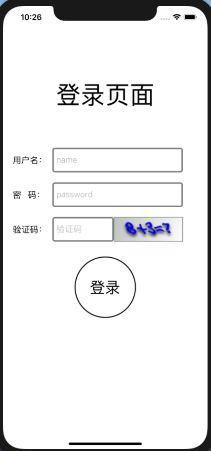 | 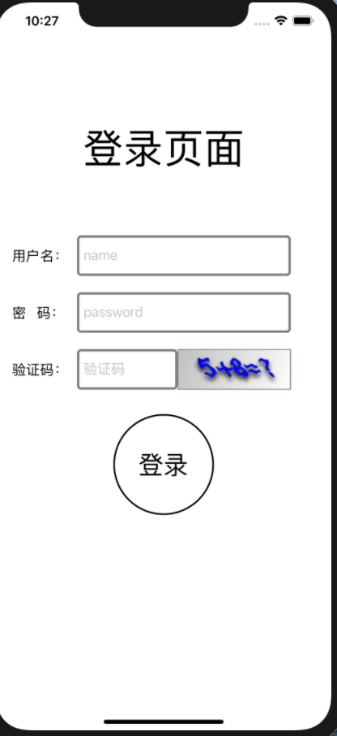 |                                                              |

   

##### 登录

登录失败

|                           输入为空                           |                          验证码错误                          |                        密码/用户错误                         |
| :----------------------------------------------------------: | :----------------------------------------------------------: | :----------------------------------------------------------: |
| 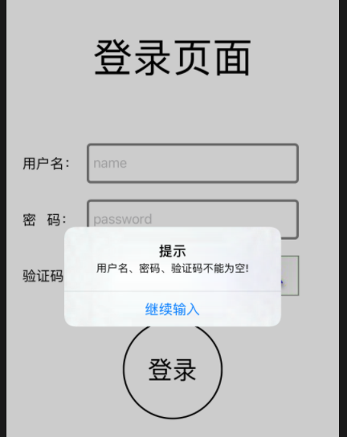 |  | 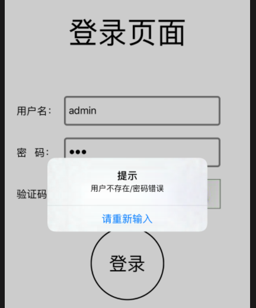 |

登录成功

| 跳转到登陆后页面                                             | ................................................................................................................................................. |
| ------------------------------------------------------------ | ------------------------------------------------------------ |
| 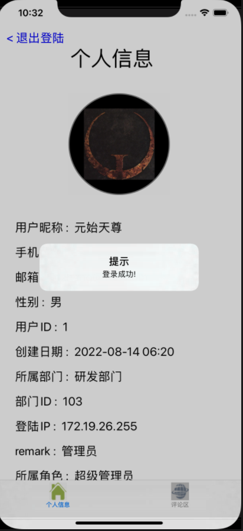 |                                                              |

##### 加载个人信息

| 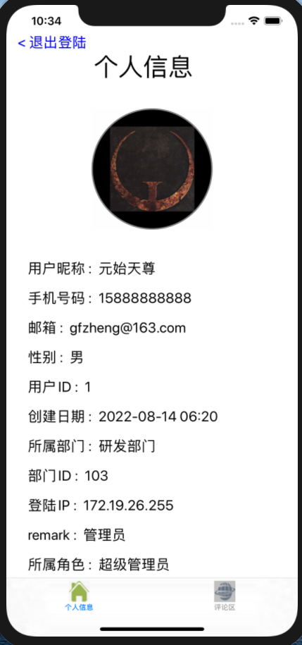 | ................................................................................................................................................. |
| ------------------------------------------------------------ | ------------------------------------------------------------ |

 

##### 加载

图文列表中每条评论最多展示9张图片

| 加载前                                                       | 加载后                                                       | 加载后                                                       |
| ------------------------------------------------------------ | ------------------------------------------------------------ | ------------------------------------------------------------ |
| 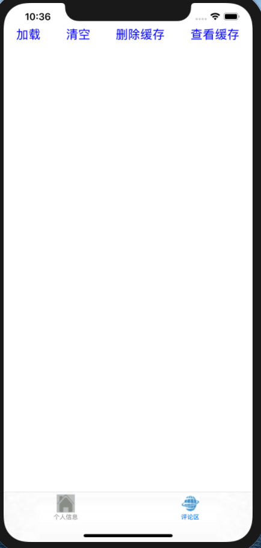 | 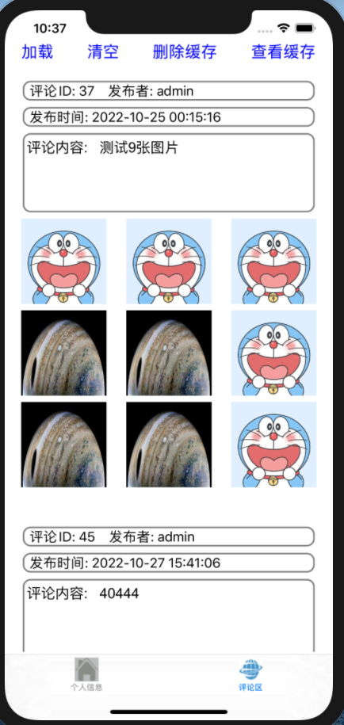 | 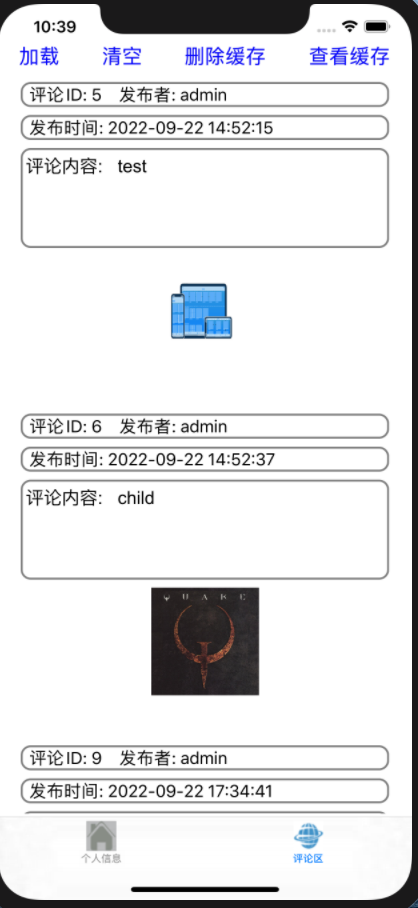 |

##### 清空

|                            清空后                            |                      可见并没有删除缓存                      | ............................................................... |
| :----------------------------------------------------------: | :----------------------------------------------------------: | ------------------------------------------------------------ |
| 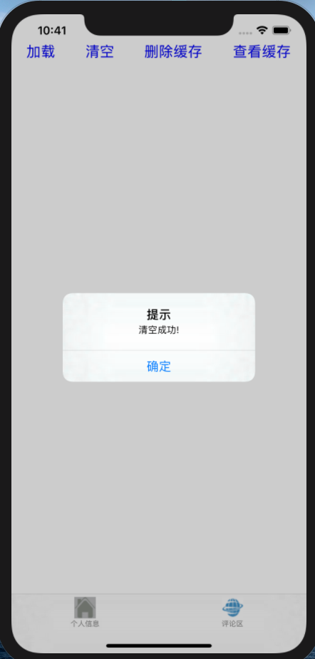 | 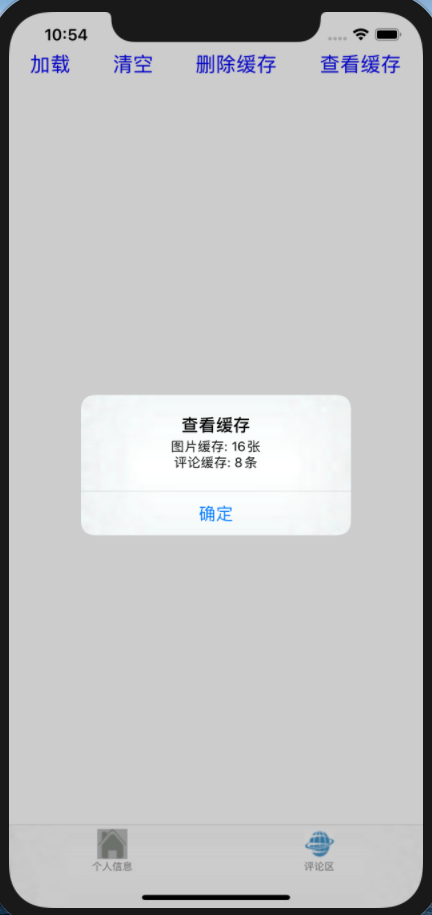 |                                                              |

##### 删除缓存

|                         点击删除按钮                         |                       可见成功删除缓存                       | ................................................................... |
| :----------------------------------------------------------: | :----------------------------------------------------------: | ------------------------------------------------------------ |
| 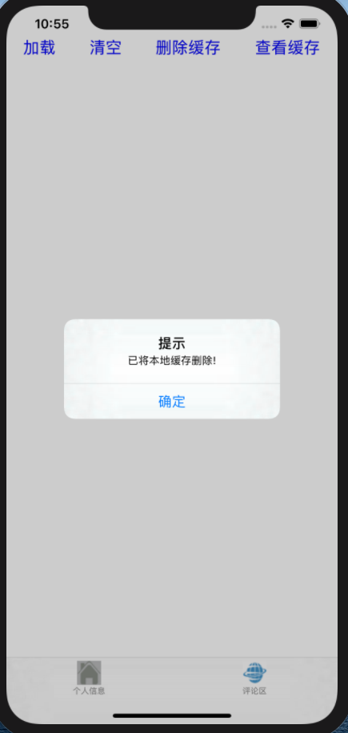 |  |                                                              |

##### 查看缓存

显示Cache中保存的评论数和图片数。

|                        未从网络加载时                        |                            加载后                            | ............................................................... |
| :----------------------------------------------------------: | :----------------------------------------------------------: | ------------------------------------------------------------ |
| 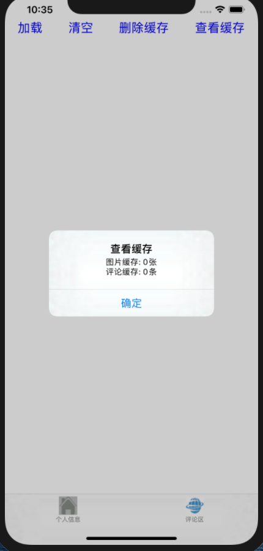 | 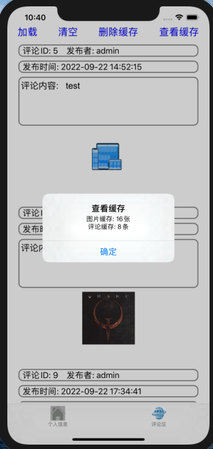 |                                                              |


## 实验总结

本次实验主要学习并用到了4个方面的知识：

1、使用NSURLSession进行网络访问

2、使用NSFileManager实现图文列表的本地存储

3、使用NSOperation实现多线程并通过GCD信号量实现同步机制保证线程安全

4、使用比UITableView更为强大的UICollectionView作为评论图文列表的UI布局设计。

其中难点是使用NSURLSession的网络访问的任务是异步的，会立即返回，而我们在加载评论图文时需要先得到GET请求的响应，才能更新数据源，从而导致线程不安全。

为了解决这个问题，开始我采用GCD的同步队列，之后又尝试NSOperation的串行队列+操作依赖，都发现还没得到GET请求的响应，就进入了队列中的下一个任务，最后才得到GET请求的响应，所以这里没有完全实现同步，是线程不安全的。

究其原因，就是NSURLSession的网络访问的任务是异步的，交给主线程执行，会立即返回，所以调用这个网络访问的任务会被认为已经完成，从而执行队列中的下一个任务。

所以我们不能让NSURLSession的网络访问的任务立即返回，针对这个问题，我采用GCD信号量：

```objc
dispatch_semaphore_t sema = dispatch_semaphore_create(0);// 创建信号量
dispatch_semaphore_wait(sema, DISPATCH_TIME_FOREVER);// P操作
dispatch_semaphore_signal(sema);// V操作
```

启动NSURLSessionDataTask任务前，先创建信号量

```objc
dispatch_semaphore_t sema = dispatch_semaphore_create(0);// 创建信号量
```

在启动NSURLSessionDataTask任务前，执行一次P操作

```objc
dispatch_semaphore_wait(sema, DISPATCH_TIME_FOREVER);// P操作
```

在NSURLSessionDataTask任务的代码块的结束部分，执行一次V操作

```objc
dispatch_semaphore_t sema = dispatch_semaphore_create(0);// 创建信号量
```

这样，就成功地实现了同步机制，实现线程安全。


## 参考文献

（如有要列出，包括网上资源）

[UIimage和NSString的转换](http://duoduokou.com/objective-c/14792804179928730809.html)


[iOS滚动视图UIScrollView使用方法 - 简书 (jianshu.com)](https://www.jianshu.com/p/b1977de4eb84)


[iOS中的多线程(关于NSOperationQueue) - 掘金 (juejin.cn)](https://juejin.cn/post/7029479934011637791)


[GCD信号量-dispatch_semaphore_t - 简书 (jianshu.com)](https://www.jianshu.com/p/24ffa819379c)


[iOS开发- UICollectionView详解+实例 - 知乎 (zhihu.com)](https://zhuanlan.zhihu.com/p/326619089)
